# Media Framing Analysis — Government Propositions 2026-05-01

**Author**: James Pether Sörling
**Date**: 2026-05-01

## Framing Methodology

Predicted media frames based on: editorial line patterns 2022–2026; party media channels; platform algorithmic tendencies; historical coverage of similar propositions.

---

## Per-Party Framing

| Party | Dominant frame | Key message for migration package | Source |
|-------|---------------|----------------------------------|--------|
| SD | "Finally, decisive action" | "Sweden is taking back control of migration policy"; claim credit for forcing M to deliver | HD03262 https://data.riksdagen.se/dokument/HD03262 |
| M | "Responsible, EU-compliant reform" | "EU pact requires modernisation; Sweden leads implementation" | HD03262 |
| KD | "Christian values of order + protection" | "Strong families need secure borders" | |
| L | "Rule of law first" | CAUTIOUS — will seek ECHR compliance reassurance; potential opposition to HD03265 | HD03265 https://data.riksdagen.se/dokument/HD03265 |
| S | "Dismantling the Swedish model" | "Government attacks integration; permanent residents lose their home" | HD03262 |
| V | "Inhumane EU migration policy" | Human rights violations; solidarity framing | HD03265 |
| MP | "Crisis for democracy and human rights" | ECHR Article 5; constitutional concerns | HD03265 |
| C | "Firm but fair — not this" | Will distance on HD03265; support HD03254 (defence) | |

---

## Print Press Framing

| Outlet | Editorial line | Expected frame |
|--------|---------------|----------------|
| Dagens Nyheter (liberal) | EU-aligned, rule of law | Critical-analytical; ECHR risk prominent; "unprecedented in EU" |
| Svenska Dagbladet (conservative) | M-aligned | Supportive; EU-compliance framing; cautious on detention |
| Aftonbladet (tabloid left) | S-sympathetic | "Sweden's harshest ever migration laws"; personal impact stories |
| Expressen (tabloid liberal) | Balanced but dramatic | "Migration revolution"; personal stories of affected residents |
| Sydsvenskan (liberal-regional) | Critical | Malmö integration angle |

---

## Platform & Digital Framing

| Platform | Predicted dominant frame | Amplification risk |
|----------|------------------------|-------------------|
| Twitter/X | "Permanent residents expelled" — oversimplification viral | HIGH — HD03262 will be misrepresented as retroactive removal |
| Facebook | SD organic amplification; personal impact stories from opposition | HIGH |
| TikTok | Personal video impact stories; emotional framing | MEDIUM |
| YouTube | Opposition explainers; SD campaign clips | MEDIUM |

---

## Counternarrative Opportunities (Government Perspective)

1. **EU pact compliance frame**: "Sweden is implementing what the EU requires" — neutralises "Sweden going extreme" narrative
2. **Security outcome frame**: "Every Swede has the right to feel safe" — connects migration to crime statistics
3. **Contrast with Denmark frame**: "Denmark did the same in 2022; Sweden is aligning with Nordic partners"

---

## Media Framing Diagram

```mermaid
%%{init: {"theme": "dark"}}%%
graph LR
    PKG[Migration Package<br/>HD03262-HD03265] --> GOV_FRAME[Government frame:<br/>EU-compliant modernisation<br/>SD: Finally decisive action]
    PKG --> OPP_FRAME[Opposition frame:<br/>ECHR violations<br/>Dismantling Swedish model]
    PKG --> MEDIA[Quality press:<br/>Constitutional risk focus<br/>ECHR analysis]
    PKG --> TABLOID[Tabloid:<br/>Personal impact stories<br/>Human drama]
    PKG --> SOCIAL[Social media:<br/>Oversimplification<br/>Viral clips]
    style GOV_FRAME fill:#1a1e3d,stroke:#00d9ff
    style OPP_FRAME fill:#1a1e3d,stroke:#ff006e
    style MEDIA fill:#1a1e3d,stroke:#ffbe0b
```

