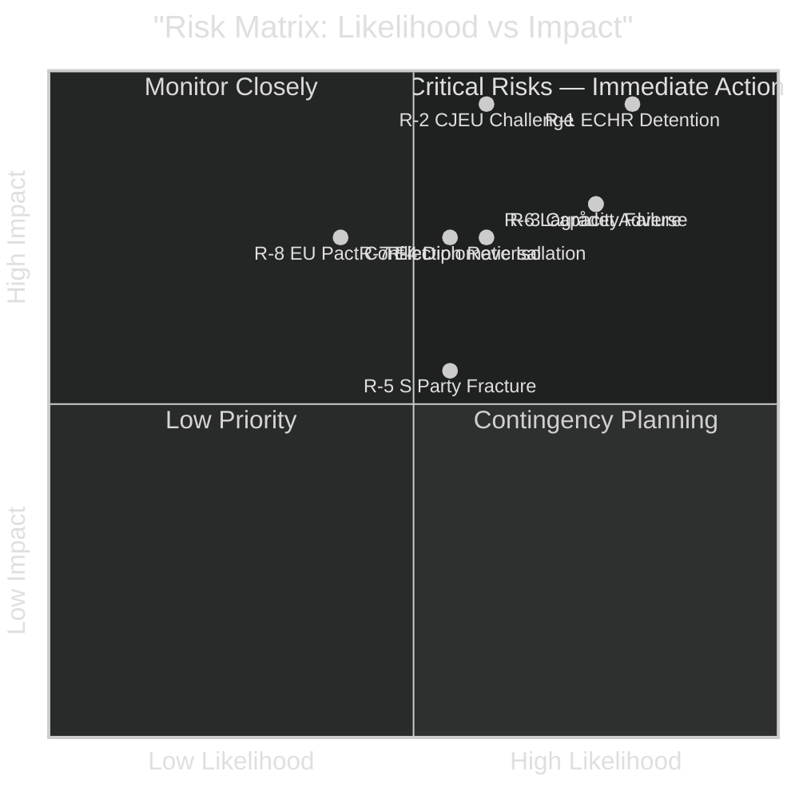

# Risk Assessment — Government Propositions 2026-05-01

**Author**: James Pether Sörling
**Date**: 2026-05-01

## 5-Dimension Risk Register

| Risk ID | Risk | Dimension | L (1-5) | I (1-5) | L×I | Trend |
|---------|------|-----------|---------|---------|-----|-------|
| R-1 | ECHR Art.5 adverse ruling on HD03265 detention | Legal/Constitutional | 4 | 5 | 20 | ↑ Rising |
| R-2 | CJEU challenge to HD03262 permanent permit abolition | Legal/EU | 3 | 5 | 15 | ↑ Rising |
| R-3 | Migrationsverket/Polis capacity failure on deportations | Implementation | 4 | 4 | 16 | ↑ Rising |
| R-4 | International diplomatic isolation (UNHCR, UN) | Reputational | 3 | 4 | 12 | → Stable |
| R-5 | S-party fracture enabling partial SD vote bleed | Political | 3 | 3 | 9 | → Stable |
| R-6 | Lagrådet adverse opinion on HD03265 | Legal/Procedural | 4 | 4 | 16 | ↑ Rising |
| R-7 | Election outcome reversal post-Sept 2026 | Political | 3 | 4 | 12 | → Stable |
| R-8 | EU pact interpretation conflict | EU/Institutional | 2 | 4 | 8 | → Stable |

## Top Cascading Risk Chains

**Chain 1: Detention → Strasbourg → Pre-election damage**
HD03265 detention expansion → Lagrådet adverse yttrande → Opposition amplifies constitutional concern → Strasbourg interim measure → Government defends, opposition exploits → Election damage (HD03265 https://data.riksdagen.se/dokument/HD03265)

**Chain 2: Deportation scale-up → Agency capacity failure → Narrative collapse**
HD03263 mandates expanded returns → Migrationsverket/Polis budget not pre-positioned → Actual deportation numbers stagnate → Opposition "all talk" attack → Coalition credibility damage pre-election (HD03263 https://data.riksdagen.se/dokument/HD03263)

**Chain 3: Permanent permit abolition → CJEU referral → Policy reversal**
HD03262 removes permanent permits → CJEU referral from Swedish administrative court → Preliminary ruling 18+ months → Policy limbo → Next government inherits mess (HD03262 https://data.riksdagen.se/dokument/HD03262)

## Posterior Probability Estimates

- P(ECHR challenge filed within 12 months of HD03265 enactment) = 0.85 — HIGH likelihood (https://data.riksdagen.se/dokument/HD03265)
- P(Lagrådet adverse opinion on HD03265) = 0.70 — HIGH likelihood (previous detention case law)
- P(Migration package passes Riksdag in full) = 0.82 — HIGH (coalition majority stable)
- P(Deportation volume doubles post-HD03263) = 0.30 — LOW (capacity constraint binding) (HD03263 https://data.riksdagen.se/dokument/HD03263)

## Risk Heat Map

