# Scenario Analysis — Government Propositions 2026-05-01

**Author**: James Pether Sörling
**Date**: 2026-05-01

## Scenario Framework

Three forward scenarios assessed against the migration restriction package (HD03262–HD03265) and defence proposition (HD03254) over a 12-month horizon to election September 2026.

---

## Scenario 1: "Full Implementation Triumph" (P = 0.35)

**Narrative**: All four migration propositions pass Riksdag before summer recess 2026. Lagrådet notes concerns but does not block. Migrationsverket scales operations with emergency funding. Deportation numbers increase modestly (30–40%). HD03254 passes with S+C support. Government enters election campaign claiming mission accomplished.

**Triggers**:
- Lagrådet yttrande cautionary but not adverse on HD03265 (detention) (HD03265 https://data.riksdagen.se/dokument/HD03265)
- Budget reallocation to Polismyndigheten returns operations
- No Strasbourg interim measure before election

**Election Impact**: Tidöalliansen consolidates M+SD+KD+L base; attracts some S-right swing voters

**Key Indicators**:
- Lagrådet yttrande published before end of May 2026
- SfU committee report positively framed
- Polis returns unit expansion announced

---

## Scenario 2: "Legal Blockade Pre-Election" (P = 0.45)

**Narrative**: Lagrådet issues adverse opinion on HD03265 detention provisions, citing ECHR Article 5. Government revises HD03265 to reduce detention ceiling from 6 to 3 months; opposition characterises as retreat. Migration package is weakened but still passes. No Strasbourg ruling before election. Election impact: modest erosion of SD base disappointed by compromise.

**Triggers**:
- Lagrådet adverse yttrande on HD03265 (HD03265 https://data.riksdagen.se/dokument/HD03265)
- Government revises detention ceiling rather than risk Riksdag defeat
- ECHR application filed but no interim measure before September

**Election Impact**: Weakened coalition narrative; SD accuses M of backing down; C+L relieved

**Key Indicators**:
- Lagrådet remiss published with Article 5 citation
- Government propositions committee stage: HD03265 revised
- Opposition frames as "forced climbdown"

---

## Scenario 3: "ECHR Crisis & Coalition Strain" (P = 0.20)

**Narrative**: Lagrådet issues hard adverse opinion and a Swedish administrative court immediately refers HD03262 to CJEU. ECtHR grants Rule 39 interim measure on a detained person under HD03265 before election. Media storm: "Sweden defies Strasbourg." SD attacks M for weakness; M faces LP internal pressure. Coalition governance strain. Election: unexpected volatility.

**Triggers**:
- Lagrådet hard adverse → government pushes through unchanged (HD03265 https://data.riksdagen.se/dokument/HD03265)
- Administrative court CJEU referral on HD03262 (HD03262 https://data.riksdagen.se/dokument/HD03262)
- ECtHR Rule 39 measure in August 2026 (pre-election window)

**Election Impact**: Coalition narrative severely damaged; S benefits from "rule of law" framing; election outcome uncertain

**Key Indicators**:
- Strasbourg Rule 39 application filed by Swedish lawyer (UNHCR-supported)
- DN/SvD front-page Strasbourg coverage in July–August 2026
- SD public statements criticising government retreat

---

## Probability Summary

| Scenario | P | Driver |
|----------|---|--------|
| S-1: Full Implementation Triumph | 0.35 | Lagrådet non-adverse; capacity expansion |
| S-2: Legal Blockade Pre-Election | 0.45 | Lagrådet adverse; government revises HD03265 |
| S-3: ECHR Crisis & Coalition Strain | 0.20 | Strasbourg Rule 39 pre-election |
| **Total** | **1.00** | |

## Decision Tree

```mermaid
%%{init: {"theme": "dark"}}%%
flowchart TD
    START[Migration Package Enacted] --> LAG{Lagrådet yttrande}
    LAG -->|Non-adverse| S1[S-1: Full Triumph<br/>P=0.35]
    LAG -->|Adverse: revise| S2[S-2: Weakened Package<br/>P=0.45]
    LAG -->|Hard adverse: override| ECHR{ECtHR Rule 39?}
    ECHR -->|No| S2B[S-2b: Forced revision<br/>P=0.10]
    ECHR -->|Yes pre-election| S3[S-3: Crisis<br/>P=0.20]
    style S1 fill:#1a1e3d,stroke:#00d9ff
    style S2 fill:#1a1e3d,stroke:#ffbe0b
    style S3 fill:#1a1e3d,stroke:#ff006e
```

