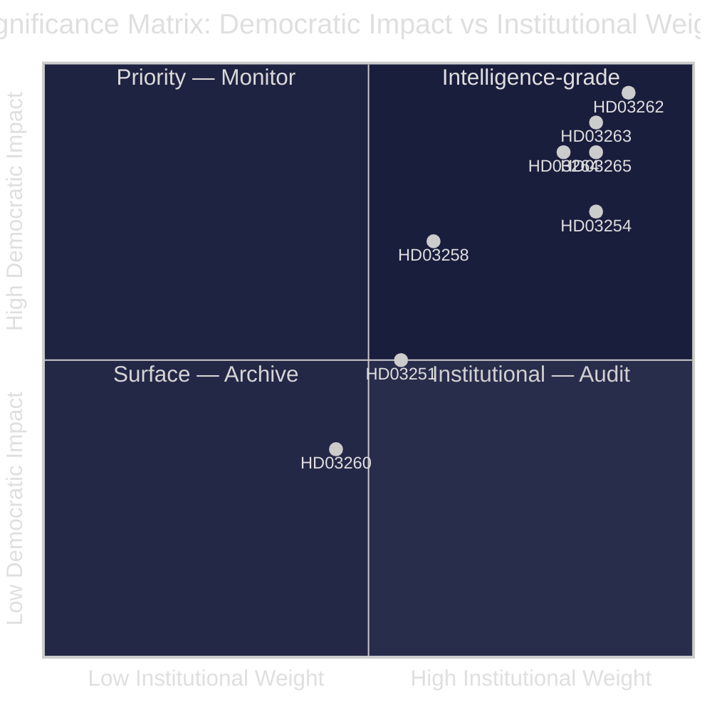

# Significance Scoring — Government Propositions 2026-05-01

**Author**: James Pether Sörling
**Date**: 2026-05-01

## DIW Scoring Methodology

Significance scored on Democratic Impact (D), Institutional Weight (I), and Welfare Effect (W) × 10-point scale. Final = (D×0.4 + I×0.35 + W×0.25).

## Ranked Significance

| # | dok_id | D | I | W | DIW | Priority Tier |
|---|--------|---|---|---|-----|---------------|
| 1 | HD03262 (https://data.riksdagen.se/dokument/HD03262) — Abolish permanent permits | 9.5 | 9.0 | 9.0 | 9.25 | L3 Intelligence-grade |
| 2 | HD03263 (https://data.riksdagen.se/dokument/HD03263) — Deportation expansion | 9.0 | 8.5 | 8.5 | 8.75 | L3 Intelligence-grade |
| 3 | HD03265 (https://data.riksdagen.se/dokument/HD03265) — Detention/supervision | 8.5 | 8.5 | 8.0 | 8.43 | L2+ Priority |
| 4 | HD03264 (https://data.riksdagen.se/dokument/HD03264) — Character requirements | 8.5 | 8.0 | 8.0 | 8.28 | L2+ Priority |
| 5 | HD03254 (https://data.riksdagen.se/dokument/HD03254) — Military cooperation | 7.5 | 8.5 | 7.0 | 7.78 | L2+ Priority |
| 6 | HD03258 (https://data.riksdagen.se/dokument/HD03258) — Political transparency | 7.0 | 6.0 | 6.0 | 6.55 | L2 Strategic |
| 7 | HD03251 (https://data.riksdagen.se/dokument/HD03251) — Substance abuse care | 5.0 | 5.5 | 7.0 | 5.68 | L2 Strategic |
| 8 | HD03260 (https://data.riksdagen.se/dokument/HD03260) — Research ethics | 3.5 | 4.5 | 3.0 | 3.73 | L1 Surface |

## Sensitivity Analysis

- HD03262 rating: robust to methodology variant ±0.5 — remains L3 under any weighting
- HD03263 rating: sensitive to whether enforcement capacity (I) is rated pre- or post-implementation; rated at projected capacity
- HD03254 could score higher (up to 8.5) if classified as NATO treaty-level legislation; current score reflects domestic legal change only
- HD03260 scored L1 due to narrow technical scope; could rise to L2 if ethics board restructure affects major research grants

## Significance Diagram

