# Stakeholder Perspectives — Government Propositions 2026-05-01

**Author**: James Pether Sörling
**Date**: 2026-05-01

## 6-Lens Stakeholder Matrix

### Lens 1: Government / Proposing Ministers

| Actor | Position | Motivation | Credibility Risk |
|-------|----------|-----------|-----------------|
| Johan Forssell (JD, Migration) | STRONGLY FOR — all 4 migration bills | Tidöavtalet implementation, pre-election mandate | Operational delivery risk if Migrationsverket under-delivers |
| Pål Jonson (FöD) | STRONGLY FOR — HD03254 | NATO integration completion | Minimal — cross-party support ensures passage |
| Gunnar Strömmer (JD, Democracy) | FOR — HD03258 | Transparency reform | Scope interpretation may narrow impact |
| Jakob Forssmed (SoD) | FOR — HD03251 | Welfare consolidation | Low profile; unlikely to face opposition |

### Lens 2: Parliamentary Opposition

| Actor | Position | Likely Action |
|-------|----------|--------------|
| Socialdemokraterna (S) | STRONGLY AGAINST HD03262 (permanent permits abolition); PARTIALLY against HD03265 (detention) | Committee minority reservations; media strategy |
| Miljöpartiet (MP) | STRONGLY AGAINST all 4 migration bills | Filibuster risk; human rights framing |
| Vänsterpartiet (V) | AGAINST all migration + HD03254 (defence) | Fullest opposition bloc |
| Centerpartiet (C) | DIVIDED on HD03262; supportive HD03254; neutral HD03251 | Possible committee co-author on defence |

### Lens 3: Regulatory / Administrative Agencies

| Actor | Position | Impact | Source |
|-------|----------|--------|--------|
| Migrationsverket | Neutral (must implement) | Very high — requires major capacity expansion for deportations + permit reclassification (HD03262–HD03263) | HD03263 https://data.riksdagen.se/dokument/HD03263 |
| Polismyndigheten | Neutral (must implement) | High — return operations (HD03263) require dedicated unit expansion | HD03263 https://data.riksdagen.se/dokument/HD03263 |
| Socialstyrelsen | Neutral (must implement) | Medium — integrated substance abuse care (HD03251) coordination role | HD03251 https://data.riksdagen.se/dokument/HD03251 |

### Lens 4: Civil Society / NGOs

| Actor | Position | Likely Action |
|-------|----------|--------------|
| UNHCR Sweden | STRONGLY AGAINST HD03262, HD03265 | Public condemnation; Strasbourg brief possible |
| Röda Korset | AGAINST HD03265 (detention) | Media campaign; parliamentary petitions |
| Amnesty International Sweden | AGAINST HD03265 | ECHR Article 5 dossier submission |
| Riksdag parties' youth wings (SDU, MUF) | FOR migration package | Amplification |

### Lens 5: International / Supranational

| Actor | Position | Impact |
|-------|----------|--------|
| EU Commission (DG HOME) | Monitoring — HD03262 pact compliance | Could trigger infringement if non-refoulement violated |
| CJEU | Latent | Referral risk from Swedish administrative court on HD03262 |
| NATO (for HD03254) | Positive | Operational military cooperation framework welcomed (HD03254 https://data.riksdagen.se/dokument/HD03254) |

### Lens 6: Media / Public Opinion

| Segment | Dominant Frame | Predicted Coverage |
|---------|---------------|-------------------|
| Sverigedemokraterna party media (Riks, SD-linked) | "Finally decisive action" | Highly positive migration package |
| Aftonbladet / Expressen (tabloid) | "Sweden's harshest ever migration laws" | Mixed — dramatic framing |
| Dagens Nyheter / SvD (quality) | Legal/constitutional angle (ECHR) | Critical-analytical |
| SVT / SR (public broadcast) | Balanced; constitutional risk prominent | Neutral-critical |

## Influence Network

```mermaid
%%{init: {"theme": "dark"}}%%
graph LR
    GOV[Forssell/Jonson<br/>Ministers] --> RIKSDAG[Riksdag<br/>SfU/FöU committees]
    RIKSDAG --> LAG[Lagrådet<br/>Constitutional review]
    LAG -->|Adverse opinion risk| GOV
    RIKSDAG --> VOTE[Plenary vote<br/>Sept 2026]
    UNHCR[UNHCR / Amnesty] -->|Public pressure| MEDIA[Media]
    MEDIA -->|Framing| OPINION[Public opinion]
    OPINION -->|Election pressure| RIKSDAG
    ECHR[ECtHR Strasbourg] -->|Legal ruling risk| GOV
    style GOV fill:#1a1e3d,stroke:#00d9ff
    style ECHR fill:#1a1e3d,stroke:#ff006e
    style UNHCR fill:#1a1e3d,stroke:#ffbe0b
```

