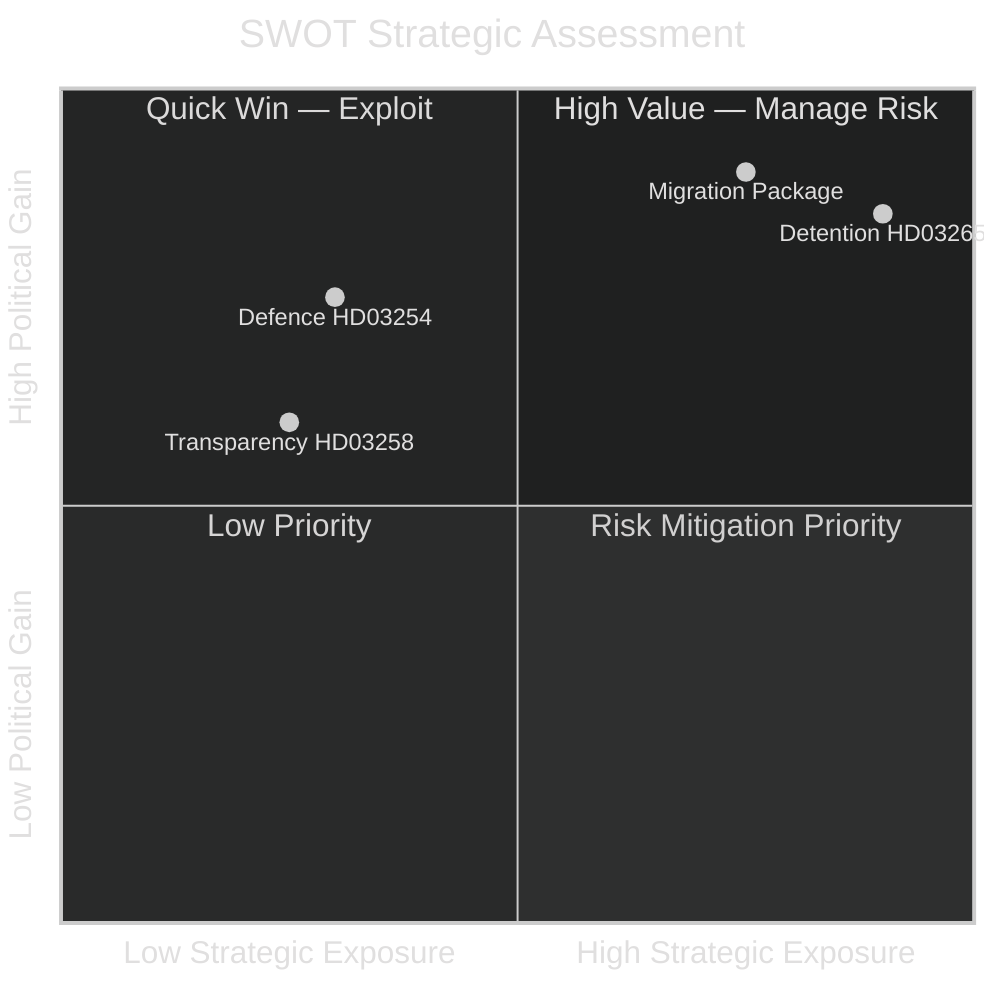

# SWOT Analysis — Government Propositions 2026-05-01

**Author**: James Pether Sörling
**Date**: 2026-05-01

## SWOT Framework: Tidöalliansen Migration Package + Defence Proposition

### Strengths

- **Electoral alignment**: Migration restriction platform matches SD+M polling strength heading into Sept 2026 election (HD03262 https://data.riksdagen.se/dokument/HD03262; HD03263 https://data.riksdagen.se/dokument/HD03263)
- **EU pact integration**: HD03262 explicitly implements EU Migration and Asylum Pact, giving legal cover from Brussels interference (HD03262 https://data.riksdagen.se/dokument/HD03262)
- **Coordinated package**: All four migration bills simultaneously submitted — prevents opposition from blocking selectively (HD03262–HD03265 https://data.riksdagen.se/dokument/HD03262)
- **Coalition discipline**: Tidöavtalet 2022 committed M+SD+KD+L to exactly these measures; internal governance conflict unlikely (prior pattern HC03202, HC03201)
- **Defence bipartisanship**: HD03254 (https://data.riksdagen.se/dokument/HD03254) will draw cross-party support (S, C, L), broadening mandate narrative

### Weaknesses

- **ECHR exposure**: HD03265 (detention without judicial order to 6 months) faces credible ECHR Article 5 challenge; Sweden ECHR violation history on detention is adverse (HD03265 https://data.riksdagen.se/dokument/HD03265)
- **Implementation capacity**: Migrationsverket and Polismyndigheten lack capacity for deportation scale-up required by HD03263; Statskontoret has previously documented agency backlog (HD03263 https://data.riksdagen.se/dokument/HD03263)
- **Permanent permit abolition unprecedented in EU**: HD03262 goes further than any other EU member state — legal challenge risk from CJEU on non-refoulement compatibility (HD03262 https://data.riksdagen.se/dokument/HD03262)
- **Forssell overload**: Single minister (Forssell) responsible for all 4 migration bills + political transparency bill — coordination risk (HD03258 https://data.riksdagen.se/dokument/HD03258)

### Opportunities

- **Election momentum**: Package dominates spring 2026 political agenda; Tidöalliansen shapes debate before opposition can respond (HD03262–HD03265)
- **EU pact first-mover**: Sweden can claim EU compliance leadership while implementing strictest national rules (HD03262 https://data.riksdagen.se/dokument/HD03262)
- **S party fracture**: SD + S could find partial common ground on deportation (HD03263) creating S internal tension (HD03263 https://data.riksdagen.se/dokument/HD03263)
- **Defence credibility**: HD03254 (https://data.riksdagen.se/dokument/HD03254) enhances NATO readiness narrative alongside migration package — "strong government" composite

### Threats

- **Strasbourg Court ruling**: Adverse ECHR ruling on HD03265 before election would be politically catastrophic (HD03265 https://data.riksdagen.se/dokument/HD03265)
- **UNHCR / UN SR condemnation**: International criticism creates foreign-policy cost and media amplification risk (HD03262–HD03265)
- **S outflanking SD on deportation**: If S adopts partial support for HD03263, SD loses differentiation — coalition fracture risk (HD03263 https://data.riksdagen.se/dokument/HD03263)
- **Agency capacity failure**: If deportation volumes don't increase post-HD03263, opposition "all show, no delivery" narrative dominates (HD03263 https://data.riksdagen.se/dokument/HD03263)

## TOWS Matrix

| | Opportunities | Threats |
|---|---|---|
| **Strengths** | S-O: Use EU pact alignment to pre-empt CJEU challenge; use coalition discipline to force rapid committee passage | S-T: Pre-position Lagrådet consultation before Strasbourg challenge materialises |
| **Weaknesses** | W-O: Stage deportation scale-up with Polismyndigheten pre-positioned budget increase | W-T: If ECHR challenge comes, temporary permit system is already in place — minimise liability window |

## Cross-SWOT Intelligence

The dominant cross-SWOT dynamic: **Electoral Strength × ECHR Threat**. The detention expansion (HD03265) is the most legally exposed element; it is also the element that resonates most strongly with the base electorate. The government is consciously accepting legal risk for political gain — this pattern is consistent with the 2022–2026 Tidöavtalet migration trajectory.

