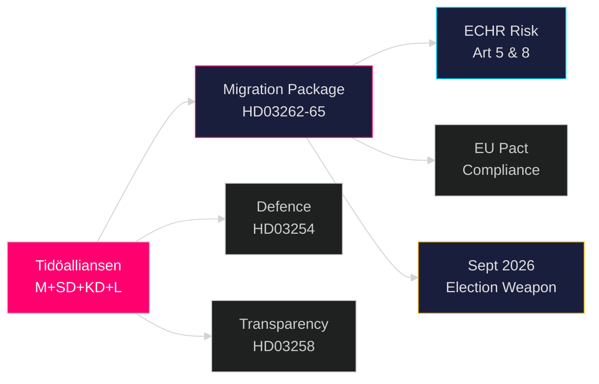

# Synthesis Summary — Government Propositions 2026-05-01

**Author**: James Pether Sörling
**Confidence**: HIGH [B2]
**Date**: 2026-05-01

## Lead Intelligence Story

On 30 April 2026 — five months before the Swedish general election — the Tidöalliansen government tabled four simultaneous propositions from Justitiedepartementet that collectively represent the most comprehensive dismantling of Sweden's asylum protection architecture since the 2016 temporary restrictions. HD03262 would eliminate the category of permanent residence permits entirely, replacing it with renewable temporary permits aligned with the EU Migration and Asylum Pact. HD03263 expands the state's deportation enforcement machinery. HD03264 widens the character-vetting net to include foreign criminal convictions. HD03265 extends administrative detention (förvar) without judicial authorisation to six months. Together they form a deliberate electoral weapon: positioned to consolidate the M–SD–KD–L governing bloc and force opposition parties into a defensive posture on immigration ahead of September 2026.

## DIW-Weighted Document Ranking

| Rank | dok_id | Title | DIW Score | Priority |
|------|--------|-------|-----------|----------|
| 1 | HD03262 (https://data.riksdagen.se/dokument/HD03262) | Abolish permanent residence permits + EU pact | 9.2/10 | L3 Intelligence-grade |
| 2 | HD03263 (https://data.riksdagen.se/dokument/HD03263) | Strengthened deportation operations | 8.7/10 | L3 Intelligence-grade |
| 3 | HD03265 (https://data.riksdagen.se/dokument/HD03265) | Stricter detention and supervision | 8.5/10 | L2+ Priority |
| 4 | HD03264 (https://data.riksdagen.se/dokument/HD03264) | Stricter character requirements | 8.3/10 | L2+ Priority |
| 5 | HD03254 (https://data.riksdagen.se/dokument/HD03254) | Military operational cooperation | 7.8/10 | L2+ Priority |
| 6 | HD03258 (https://data.riksdagen.se/dokument/HD03258) | Transparency in political processes | 6.5/10 | L2 Strategic |
| 7 | HD03251 (https://data.riksdagen.se/dokument/HD03251) | Integrated substance abuse/mental health care | 5.8/10 | L2 Strategic |
| 8 | HD03260 (https://data.riksdagen.se/dokument/HD03260) | Research ethics regulation reform | 4.2/10 | L1 Surface |

## Integrated Intelligence Picture

The 30 April 2026 proposition batch reveals three distinct but interlocking government strategies:

**Strategy 1: Migration Escalation Before Election (HIGH confidence [B2])**
The four-bill migration package is unprecedented in scope and coordination. All four carry identical ministry stamps (Justitiedepartementet), identical dates (2026-04-30), and share minister Forssell's signature. This is not four coincidental bills — it is a single legislative campaign presented in four simultaneous legal instruments. Abolishing permanent residence permits (HD03262) is the structural anchor; the deportation, character and detention bills (HD03263–HD03265) are enforcement arms that make the anchor effective. The electoral calculation: SD and M have polling leads on migration; making this the pre-election legislative centrepiece forces S and C into uncomfortable positions.

**Strategy 2: Defence Readiness Legislation (HIGH confidence [B2])**
HD03254 completes the NORDEFCO + bilateral defence cooperation legal framework that NATO membership required. Finland and Norway already have equivalent legislation. This is housekeeping for an alliance member, but the timing — concurrent with the migration package — is significant: the government is projecting strength across the two defining policy areas of its tenure (security + immigration restriction).

**Strategy 3: Governance Legitimacy Building (MEDIUM confidence [B3])**
HD03258 (political transparency) and HD03251 (integrated health care) are cross-party-friendly propositions that broaden the government's governance legitimacy profile beyond immigration. They are unlikely to generate controversy; they exist to signal policy breadth and competence.

## Key Intelligence Gaps

- Full text of HD03258 and HD03260 not yet retrieved from MCP (summaries only; metadata-only classification risk)
- Lagrådet referral status for HD03265 (detention expansion) — critical ECHR risk
- SfU committee timetable not yet confirmed
- Opposition whip positions on HD03262 not yet public

