# Threat Analysis — Government Propositions 2026-05-01

**Author**: James Pether Sörling
**Date**: 2026-05-01

## Political Threat Taxonomy

### T-1: Constitutional-Legal Threat (HD03265 — Detention Without Court Order)

**Threat Actor**: Council of Europe / ECtHR; Swedish administrative courts; UNHCR  
**Attack Vector**: HD03265 extends administrative detention (förvar) to 6 months without judicial authorisation — directly conflicts with ECHR Article 5 (right to liberty) and Swedish constitutional principle of judicial oversight of deprivation of liberty  
**Source**: HD03265 https://data.riksdagen.se/dokument/HD03265  

**Attack Tree**:
```
Administrative detention rule enacted (HD03265)
├── Lagrådet referral → adverse constitutional opinion (P=0.70)
│   └── Opposition parliamentary challenge delayed passage
└── First application → Strasbourg application filed
    ├── Interim measure (Rule 39) granted
    │   └── Sweden ordered to release detained persons
    │       └── Government humiliation pre-election
    └── Judgment: violation Art.5
        └── Legislative reversal required post-election
```

**MITRE-style TTP Mapping (Political Threat)**:
- Tactic: Legal challenge to erode government legitimacy
- Technique: International human rights adjudication  
- Procedure: NGO → Strasbourg application → media amplification → opposition questioning

### T-2: Electoral Counter-Mobilisation Threat

**Threat Actor**: S+MP+V+C opposition bloc  
**Attack Vector**: Migration package creates energised opposition base; HD03262 permanent permit abolition could alienate centrist voters who accept firm but fair migration control  
**Source**: HD03262 https://data.riksdagen.se/dokument/HD03262; HD03263 https://data.riksdagen.se/dokument/HD03263

**Kill Chain**:
1. Package announcement (30 Apr 2026)
2. Opposition media blitz — "Swedes reject Swedish permanent residents"
3. S campaign positions HD03262 as anti-integration
4. Polling shift among 30–50 urban voters (key swing demographic)
5. Election outcome: coalition loses seats

### T-3: Implementation Credibility Threat (HD03263)

**Threat Actor**: Domestic opposition; media accountability cycle  
**Attack Vector**: If deportation volumes do not materially increase after HD03263 enactment, opposition deploys "all talk, no action" narrative  
**Source**: HD03263 https://data.riksdagen.se/dokument/HD03263

**Likelihood**: HIGH — Swedish deportation capacity has been constrained by receivership country refusal, not by domestic legal powers. HD03263 addresses the domestic legal side but cannot compel third-country cooperation.

### T-4: Democratic Legitimacy Threat (HD03258 Implementation Failure)

**Threat Actor**: Media; civil society  
**Attack Vector**: HD03258 (political transparency) could be undermined if its scope is narrow and excludes de facto lobbying activities  
**Source**: HD03258 https://data.riksdagen.se/dokument/HD03258  
**Likelihood**: MEDIUM — depends on KU committee scope interpretation

## Threat Priority Matrix

```mermaid
%%{init: {"theme": "dark"}}%%
graph TD
    T1[T-1: ECHR Detention<br/>Constitutional threat<br/>CRITICAL] --> GOV[Government Programme]
    T2[T-2: Electoral mobilisation<br/>HIGH] --> GOV
    T3[T-3: Implementation credibility<br/>HIGH] --> GOV
    T4[T-4: Transparency scope<br/>MEDIUM] --> GOV
    GOV --> OUTCOME[Election outcome<br/>Sept 2026]
    style T1 fill:#ff006e,color:#fff
    style T2 fill:#1a1e3d,stroke:#ffbe0b
    style T3 fill:#1a1e3d,stroke:#ffbe0b
    style T4 fill:#1a1e3d,stroke:#00d9ff
    style OUTCOME fill:#1a1e3d,stroke:#00d9ff
```


