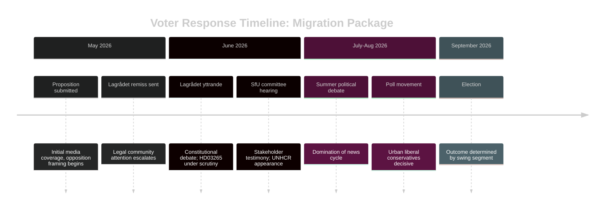

# Voter Segmentation — Government Propositions 2026-05-01

**Author**: James Pether Sörling
**Date**: 2026-05-01

## Segmentation Framework: Migration Package Impact on Swedish Electorate

### Demographic Segments

| Segment | Size | Migration Package Response | Key Proposition |
|---------|------|--------------------------|-----------------|
| Foreign-born (16% of electorate) | ~1.3M voters | STRONGLY NEGATIVE — HD03262 directly affects status (HD03262 https://data.riksdagen.se/dokument/HD03262) | HD03262 |
| Swedish-born children of migrants | ~10% | MODERATELY NEGATIVE — family member status affected | HD03264 |
| Rural Sweden (north, inland) | ~20% | POSITIVE — migration restriction resonates | HD03262–HD03265 |
| Urban professionals (Stockholm, Göteborg, Malmö) | ~25% | MIXED — support firmness, oppose ECHR violations | HD03265 |
| Pensioners | ~25% | SLIGHTLY POSITIVE — public order framing | HD03263 |
| Young voters under 30 | ~15% | NEGATIVE — liberal values; climate/environment priority | All migration bills |

### Regional Segments

| Region | Migration Package | Defence HD03254 |
|--------|-----------------|----------------|
| Norrland (north) | HIGH support | Neutral |
| Stockholm/Gothenburg/Malmö | DIVIDED | Support |
| Skåne (SD stronghold) | HIGH support | Support |
| University cities | LOW support | Support |

### Ideological Segments

| Ideological profile | Segment size | Response |
|--------------------|-------------|----------|
| Social conservative (SD/KD base) | ~25% | STRONGLY FOR all migration bills |
| Liberal-conservative (M/L) | ~20% | FOR firm migration, WORRIED about ECHR exposure (HD03265 https://data.riksdagen.se/dokument/HD03265) |
| Social democratic (S base) | ~30% | AGAINST permanent permit abolition; DIVIDED on deportation |
| Green/left (MP/V) | ~12% | STRONGLY AGAINST |
| Agrarian/rural (C base) | ~8% | DIVIDED |

## Key Swing Segment: Urban Liberal Conservatives

This is the decisive segment for election outcome. These voters (estimated 8–12% of electorate) supported M in 2022 on economic and governance grounds. They accept firm migration management but have strong ECHR/rule-of-law values.

**Critical question for this segment**: Does the government successfully frame HD03265 as "EU-compliant security measure" or does opposition successfully frame it as "ECHR violation"?

If Lagrådet issues adverse opinion before election (scenario 2, P=0.45), this segment is at risk of defection to C or abstention. (HD03265 https://data.riksdagen.se/dokument/HD03265)

## Voter Response Timeline

