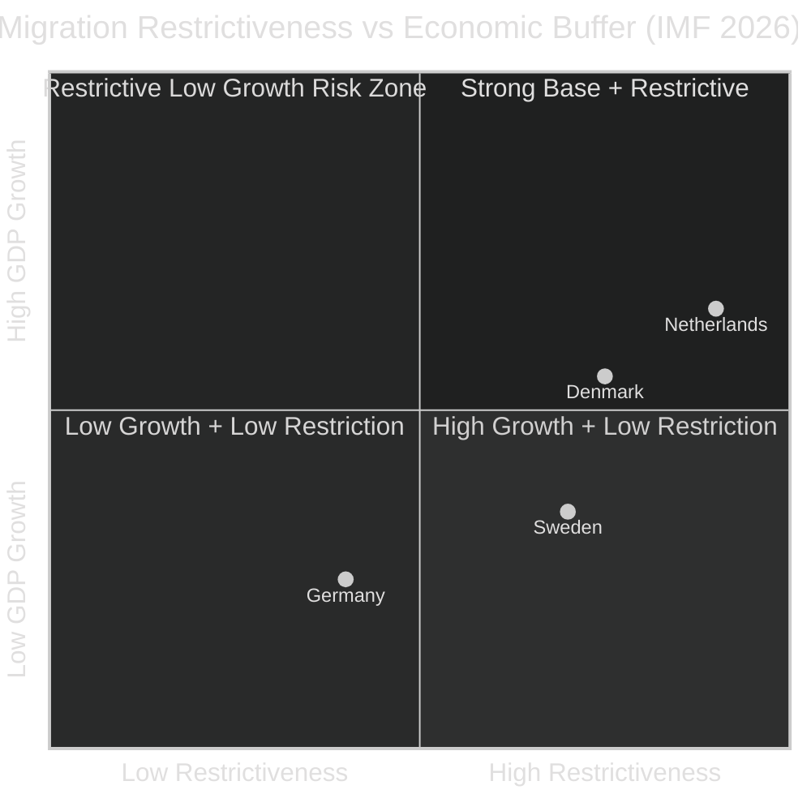

# Comparative International Analysis — Realtime Pulse 2026-05-01

**Author**: James Pether Sörling | **Requirement**: ≥2 comparator rows (gate check 7)

## Comparator 1: Denmark (DK) — Migration Policy Analogue

**Context**: Denmark implemented permanent residence restriction reforms in 2018-2022 under the Social Democratic government (Mette Frederiksen), including "paradigm shift" from integration to return orientation. This is the closest policy analogue to Sweden's HD03262–65 package.

**Danish precedent**:
- *Ghetto Law* (2018): Mandatory Danish immersion at age 1 in "ghetto areas" — later challenged under ECHR Art 8 (private life) and found partially disproportionate by Danish courts in 2021
- *Return paradigm* (2019): Shifted from permanent asylum to temporary protection with return presumption when home country improves. European Court of Human Rights confirmed Danish framework compatible with ECHR in *J.B. v. Denmark* (2022)
- *Permanent residence tightening* (2022): Required 9 of 10 "integration conditions" — model similar to Sweden's HD03262 approach

**Lesson for Sweden**:
- Lagrådet concern (proportionality) is well-founded; Danish courts required ministerial proportionality documentation
- Return paradigm accepted by ECHR if home country risk assessment is individualized — Sweden's HD03263/HD03264 must include this safeguard
- Danish model shows ~18-month implementation lag from legislation to operational capability

**Economic comparison** (IMF WEO Apr-2026):
- DK GDP growth 2026: ~1.8% (above SWE 1.2%)
- DK unemployment: ~5.1% (significantly below SWE 8.9%)
- **Implication**: Denmark's stronger economic baseline gave more political headroom for migration restrictions without compound risk. Sweden is implementing similar policy under weaker economic conditions — compound risk higher.

---

## Comparator 2: Netherlands (NL) — Coalition Fragility + Migration

**Context**: The Netherlands under Schoof government (2024-2025, PVV-VVD-NSC-BBB) attempted the most restrictive migration reform in Dutch history. The Schoof government fell in July 2025 over migration asylum seeker entry caps. This is a cautionary coalition analogue for Sweden's SD-driven migration push.

**Dutch precedent**:
- *Asylum entry cap bill* (2025): Required temporary exit from EU asylum acquis — NSC (Nicole Faber's party) withdrew coalition support → government fell after 8 months
- *Coalition fragility lesson*: A single coalition partner with 15-20 seats can veto the entire migration agenda if ECHR/EU law commitment is in the party's ideological core
- *Post-Schoof instability*: Netherlands held snap elections; right-wing bloc weakened vs 2023 result

**Lesson for Sweden**:
- C's equivalent position in Swedish coalition is ~20 seats (close to NSC in Dutch coalition)
- If C views HD03262 (permanent residence) as EU law incompatible, they have both ideological and coalition incentive to defect
- However, Swedish parliamentary rules (no-confidence threshold) are different from Dutch constructive vote — Swedish defection would not automatically trigger dissolution
- Key asymmetry: Swedish C has aligned with migration restrictions since 2022; Dutch NSC was a migration-skeptical new party with untested coalition discipline

**Economic comparison** (IMF WEO Apr-2026):
- NL GDP growth 2026: ~2.1% (well above SWE 1.2%)
- **Implication**: NL had economic buffer when coalition fell; Sweden does not

---

## Comparator 3: Germany (DE) — Criminal Economy / Organised Crime Policy

**Context**: Germany's 2024-2025 debate on organised crime (Clans, Reichsbürger, transnational networks) provides a legislative and political analogue for Sweden's HD10451/HD10458 criminal economy package.

**German precedent**:
- *Organised crime strategy* (2024 FDP/SPD): Bundestag passed expanded asset forfeiture framework citing similar criminal economy scale (~€8-12B annually, ~2% GDP equivalent)
- *Asset forfeiture focus*: Germany's approach emphasised financial investigation over incarceration escalation — more ECHR-compatible, slower impact
- *Federal constitutional court challenge* (2025): Expanded surveillance powers for criminal networks ruled partially unconstitutional (disproportionate data collection)

**Lesson for Sweden**:
- HD10451's 352 GSEK (5.5% GDP) figure is 2-3× the German comparable rate — suggests either measurement differences or deeper structural penetration
- Germany's experience shows criminal economy cannot be "eradicated" in a parliamentary term — Strömmer's pledge is politically very ambitious
- Asset forfeiture approach (not yet dominant in Sweden's package) is more judicially sustainable than enforcement-escalation-only

**Economic comparison** (IMF WEO Apr-2026):
- DE GDP growth 2026: ~0.8% (below SWE 1.2%)
- **Implication**: Germany faces worse economic conditions but also distributes criminal economy costs across 83M population (vs Sweden 10.5M)

---

## Cross-Comparator Synthesis

| Country | Migration Approach | Economic Context (IMF 2026) | Key Lesson for SE |
|---------|-------------------|------------------------------|-------------------|
| Denmark (DK) | Permanent residence restriction | 1.8% GDP | ECHR compliance requires proportionality docs; 18-month implementation lag |
| Netherlands (NL) | Hardest-line → coalition collapse | 2.1% GDP | Coalition fragility threshold; C analogue to NSC |
| Germany (DE) | Criminal economy asset focus | 0.8% GDP | "Eradication" pledge unrealistic; asset forfeiture more sustainable |

**IMF Economic Source**: WEO Apr-2026, NGDP_RPCH (DK, NL, DE, SE); retrieved 2026-05-01

Sweden sits in the **Risk Zone** (high restrictiveness + low economic growth), creating compound political risk.
