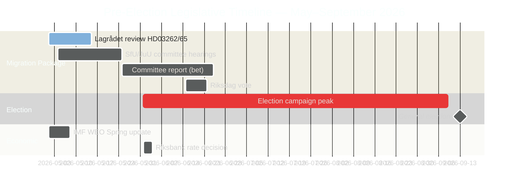

# Sweden's Pre-Election Legislative Sprint: Migration, Crime, and Economic Bind

**Author**: James Pether Sörling
**Classification**: PUBLIC — GDPR Art. 9(2)(e) publicly made / 9(2)(g) substantial public interest
**Confidence**: HIGH [B2] | **Date**: 2026-05-01

## 🎯 BLUF

Five months before Sweden's September 2026 general election, the Tidöalliansen government has launched its most ambitious pre-election legislative sprint: a four-bill migration mega-package (HD03262–65) proposing to abolish permanent residence permits, harden deportation operations, and extend detention authority — simultaneously with formal Riksdag ratification of below-trend economic growth (GDP 1.2% 2026) and parliamentary accountability battles over a 352-billion-SEK criminal economy. The government's electoral position is structurally strong on migration and security, but critically exposed on economic governance. Lagrådet ECHR review of two key bills remains outstanding.

## 🧭 3 Decisions This Brief Supports

1. **Monitor Lagrådet timeline**: A negative Lagrådet advisory on HD03262/HD03265 would force either constitutional revision or a politically costly Riksdag override — the single highest-leverage intelligence gap of the week.
2. **Track S electoral counter-strategy**: S's coordinated 16-motion filing confirms end-of-session maximalism; the environmental permitting challenge (HD024124 anchor) is their strongest substantive argument. Monitoring committee hearing outcomes at MJU and NU defines S's electoral credibility on governance reform.
3. **Assess IMF economic data vintage**: HC01FiU20 ratifies below-trend growth (1.2% 2026, IMF WEO Apr-2026); the opposition will anchor their economic campaign to this baseline. Fresh IMF IFS monthly CPI data (PCPI_IX SWE) and Riksbank MFS_IR policy-rate trajectory are forward intelligence triggers.

## 60-Second Read

- **Migration package (HD03262–65)**: Four simultaneous bills targeting Sweden's migration architecture — most restrictive proposal since 2016 temporary restrictions. Abolishing permanent residence permits is the structural anchor; deportation/detention/character bills are the enforcement arms. Lagrådet pending on two bills.
- **Criminal economy accountability (HD10451, HD10458)**: ESO-documented 352 GSEK criminal sector (5.5% GDP, 23,000 company-linked structures) enters formal Riksdag debate. Strömmer's "eradicate in 4 years" pledge now has a measurable baseline and a falsifiable clock.
- **Economic bind ratified (HC01FiU20)**: Riksdag formally endorsed below-trend GDP growth — government cannot claim economic success. IMF WEO Apr-2026 sets the baseline; US tariff shock provides cover but will not neutralise opposition attack lines.
- **Defence consensus (HD03254)**: Military cooperation framework (NORDEFCO, UK ELSA, US DCA) passes with near-cross-party consensus — 297/28 in prior comparable votes. Structurally reinforces NATO integration.
- **Opposition maximalism (S motions cluster)**: 16 simultaneous committee motions across 6 committees signal S's election-year legislative saturation strategy. Environmental permitting (HD024124 cluster) is the highest-quality substantive challenge.

## Top Forward Trigger

**Lagrådet yttrande on HD03265 (detention expansion)** — expected window: 5–12 May 2026. A negative opinion triggers ECHR compliance revision requirements and creates maximum political cost for the government immediately before the election campaign peaks.

