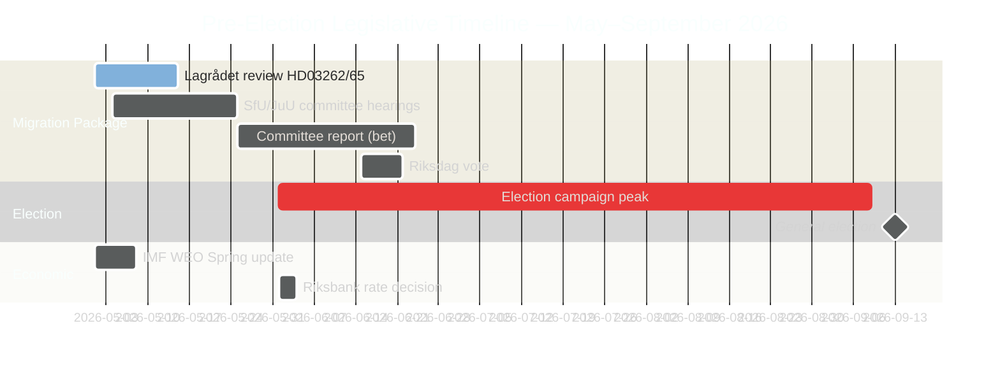

‏# سباق التشريعات السويدية قبيل الانتخابات: الهجرة والجريمة والقيد الاقتصادي

‏**المؤلف**: James Pether Sörling
‏**التصنيف**: عام — اللائحة العامة لحماية البيانات المادة 9(2)(ه) منشور علنًا / 9(2)(ز) مصلحة عامة جوهرية
‏**الثقة**: عالية [B2] | **التاريخ**: 2026-05-01

‏## 🎯 الخلاصة

‏قبل خمسة أشهر من انتخابات البرلمان السويدي في سبتمبر 2026، أطلق تحالف Tidöalliansen أكثر مسيرة تشريعية طموحًا له قبيل الانتخابات: حزمة هجرة ضخمة من أربعة مشاريع قوانين (HD03262–65) تقترح إلغاء تصاريح الإقامة الدائمة، وتشديد عمليات الترحيل، وتوسيع صلاحيات الاحتجاز — في وقت واحد مع المصادقة الرسمية من الريكسداغ على النمو الاقتصادي دون المعدل (الناتج المحلي الإجمالي 1.2٪ لعام 2026) ومعارك المساءلة البرلمانية حول اقتصاد إجرامي بقيمة 352 مليار كرونة سويدية. الموقف الانتخابي للحكومة قوي هيكليًا في الهجرة والأمن، لكنه مكشوف بشكل حرج في مجال الحوكمة الاقتصادية. لا تزال مراجعة Lagrådet للاتفاقية الأوروبية لحقوق الإنسان لمشروعَي قانون رئيسيَّين معلقةً.

‏## 🧭 3 قرارات يدعمها هذا التقرير

‏1. **مراقبة جدول زمني Lagrådet**: سيضطر رأي سلبي من Lagrådet حول HD03262/HD03265 إلى إجراء مراجعة دستورية أو تجاوز مكلف سياسيًا من الريكسداغ — أهم ثغرة استخباراتية في الأسبوع.
‏2. **تتبع الاستراتيجية المضادة الانتخابية لحزب S**: يؤكد تقديم حزب S المنسق لـ 16 اقتراحًا تحقيق الحد الأقصى من نهاية الجلسة؛ تحدي تصاريح البيئة (المرساة HD024124) هو أقوى حجة موضوعية لهم. مراقبة نتائج جلسات استماع اللجان في MJU وNU تحدد مصداقية S الانتخابية في إصلاحات الحوكمة.
‏3. **تقييم بيانات صندوق النقد الدولي الاقتصادية**: يصادق HC01FiU20 على نمو دون الاتجاه (1.2٪ لعام 2026، توقعات الاقتصاد العالمي لصندوق النقد الدولي أبريل 2026)؛ ستربط المعارضة حملتها الاقتصادية بهذا الخط الأساسي. بيانات مؤشر أسعار المستهلك الشهرية الأخيرة لصندوق النقد الدولي (PCPI_IX SWE) ومسار معدل السياسة النقدية MFS_IR للريكسبنك هي محفزات استخباراتية مستقبلية.

‏## القراءة في 60 ثانية

‏- **حزمة الهجرة (HD03262–65)**: أربعة مشاريع قوانين متزامنة تستهدف بنية الهجرة السويدية — أكثر الاقتراحات تقييدًا منذ القيود المؤقتة عام 2016. إلغاء تصاريح الإقامة الدائمة هو المرساة الهيكلية؛ قوانين الترحيل والاحتجاز والشخصية هي أذرع التنفيذ. Lagrådet معلق على مشروعَي قانون.
‏- **المساءلة الاقتصادية الجنائية (HD10451, HD10458)**: القطاع الإجرامي الموثق من ESO بقيمة 352 مليار كرونة سويدية (5.5٪ من الناتج المحلي الإجمالي، 23,000 هيكل مرتبط بالشركات) يدخل نقاشًا رسميًا في الريكسداغ. وعد Strömmer بـ"الاستئصال في 4 سنوات" لديه الآن خط أساس قابل للقياس وساعة قابلة للتكذيب.
‏- **القيد الاقتصادي المصادق عليه (HC01FiU20)**: وافق الريكسداغ رسميًا على نمو الناتج المحلي الإجمالي دون الاتجاه — لا يمكن للحكومة الادعاء بالنجاح الاقتصادي. يحدد توقعات الاقتصاد العالمي لصندوق النقد الدولي أبريل 2026 خط الأساس؛ صدمة الرسوم الجمركية الأمريكية توفر الغطاء لكنها لن تحيد خطوط الهجوم المعارضة.
‏- **توافق الدفاع (HD03254)**: يمر إطار التعاون العسكري (NORDEFCO، UK ELSA، US DCA) بتوافق شبه عابر للأحزاب — 297/28 في تصويتات مماثلة سابقة. يعزز هيكليًا الاندماج في حلف الناتو.
‏- **تطرف المعارضة (مجموعة اقتراحات S)**: 16 اقتراحًا لجنة متزامنًا عبر 6 لجان تشير إلى استراتيجية إشباع تشريعي لعام الانتخابات لدى S. تصاريح البيئة (مجموعة HD024124) هي التحدي الموضوعي الأعلى جودة.

‏## المحفز الاستشرافي الرئيسي

‏**رأي Lagrådet حول HD03265 (توسيع الاحتجاز)** — النافذة المتوقعة: 5–12 مايو 2026. يؤدي الرأي السلبي إلى تفعيل متطلبات مراجعة الامتثال للاتفاقية الأوروبية لحقوق الإنسان ويخلق أقصى تكلفة سياسية للحكومة مباشرة قبل ذروة الحملة الانتخابية.

<!-- source-sha: 0662dfda88b9d02453368e18ec4258559dd23f48 -->
