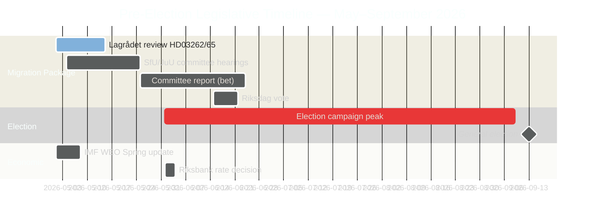

# Schwedens Vorwahlgesetzgebungssprint: Migration, Kriminalität und wirtschaftliche Zwangslage

**Autor**: James Pether Sörling
**Klassifizierung**: ÖFFENTLICH — DSGVO Art. 9(2)(e) öffentlich gemacht / 9(2)(g) erhebliches öffentliches Interesse
**Konfidenz**: HOCH [B2] | **Datum**: 2026-05-01

## 🎯 Fazit

Fünf Monate vor Schwedens Riksdag-Wahl im September 2026 hat die Tidöalliansen ihren ambitioniertesten Vorwahlgesetzgebungssprint gestartet: ein Vier-Gesetze-Migrationsmegapaket (HD03262–65), das die Abschaffung dauerhafter Aufenthaltsgenehmigungen, härtere Abschiebungsoperationen und erweiterte Abschiebebefugnisse vorschlägt — gleichzeitig mit der formalen Ratifizierung unterdurchschnittlichen Wirtschaftswachstums (BIP 1,2 % 2026) und parlamentarischen Rechenschaftsschlachten über eine 352-Milliarden-SEK-Kriminalwirtschaft. Die Wahlposition der Regierung ist in Migration und Sicherheit strukturell stark, aber in der Wirtschaftspolitik kritisch exponiert. Lagrådets EMRK-Prüfung zweier Schlüsselgesetze steht noch aus.

## 🧭 3 Entscheidungen, die dieser Bericht unterstützt

1. **Lagrådets Zeitplan überwachen**: Ein negatives Lagrådet-Gutachten zu HD03262/HD03265 würde entweder eine Verfassungsrevision oder eine politisch kostspielige Riksdag-Überstimmung erzwingen — die einzige wichtigste Nachrichtenlücke der Woche.
2. **S's wahlstrategische Gegenstrategie verfolgen**: S's koordinierte Einreichung von 16 Anträgen bestätigt Sitzungsende-Maximalismus; die Herausforderung bei Umweltgenehmigungen (HD024124-Anker) ist ihr stärkstes sachliches Argument. Die Überwachung der Ausschussanhörungsergebnisse bei MJU und NU definiert S's Glaubwürdigkeit bei Governance-Reformen.
3. **IMF-Wirtschaftsdaten-Jahrgang bewerten**: HC01FiU20 ratifiziert unterdurchschnittliches Wachstum (1,2 % 2026, IWF WEO Apr. 2026); die Opposition wird ihren Wirtschaftswahlkampf an dieser Baseline verankern. Aktuelle IWF-IFS-monatliche KPI-Daten (PCPI_IX SWE) und Riksbankens MFS_IR-Zinspfad sind vorausschauende Nachrichtentrigger.

## 60-Sekunden-Lektüre

- **Migrationspaket (HD03262–65)**: Vier gleichzeitige Gesetzentwürfe gegen Schwedens Migrationsarchitektur — der restriktivste Vorschlag seit den temporären Beschränkungen von 2016. Die Abschaffung dauerhafter Aufenthaltsgenehmigungen ist der strukturelle Anker; Abschiebungs-, Abschiebe- und Charaktergesetze sind die Vollstreckungsarme. Lagrådet ausstehendes Gutachten zu zwei Gesetzentwürfen.
- **Kriminalwirtschaft-Rechenschaft (HD10451, HD10458)**: ESO-dokumentierter 352-Mrd.-SEK-Kriminalsektor (5,5 % des BIP, 23.000 unternehmensverbundene Strukturen) tritt in die formale Riksdag-Debatte ein. Strömmers Versprechen „in 4 Jahren ausrotten" hat jetzt eine messbare Baseline und eine falsifizierbare Uhr.
- **Wirtschaftliche Zwangslage ratifiziert (HC01FiU20)**: Der Riksdag genehmigte formell unterdurchschnittliches BIP-Wachstum — die Regierung kann keinen wirtschaftlichen Erfolg beanspruchen. IWF WEO Apr. 2026 setzt die Baseline; der US-Zollschock bietet Deckung, neutralisiert jedoch nicht die Angriffslinien der Opposition.
- **Verteidigungskonsens (HD03254)**: Militärisches Kooperationsrahmenwerk (NORDEFCO, UK ELSA, US DCA) wird mit parteiübergreifendem Konsens verabschiedet — 297/28 bei früheren vergleichbaren Abstimmungen. Stärkt strukturell die NATO-Integration.
- **Oppositionsmaximalismus (S-Antragscluster)**: 16 gleichzeitige Ausschussanträge in 6 Ausschüssen signalisieren S's wahljahrbedingte Gesetzgebungssättigungsstrategie. Umweltgenehmigungen (HD024124-Cluster) sind die inhaltlich hochwertigste Herausforderung.

## Führender vorausschauender Auslöser

**Lagrådets Gutachten zu HD03265 (Ausweitung der Inhaftierung)** — erwartetes Fenster: 5.–12. Mai 2026. Ein negatives Gutachten löst EMRK-Konformitätsrevisionspflichten aus und verursacht maximale politische Kosten für die Regierung unmittelbar vor den Höhepunkten des Wahlkampfs.

<!-- source-sha: 0662dfda88b9d02453368e18ec4258559dd23f48 -->
