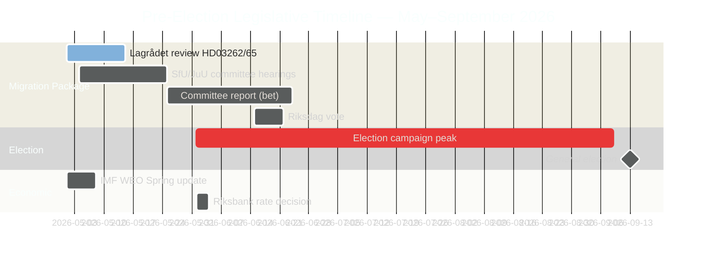

# El sprint legislativo pre-electoral de Suecia: Migración, crimen y aprieto económico

**Autor**: James Pether Sörling
**Clasificación**: PÚBLICO — RGPD art. 9(2)(e) hecho público / 9(2)(g) interés público sustancial
**Confianza**: ALTA [B2] | **Fecha**: 2026-05-01

## 🎯 Conclusión

Cinco meses antes de las elecciones suecas al Riksdag de septiembre de 2026, la Tidöalliansen ha lanzado su sprint legislativo pre-electoral más ambicioso: un mega-paquete migratorio de cuatro leyes (HD03262–65) que propone abolir los permisos de residencia permanente, endurecer las operaciones de deportación y ampliar la autoridad de detención — simultáneamente con la ratificación formal por el Riksdag del crecimiento económico por debajo de tendencia (PIB 1,2 % en 2026) y las batallas parlamentarias de rendición de cuentas en torno a una economía criminal de 352 miles de millones de SEK. La posición electoral del gobierno es estructuralmente sólida en migración y seguridad, pero críticamente expuesta en materia de gobernanza económica. La revisión CEDH del Lagrådet sobre dos proyectos de ley clave permanece pendiente.

## 🧭 3 decisiones que respalda este informe

1. **Vigilar el calendario del Lagrådet**: Un dictamen negativo del Lagrådet sobre HD03262/HD03265 forzaría una revisión constitucional o una costosa anulación parlamentaria — la brecha de inteligencia más importante de la semana.
2. **Seguir la contra-estrategia electoral del S**: La presentación coordinada de 16 mociones por el S confirma el maximalismo de final de sesión; el desafío sobre los permisos medioambientales (ancla HD024124) es su argumento sustantivo más sólido. El seguimiento de los resultados de las audiencias de los comités en MJU y NU define la credibilidad electoral del S en las reformas de gobernanza.
3. **Evaluar el año de datos económicos del FMI**: HC01FiU20 ratifica el crecimiento por debajo de tendencia (1,2 % en 2026, FMI WEO abr. 2026); la oposición anclará su campaña económica a esta línea base. Los datos mensuales recientes del IPC IFS del FMI (PCPI_IX SWE) y la trayectoria de tasas MFS_IR del Riksbank son desencadenantes de inteligencia prospectiva.

## Lectura en 60 segundos

- **Paquete migratorio (HD03262–65)**: Cuatro proyectos de ley simultáneos contra la arquitectura migratoria sueca — la propuesta más restrictiva desde las restricciones temporales de 2016. La abolición de los permisos de residencia permanente es el ancla estructural; las leyes de deportación, detención y conducta son los brazos de aplicación. Lagrådet pendiente en dos proyectos.
- **Rendición de cuentas de la economía criminal (HD10451, HD10458)**: Sector criminal de 352.000 millones de SEK documentado por ESO (5,5 % del PIB, 23.000 estructuras vinculadas a empresas) entra en el debate formal del Riksdag. La promesa de Strömmer de «erradicar en 4 años» tiene ahora una línea base medible y un reloj falsificable.
- **Aprieto económico ratificado (HC01FiU20)**: El Riksdag aprobó formalmente el crecimiento del PIB por debajo de tendencia — el gobierno no puede reclamar éxito económico. El FMI WEO abr. 2026 fija la línea base; el choque arancelario estadounidense proporciona cobertura pero no neutralizará las líneas de ataque de la oposición.
- **Consenso en defensa (HD03254)**: El marco de cooperación militar (NORDEFCO, UK ELSA, US DCA) se aprueba con un consenso casi transversal — 297/28 en votaciones anteriores comparables. Refuerza estructuralmente la integración en la OTAN.
- **Maximalismo de la oposición (clúster de mociones S)**: 16 mociones de comité simultáneas en 6 comités señalan la estrategia de saturación legislativa del año electoral del S. Los permisos medioambientales (clúster HD024124) son el desafío sustantivo de mayor calidad.

## Desencadenante prospectivo principal

**Dictamen del Lagrådet sobre HD03265 (ampliación de la detención)** — ventana esperada: 5–12 de mayo de 2026. Un dictamen negativo desencadena requisitos de revisión de cumplimiento del CEDH y crea el máximo coste político para el gobierno inmediatamente antes de los picos de la campaña electoral.

<!-- source-sha: 0662dfda88b9d02453368e18ec4258559dd23f48 -->
