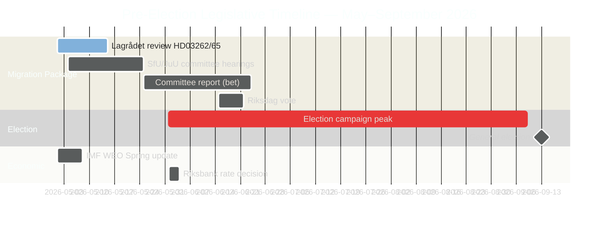

# Ruotsin vaaleja edeltävä lainsäädäntövauhti: Maahanmuutto, rikollisuus ja taloudellinen solmukohta

**Tekijä**: James Pether Sörling
**Luokitus**: JULKINEN — GDPR 9(2)(e) julkinen / 9(2)(g) merkittävä yleinen etu
**Luottamus**: KORKEA [B2] | **Päivämäärä**: 2026-05-01

## 🎯 Yhteenveto

Viisi kuukautta ennen Ruotsin syyskuun 2026 vaaleja Tidöalliansen on käynnistänyt kunnianhimoisimman vaaleja edeltävän lainsäädäntösprinttinsä: neljän lain maahanmuuttomegapaketin (HD03262–65), joka ehdottaa pysyvien oleskelulupien poistamista, karkotustoiminnan tiukentamista ja säilöönottovaltuuksien laajentamista — samaan aikaan kuin Riksdag on virallisesti ratifioinut trendialittavan talouskasvun (BKT 1,2 % 2026) ja parlamentaariset vastuutaistelut 352 miljardin kruunun rikostaloudesta. Hallituksen vaalipolitiittinen asema on rakenteellisesti vahva maahanmuuton ja turvallisuuden osalta, mutta kriittisesti alttiina talousohjauksessa. Lagrådets ECHR-tarkistus kahdesta keskeisestä lakiesityksestä on vielä kesken.

## 🧭 3 päätöstä, joita tämä tiivistelmä tukee

1. **Seuraa Lagrådets-aikataulua**: Kielteinen Lagrådets-lausunto HD03262/HD03265-lakiesityksistä pakottaisi joko perustuslain tarkistamiseen tai poliittisesti kalliiseen Riksdag-yliohitukseen — viikon tärkein tiedusteluaukko.
2. **Seuraa S:n vaalien vastastrategiaa**: S:n koordinoitu 16 liikkeestä koostuva jättäminen vahvistaa loppuistuntokauden maksimalismin; ympäristölupahaaste (HD024124-ankkuri) on heidän vahvin asiallinen argumenttinsa. Valiokunnan kuulemistulosten seuranta MJU:ssa ja NU:ssa määrittelee S:n vaalimaineen hallintouudistusten osalta.
3. **Arvioi IMF:n talousdata-vuosikerta**: HC01FiU20 ratifioi trendialittavan kasvun (1,2 % 2026, IMF WEO huhtikuu 2026); oppositio kiinnittää talouskampanjansa tähän perusviivaan. Tuore IMF IFS kuukausittainen KPI-data (PCPI_IX SWE) ja Riksbanken MFS_IR-korkorata ovat eteenpäin katsovia tiedustelulaukaisimia.

## 60 sekunnin lukeminen

- **Maahanmuuttopaketti (HD03262–65)**: Neljä samanaikaista lakiesitystä kohdistuu Ruotsin maahanmuuttorakenteeseen — rajoittavin ehdotus sitten vuoden 2016 väliaikaisrajoitusten. Pysyvien oleskelulupien poistaminen on rakenteellinen ankkuri; karkotus-, säilöönotto- ja luonteenpiirtotuslait ovat täytäntöönpanohaarat. Lagrådets odottaa kahta lakiesitystä.
- **Rikostaloudellinen vastuullisuus (HD10451, HD10458)**: ESO-dokumentoitu 352 mrd. SEK rikollinen sektori (5,5 % BKT:sta, 23 000 yrityskytkentäistä rakennetta) siirtyy viralliseen Riksdag-debattiin. Strömmerin lupaus "hävittää 4 vuodessa" on nyt mitattava lähtötaso ja falsifioituva kello.
- **Taloudellinen solmukohta ratifioitu (HC01FiU20)**: Riksdag hyväksyi virallisesti trendialittavan BKT-kasvun — hallitus ei voi väittää saavuttaneensa taloudellista menestystä. IMF WEO huhtikuu 2026 asettaa lähtötason; Yhdysvaltain tullishokki tarjoaa suojan mutta ei neutralisoi opposition hyökkäyslinjoja.
- **Puolustuskonsensus (HD03254)**: Sotilaallinen yhteistyökehys (NORDEFCO, UK ELSA, US DCA) läpäisee lähes puolueenvälisellä yksimielisyydellä — 297/28 aiemmissa vertailukelpoisissa äänestyksissä. Vahvistaa rakenteellisesti NATO-integraatiota.
- **Opposition maksimalismi (S-motioniklusteri)**: 16 samanaikaista valiokuntamotiota 6 valiokunnassa merkitsee S:n vaalivuoden lainsäädäntökyllästymisstrategiaa. Ympäristölupa (HD024124-klusteri) on laadukkain asiallinen haaste.

## Johtava eteenpäin katsova laukaisin

**Lagrådets yttrande HD03265:stä (säilöönoton laajentaminen)** — odotettu ikkuna: 5.–12. toukokuuta 2026. Kielteinen lausunto käynnistää ECHR-vaatimustenmukaisuustarkistusvaatimukset ja luo maksimaalisen poliittisen kustannuksen hallitukselle juuri ennen vaalikampanjan huippua.

<!-- source-sha: 0662dfda88b9d02453368e18ec4258559dd23f48 -->
