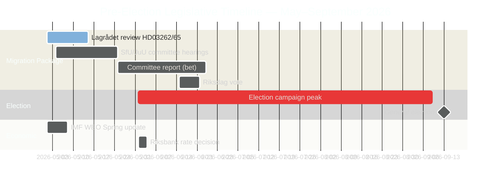

# Le sprint législatif pré-électoral suédois : Migration, criminalité et contrainte économique

**Auteur** : James Pether Sörling
**Classification** : PUBLIC — RGPD art. 9(2)(e) rendu public / 9(2)(g) intérêt public substantiel
**Confiance** : ÉLEVÉE [B2] | **Date** : 2026-05-01

## 🎯 Conclusion

Cinq mois avant les élections suédoises au Riksdag de septembre 2026, la Tidöalliansen a lancé son sprint législatif pré-électoral le plus ambitieux : un méga-paquet migratoire de quatre projets de loi (HD03262–65) proposant d'abolir les permis de résidence permanents, de durcir les opérations d'expulsion et d'étendre les pouvoirs de détention — en parallèle avec la ratification formelle par le Riksdag d'une croissance économique sous tendance (PIB 1,2 % en 2026) et des batailles parlementaires de responsabilité autour d'une économie criminelle de 352 milliards de SEK. La position électorale du gouvernement est structurellement forte sur la migration et la sécurité, mais critiquement exposée sur la gouvernance économique. L'examen CEDH de deux projets de loi clés par le Lagrådet reste en suspens.

## 🧭 3 décisions que ce rapport soutient

1. **Surveiller le calendrier du Lagrådet** : Un avis négatif du Lagrådet sur HD03262/HD03265 forcerait soit une révision constitutionnelle, soit un rejet politique coûteux du Riksdag — la lacune de renseignement la plus importante de la semaine.
2. **Suivre la contre-stratégie électorale du S** : Le dépôt coordonné de 16 motions par le S confirme le maximalisme de fin de session ; le défi sur les permis environnementaux (ancre HD024124) est leur argument substantiel le plus fort. Le suivi des résultats des auditions des commissions à MJU et NU définit la crédibilité électorale du S sur les réformes de gouvernance.
3. **Évaluer le millésime des données économiques du FMI** : HC01FiU20 ratifie une croissance sous tendance (1,2 % en 2026, FMI WEO avr. 2026) ; l'opposition ancrera sa campagne économique à cette ligne de base. Les données mensuelles récentes de l'IPC IFS du FMI (PCPI_IX SWE) et la trajectoire des taux MFS_IR de la Riksbank sont des déclencheurs de renseignement prospectifs.

## Lecture en 60 secondes

- **Paquet migratoire (HD03262–65)** : Quatre projets de loi simultanés ciblant l'architecture migratoire suédoise — la proposition la plus restrictive depuis les restrictions temporaires de 2016. L'abolition des permis de résidence permanents est l'ancre structurelle ; les lois sur l'expulsion, la détention et le comportement sont les bras d'exécution. Lagrådet en attente sur deux projets.
- **Responsabilité de l'économie criminelle (HD10451, HD10458)** : Le secteur criminel de 352 Mrd. SEK documenté par l'ESO (5,5 % du PIB, 23 000 structures liées aux entreprises) entre dans le débat formel du Riksdag. La promesse de Strömmer « d'éradiquer en 4 ans » dispose désormais d'une base de référence mesurable et d'une horloge falsifiable.
- **Contrainte économique ratifiée (HC01FiU20)** : Le Riksdag a approuvé formellement une croissance du PIB sous tendance — le gouvernement ne peut pas prétendre à un succès économique. Le FMI WEO avr. 2026 fixe la base ; le choc tarifaire américain offre une couverture mais ne neutralisera pas les lignes d'attaque de l'opposition.
- **Consensus sur la défense (HD03254)** : Le cadre de coopération militaire (NORDEFCO, UK ELSA, US DCA) passe avec un consensus presque transpartisan — 297/28 lors de votes comparables précédents. Renforce structurellement l'intégration OTAN.
- **Maximalisme de l'opposition (grappe de motions S)** : 16 motions simultanées en commission dans 6 commissions signalent la stratégie de saturation législative de l'année électorale du S. Les permis environnementaux (grappe HD024124) sont le défi substantiel de la plus haute qualité.

## Déclencheur prospectif principal

**Avis du Lagrådet sur HD03265 (extension de la détention)** — fenêtre attendue : 5–12 mai 2026. Un avis négatif déclenche des exigences de révision de conformité CEDH et crée un coût politique maximal pour le gouvernement immédiatement avant les pics de la campagne électorale.

<!-- source-sha: 0662dfda88b9d02453368e18ec4258559dd23f48 -->
