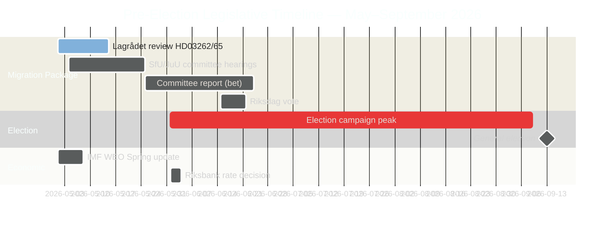

‏# ספרינט החקיקה הטרום-בחירותי בשוודיה: הגירה, פשע ולחץ כלכלי

‏**מחבר**: James Pether Sörling
‏**סיווג**: ציבורי — GDPR סעיף 9(2)(ה) פורסם לציבור / 9(2)(ז) אינטרס ציבורי מהותי
‏**רמת ביטחון**: גבוהה [B2] | **תאריך**: 2026-05-01

‏## 🎯 תמצית

‏חמישה חודשים לפני בחירות הריקסדאג השוודי בספטמבר 2026, השיקה Tidöalliansen את הספרינט החקיקתי הטרום-בחירותי השאפתני ביותר שלה: חבילת הגירה ענקית של ארבעה חוקים (HD03262–65) המציעה לבטל רישיונות שהייה קבועים, להקשיח פעולות גירוש ולהרחיב סמכויות מעצר — במקביל לאישור הרשמי של הריקסדאג לצמיחה כלכלית מתחת למגמה (תמ"ג 1.2% ב-2026) ולמאבקי אחריות פרלמנטריים סביב כלכלה פלילית של 352 מיליארד כתר שוודי. עמדתה הבחירותית של הממשלה חזקה מבחינה מבנית בנושאי הגירה וביטחון, אך חשופה בצורה קריטית בנושא הממשל הכלכלי. בחינת ה-ECHR של Lagrådet לשני הצעות חוק מרכזיות עדיין ממתינה.

‏## 🧭 3 החלטות שדוח זה תומך בהן

‏1. **מעקב אחר לוח הזמנים של Lagrådet**: חוות דעת שלילית של Lagrådet על HD03262/HD03265 תכריח לבצע שינוי חוקתי או פסיחה פרלמנטרית יקרה פוליטית — פער המודיעין המשמעותי ביותר של השבוע.
‏2. **מעקב אחר אסטרטגיית הנגד הבחירותית של S**: הגשת 16 הצעות מתואמת על ידי S מאשרת מקסימליזם של סוף המושב; האתגר על רישיונות סביבתיים (עוגן HD024124) הוא הטיעון המהותי החזק ביותר שלהם. מעקב אחר תוצאות שימועי הוועדות ב-MJU וב-NU מגדיר את אמינות S הבחירותית ברפורמות הממשל.
‏3. **הערכת וינטאג' הנתונים הכלכליים של קרן המטבע הבינלאומית**: HC01FiU20 מאשר צמיחה מתחת למגמה (1.2% ב-2026, IMF WEO אפריל 2026); האופוזיציה תעגן את קמפיין הכלכלה שלה לקו הבסיס הזה. נתוני מדד המחירים לצרכן החודשיים של IMF IFS (PCPI_IX SWE) ומסלול ריבית MFS_IR של הריקסבנק הם טריגרי מודיעין עתידיים.

‏## קריאה של 60 שניות

‏- **חבילת ההגירה (HD03262–65)**: ארבע הצעות חוק מקבילות המכוונות לארכיטקטורת ההגירה של שוודיה — ההצעה המגבילה ביותר מאז המגבלות הזמניות של 2016. ביטול רישיונות שהייה קבועים הוא העוגן המבני; חוקי גירוש, מעצר ואופי הם זרועות האכיפה. Lagrådet ממתין על שתי הצעות חוק.
‏- **אחריות כלכלית פלילית (HD10451, HD10458)**: ענף פלילי של 352 מיליארד כתר שוודי הרשום על ידי ESO (5.5% מהתמ"ג, 23,000 מבנים קשורים לחברות) נכנס לדיון רשמי בריקסדאג. הבטחתו של Strömmer "לכחד תוך 4 שנים" כוללת כעת קו בסיס מדיד ושעון שניתן להפריך.
‏- **לחץ כלכלי מאושר (HC01FiU20)**: הריקסדאג אישר רשמית צמיחת תמ"ג מתחת למגמה — הממשלה אינה יכולה לטעון להצלחה כלכלית. IMF WEO אפריל 2026 קובע את קו הבסיס; הלם המכסים האמריקאי מספק כיסוי אך לא יסתיר את קווי התקיפה של האופוזיציה.
‏- **קונצנזוס ביטחון (HD03254)**: מסגרת שיתוף הפעולה הצבאי (NORDEFCO, UK ELSA, US DCA) עוברת עם קונצנזוס כמעט חוצה מפלגות — 297/28 בהצבעות קודמות דומות. מחזקת מבנית את השילוב בנאט"ו.
‏- **מקסימליזם של האופוזיציה (מקבץ הצעות S)**: 16 הצעות ועדה מקבילות ב-6 ועדות מאותתות על אסטרטגיית רוויה חקיקתית לשנת הבחירות של S. רישיונות סביבתיים (מקבץ HD024124) הם האתגר המהותי האיכותי ביותר.

‏## טריגר עתידי מוביל

‏**חוות דעת Lagrådet על HD03265 (הרחבת המעצר)** — חלון צפוי: 5–12 במאי 2026. חוות דעת שלילית מפעילה דרישות תיקון ציות ל-ECHR ויוצרת עלות פוליטית מקסימלית לממשלה מיד לפני שיאי קמפיין הבחירות.

<!-- source-sha: 0662dfda88b9d02453368e18ec4258559dd23f48 -->
