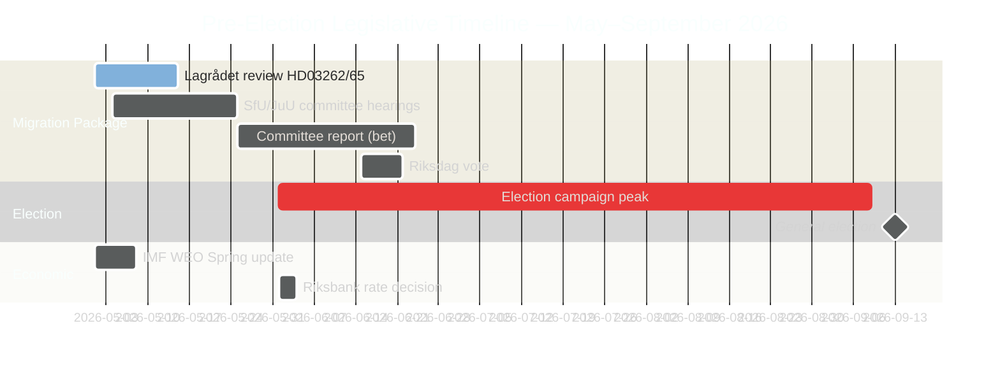

# スウェーデンの選挙前立法スプリント：移民、犯罪、経済的制約

**著者**: James Pether Sörling
**分類**: 公開 — GDPR第9条(2)(e)公開済み / 第9条(2)(g)実質的な公益
**信頼度**: 高 [B2] | **日付**: 2026-05-01

## 🎯 結論

2026年9月のスウェーデン・リクスダーグ選挙まで5か月、Tidöalliansen政府は最も野心的な選挙前立法スプリントを開始した。4法案からなる移民メガパッケージ（HD03262–65）は永住許可証の廃止、国外退去強化、収容権限の拡大を提案し、リクスダーグが正式に低成長トレンド（GDP 1.2%、2026年）を承認したこと、352億SEKの犯罪経済をめぐる議会的説明責任の争いとも同時進行している。政府の選挙的立場は移民・安全保障において構造的に強いが、経済ガバナンスで決定的な脆弱性を抱える。2つの主要法案についてのLagrådets（立法評議会）のECHR審査は未決のまま。

## 🧭 この報告が支援する3つの意思決定

1. **Lagrådetsのタイムラインを監視する**: HD03262/HD03265に対するLagrådetsの否定的な意見は、憲法改正か政治的コストの高いリクスダーグ否決のいずれかを強いる——今週最も重要な情報ギャップ。
2. **Sの選挙的反撃戦略を追跡する**: S党による16の動議の調整的提出は会期末最大主義を確認する。環境許可への挑戦（HD024124アンカー）が最も強力な実質的論拠。MJUおよびNUでの委員会審議結果の監視がSのガバナンス改革における選挙的信頼性を定義する。
3. **IMF経済データのヴィンテージを評価する**: HC01FiU20はトレンド以下の成長（1.2%、2026年、IMF WEO 2026年4月）を批准。野党はこの基準線に経済選挙運動を据える。IMF IFS月次CPI（PCPI_IX SWE）とリクスバンクのMFS_IR政策金利軌道は先見的な情報トリガー。

## 60秒要約

- **移民パッケージ（HD03262–65）**: スウェーデンの移民構造を対象とした4つの同時法案——2016年の一時規制以来最も厳しい提案。永住許可証の廃止が構造的な要となり、退去強制・収容・品性法が執行の腕となる。Lagrådets審査が2法案において保留中。
- **犯罪経済の説明責任（HD10451、HD10458）**: ESO文書化の352億SEK犯罪セクター（GDP比5.5%、2万3,000の企業関連構造）がリクスダーグの正式な議論に入る。Strömmersの「4年で根絶」の公約は今や測定可能な基準線と反証可能な時計を持つ。
- **経済的制約の承認（HC01FiU20）**: リクスダーグはトレンド以下のGDP成長を正式に承認——政府は経済的成功を主張できない。IMF WEO 2026年4月が基準を設定、米国の関税ショックが口実を提供するが野党の攻撃線を無力化しない。
- **防衛コンセンサス（HD03254）**: 軍事協力枠組み（NORDEFCO、UK ELSA、US DCA）がほぼ全党一致で可決——過去の同等の採決では297対28。NATOへの統合を構造的に強化。
- **野党の最大主義（S動議クラスター）**: 6委員会にまたがる16の同時委員会動議はSの選挙年における立法飽和戦略を示す。環境許可（HD024124クラスター）が最も質の高い実質的課題。

## 主要な前方展望トリガー

**HD03265（収容拡大）に関するLagrådetsの意見** — 予想窓：2026年5月5日〜12日。否定的意見はECHR適合性改正要件を発動し、選挙運動のピーク直前に政府に最大の政治的コストをもたらす。

<!-- source-sha: 0662dfda88b9d02453368e18ec4258559dd23f48 -->
