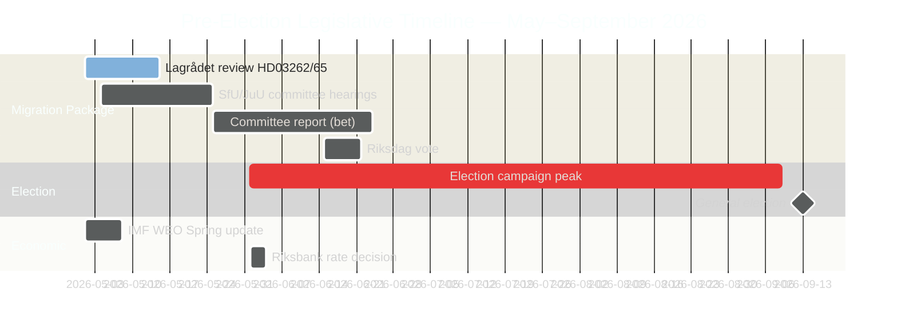

# 스웨덴의 선거 전 입법 스프린트: 이민, 범죄, 경제적 압박

**저자**: James Pether Sörling
**분류**: 공개 — GDPR 제9조(2)(e) 공개 / 제9조(2)(g) 실질적인 공익
**신뢰도**: 높음 [B2] | **날짜**: 2026-05-01

## 🎯 결론

2026년 9월 스웨덴 릭스다그 선거를 5개월 앞두고, Tidöalliansen 정부는 가장 야심찬 선거 전 입법 스프린트를 시작했다. 4개 법안으로 구성된 이민 메가패키지(HD03262–65)는 영주 허가 폐지, 추방 작전 강화, 구금 권한 확대를 제안하며, 릭스다그의 공식적인 저성장 추세 비준(GDP 1.2%, 2026년)과 3,520억 SEK 규모 범죄 경제에 대한 의회적 책임 투쟁과 동시에 진행되고 있다. 정부의 선거적 입지는 이민·안보 면에서 구조적으로 강하지만, 경제 거버넌스에서는 치명적으로 취약하다. 주요 법안 2건에 대한 Lagrådet의 ECHR 검토가 아직 미결 상태다.

## 🧭 이 보고서가 지원하는 3가지 결정

1. **Lagrådet 일정 모니터링**: HD03262/HD03265에 대한 Lagrådet의 부정적 의견은 헌법 개정이나 정치적으로 값비싼 릭스다그 번복을 강요할 것이다 — 이번 주 가장 중요한 정보 공백.
2. **S당의 선거적 반전 전략 추적**: S당의 16개 동의 조율 제출은 회기말 최대주의를 확인한다. 환경 허가 도전(HD024124 앵커)이 가장 강력한 실질적 논거. MJU와 NU에서 위원회 청문회 결과를 모니터링하는 것이 거버넌스 개혁에서 S당의 선거 신뢰성을 정의한다.
3. **IMF 경제 데이터 빈티지 평가**: HC01FiU20은 추세 이하 성장(1.2%, 2026, IMF WEO 2026년 4월)을 비준한다. 야당은 경제 선거 캠페인을 이 기준선에 고정할 것이다. 최신 IMF IFS 월별 CPI 데이터(PCPI_IX SWE)와 릭스방크 MFS_IR 정책금리 궤도가 전망적 정보 트리거다.

## 60초 요약

- **이민 패키지(HD03262–65)**: 스웨덴 이민 구조를 겨냥한 4개의 동시 법안 — 2016년 임시 제한 이래 가장 제한적인 제안. 영주 허가 폐지가 구조적 앵커이며, 추방·구금·품성 법안이 집행의 팔. Lagrådet가 2개 법안 심사 중.
- **범죄 경제 책임(HD10451, HD10458)**: ESO가 문서화한 3,520억 SEK 범죄 부문(GDP의 5.5%, 2만 3,000개 기업 연관 구조)이 공식 릭스다그 토론에 진입. Strömmer의 "4년 내 척결" 약속은 이제 측정 가능한 기준선과 반증 가능한 시계를 가진다.
- **경제적 압박 비준(HC01FiU20)**: 릭스다그는 공식적으로 추세 이하 GDP 성장을 승인 — 정부는 경제적 성공을 주장할 수 없다. IMF WEO 2026년 4월이 기준선을 설정하며, 미국 관세 충격이 덮개를 제공하지만 야당의 공격선을 무력화하지는 않는다.
- **방위 합의(HD03254)**: 군사 협력 프레임워크(NORDEFCO, UK ELSA, US DCA)가 사실상 초당적 합의로 통과 — 이전 유사 표결에서 297대 28. 나토 통합을 구조적으로 강화.
- **야당 최대주의(S 동의 클러스터)**: 6개 위원회에 걸친 16개 동시 위원회 동의가 S당의 선거 연도 입법 포화 전략을 신호한다. 환경 허가(HD024124 클러스터)가 가장 질 높은 실질적 도전.

## 선도적 전망 트리거

**HD03265(구금 확대)에 관한 Lagrådet 의견** — 예상 창구: 2026년 5월 5일~12일. 부정적 의견은 ECHR 준수 개정 요건을 발동시키고 선거 운동 정점 직전에 정부에 최대 정치적 비용을 창출한다.

<!-- source-sha: 0662dfda88b9d02453368e18ec4258559dd23f48 -->
