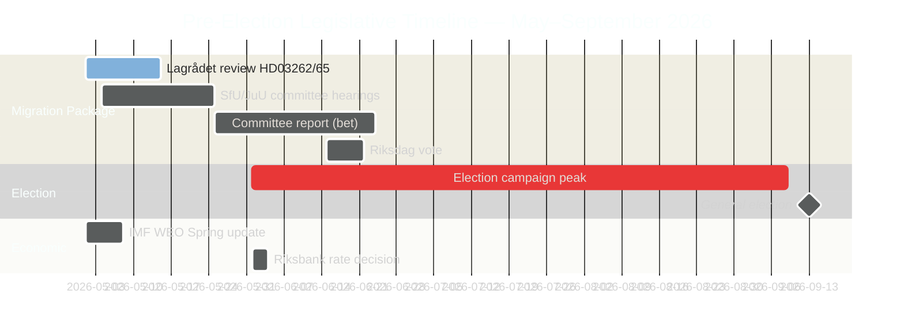

# Zweden's pre-electorale wetgevingssprint: Migratie, criminaliteit en economische knel

**Auteur**: James Pether Sörling
**Classificatie**: OPENBAAR — AVG art. 9(2)(e) openbaar gemaakt / 9(2)(g) aanzienlijk algemeen belang
**Vertrouwen**: HOOG [B2] | **Datum**: 2026-05-01

## 🎯 Conclusie

Vijf maanden voor de Zweedse Riksdag-verkiezingen van september 2026 heeft de Tidöalliansen zijn meest ambitieuze pre-electorale wetgevingssprint gestart: een migratiemegapakket van vier wetten (HD03262–65) dat de afschaffing van permanente verblijfsvergunningen, hardere deportatieoperaties en uitgebreide detentiebevoegdheden voorstelt — gelijktijdig met de formele ratificatie door de Riksdag van ondertrends economische groei (bbp 1,2% in 2026) en parlementaire verantwoordingsgeslachten over een 352 miljard SEK-criminele economie. De electorale positie van de regering is structureel sterk op migratie en veiligheid, maar kritisch blootgesteld op economisch bestuur. De EVRM-toetsing van het Lagrådet van twee sleutelwetten staat nog open.

## 🧭 3 beslissingen die dit rapport ondersteunt

1. **Tijdlijn Lagrådet bewaken**: Een negatief advies van het Lagrådet over HD03262/HD03265 zou een grondwetsherziening of een politiek kostbare Riksdag-overstemmig afdwingen — de belangrijkste inlichtingenlacune van de week.
2. **S's electorale tegenstrategie volgen**: De gecoördineerde indiening van 16 moties door S bevestigt einde-sessie-maximalisme; de uitdaging op milieuvergunningen (HD024124-anker) is hun sterkste inhoudelijke argument. Monitoring van uitkomsten van commissieverhoren bij MJU en NU definieert de electorale geloofwaardigheid van S op bestuursreformen.
3. **Jaargang IMF-economische data beoordelen**: HC01FiU20 ratificeert ondertrends groei (1,2% 2026, IMF WEO apr. 2026); de oppositie zal haar economische campagne aan deze basislijn verankeren. Recente maandelijkse IMF IFS CPI-data (PCPI_IX SWE) en het MFS_IR-rentetraject van Riksbank zijn vooruitblikkende inlichtingenactiveerders.

## 60-secondenlectuur

- **Migratiepakket (HD03262–65)**: Vier gelijktijdige wetsvoorstellen gericht op Zweden's migratiearchitectuur — het meest restrictieve voorstel sinds de tijdelijke beperkingen van 2016. De afschaffing van permanente verblijfsvergunningen is het structurele anker; deportatie-, detentie- en gedragswetten zijn de uitvoeringsarmen. Lagrådet in afwachting van twee wetsvoorstellen.
- **Verantwoording criminele economie (HD10451, HD10458)**: ESO-gedocumenteerde 352 mrd. SEK criminele sector (5,5% bbp, 23.000 bedrijfsgerelateerde structuren) treedt in formeel Riksdag-debat. Strömmers belofte 'uitroeien in 4 jaar' heeft nu een meetbare basislijn en een falsificeerbare klok.
- **Economische knel geratificeerd (HC01FiU20)**: De Riksdag keurde formeel ondertrends bbp-groei goed — de regering kan geen economisch succes claimen. IMF WEO apr. 2026 stelt de basislijn; de Amerikaanse tariefschok biedt dekking maar neutraliseert de aanvalslijnen van de oppositie niet.
- **Defensieconsensus (HD03254)**: Militair samenwerkingskader (NORDEFCO, UK ELSA, US DCA) wordt aangenomen met bijna transpartijse consensus — 297/28 bij eerdere vergelijkbare stemmingen. Versterkt structureel de NAVO-integratie.
- **Oppositionsmaximalisme (S-motiecluster)**: 16 gelijktijdige commissiemoties in 6 commissies signaleren S's verkiezingsjaar wetgevingsverzadigingsstrategie. Milieuvergunningen (HD024124-cluster) zijn de inhoudelijk hoogwaardige uitdaging.

## Toonaangevende vooruitblikkende activeerder

**Advies Lagrådet over HD03265 (uitbreiding detentie)** — verwacht venster: 5–12 mei 2026. Een negatief advies activeert EVRM-nalevingsrevisievereisten en creëert maximale politieke kosten voor de regering onmiddellijk vóór de hoogtepunten van de verkiezingscampagne.

<!-- source-sha: 0662dfda88b9d02453368e18ec4258559dd23f48 -->
