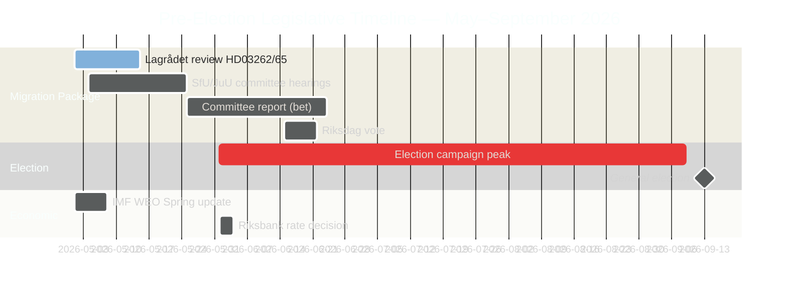

# Sveriges förvalslagstiftningssprint: Migration, brottslighet och ekonomisk klemma

**Författare**: James Pether Sörling
**Klassificering**: OFFENTLIG — GDPR Art. 9(2)(e) offentliggjord / 9(2)(g) väsentligt allmänintresse
**Konfidens**: HÖG [B2] | **Datum**: 2026-05-01

## 🎯 Slutsats

Fem månader före Sveriges riksdagsval i september 2026 har Tidöalliansen inlett sin mest ambitiösa förvalslagstiftningssprint: ett fyra-lagsmigrationspaket (HD03262–65) som föreslår att permanenta uppehållstillstånd avskaffas, utvisningsoperationer hårdnar och förvarsbefogenheter utökas — parallellt med riksdagens formella ratificering av undertrendsmässig ekonomisk tillväxt (BNP 1,2 % 2026) och parlamentariska ansvarsbataljer om en 352 miljarder kronor stor kriminalekonomi. Regeringens valpolitiska position är strukturellt stark i migrations- och säkerhetsfrågor, men kritiskt exponerad i ekonomisk styrning. Lagrådets ECHR-granskning av två centrala lagförslag återstår.

## 🧭 3 beslut som detta underlag stöder

1. **Bevaka Lagrådets tidslinje**: Ett negativt yttrande från Lagrådet om HD03262/HD03265 skulle tvinga fram antingen grundlagsrevision eller en politiskt kostsam riksdagsöverstyrning — den enskilt viktigaste underrättelsefrågan under veckan.
2. **Följ S:s valmässiga motstrategi**: S:s samordnade inlämning av 16 motioner bekräftar slutsessionsmaximalism; miljötillståndsutmaningen (HD024124-ankaret) är deras starkaste sakliga argument. Bevakning av utskottshearingsutfall vid MJU och NU definierar S:s valförtroende på styrningsfrågor.
3. **Bedöm IMF:s ekonomidatavintage**: HC01FiU20 ratificerar undertrendstillväxt (1,2 % 2026, IMF WEO apr 2026); oppositionen kommer att förankra sin ekonomiska valkampanj vid denna baslinje. Aktuell IMF IFS månads-KPI-data (PCPI_IX SWE) och Riksbankens MFS_IR styrräntebana är framåtblickande underrättelsetriggrar.

## 60-sekunders läsning

- **Migrationspaket (HD03262–65)**: Fyra simultana lagförslag riktar sig mot Sveriges migrationsarkitektur — det mest restriktiva förslaget sedan de temporära restriktionerna 2016. Avskaffandet av permanenta uppehållstillstånd är strukturellt ankare; utvisnings-, förvars- och vandelsslagarna är verkställighetsarmar. Lagrådet avvaktar på två förslag.
- **Ansvarsutkrävande kriminalekonomi (HD10451, HD10458)**: ESO-dokumenterad 352 miljarder kronor stor kriminell sektor (5,5 % av BNP, 23 000 bolagsanknutna strukturer) inträder i formell riksdagsdebatt.Strömmers "utrota på 4 år"-löfte har nu en mätbar baslinje och en falsifierbar klocka.
- **Ekonomisk klemma ratificerad (HC01FiU20)**: Riksdagen godkände formellt undertrendsmässig BNP-tillväxt — regeringen kan inte göra anspråk på ekonomisk framgång. IMF WEO apr 2026 sätter baslinjen; den amerikanska tullavancen ger täckning men neutraliserar inte oppositionens attacklinjer.
- **Försvarskonsensus (HD03254)**: Militärt samarbetsramverk (NORDEFCO, UK ELSA, US DCA) passerar med nästan tvärpolitisk enighet — 297/28 i tidigare jämförbara omröstningar. Stärker strukturellt NATO-integrationen.
- **Oppositionens maximalism (S-motionskluster)**: 16 simultana utskottsmotioner i 6 utskott signalerar S:s valårs lagstiftningsmettnadsstrategikens. Miljötillståndsfrågan (HD024124-klustret) är den högst kvalitativa sakliga utmaningen.

## Ledande framåtblickande trigger

**Lagrådets yttrande om HD03265 (utvidgad förvarsrätt)** — förväntat fönster: 5–12 maj 2026. Ett negativt yttrande utlöser krav på ECHR-efterlevnadsrevision och skapar maximal politisk kostnad för regeringen omedelbart inför valkampanjernas topp.

<!-- source-sha: 0662dfda88b9d02453368e18ec4258559dd23f48 -->
