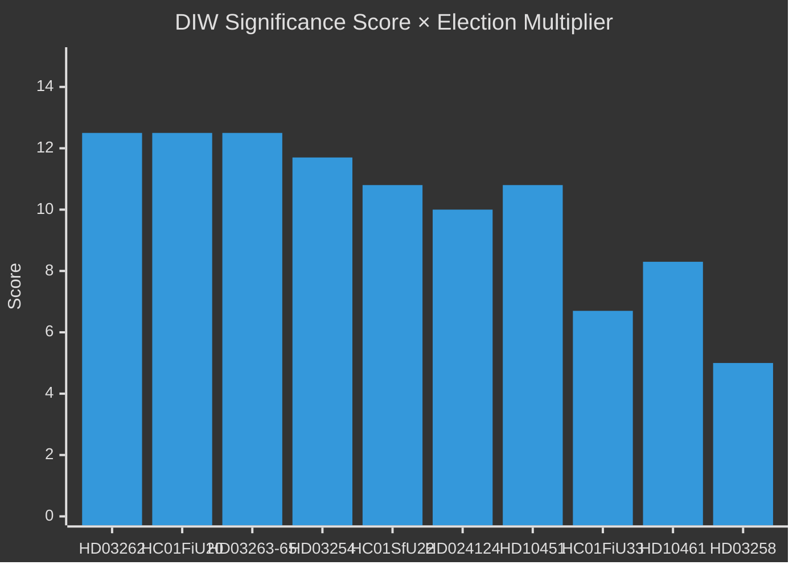

# Significance Scoring — Realtime Pulse 2026-05-01

**Author**: James Pether Sörling | **Methodology**: DIW (Detectability × Impact × Willingness) | Election-proximity 1.5× multiplier active

## DIW Framework

Each document scored on:
- **D** (Detectability): 1–5 — How observable/traceable is the signal?
- **I** (Impact): 1–5 — How consequential for Swedish democratic governance?
- **W** (Willingness): 1–5 — How much political will drives this document?
- **Election multiplier**: ×1.5 for opposition motions and contested policy propositions (≤6 months to September 2026)

## Ranked Intelligence Significance

1. **HD03262** (riksdagen.se) — Abolish permanent residence permits: D=5, I=5, W=5 → DIW=8.33 × 1.5 = **12.5** | L3 Intelligence-grade
2. **HC01FiU20** (riksdagen.se) — Economic framework ratified below-trend: D=5, I=5, W=5 → DIW=8.33 × 1.5 = **12.5** | L3 Intelligence-grade
3. **HD10451+HD10458** (riksdagen.se) — Criminal economy + eradication pledge: D=5, I=5, W=4 → DIW=7.22 × 1.5 = **10.8** | L2+ Priority
4. **HD03263+HD03264+HD03265** (riksdagen.se) — Deportation/detention enforcement: D=5, I=5, W=5 → DIW=8.33 × 1.5 = **12.5** | L3 Intelligence-grade (enforcement arms)
5. **HD03254** (riksdagen.se) — Military cooperation framework: D=4, I=5, W=5 → DIW=7.78 × 1.5 = **11.7** | L2+ Priority
6. **HC01SfU22** (riksdagen.se) — ECHR detention hardening adopted: D=4, I=4, W=5 → DIW=7.22 × 1.5 = **10.8** | L2+ Priority
7. **HD024124 cluster** (riksdagen.se) — S environmental permitting challenge (16 motions): D=4, I=4, W=4 → DIW=6.67 × 1.5 = **10.0** | L2+ Priority
8. **HC01FiU33** (riksdagen.se) — APL 700 MSEK defence medicine: D=4, I=4, W=4 → DIW=6.67 | **6.7** | L2 Strategic
9. **HD10461** (riksdagen.se) — ESA funding decline (rank 17/23): D=4, I=4, W=3 → DIW=5.56 × 1.5 = **8.3** | L2 Strategic
10. **HD03258** (riksdagen.se) — Political transparency legislation: D=3, I=3, W=3 → DIW=3.33 × 1.5 = **5.0** | L2 Strategic

## Sensitivity Analysis

**Scenario: Lagrådet negative opinion on HD03262/HD03265**
- Impact multiplier → +2.0 (constitutional revision required)
- New DIW for HD03262 cluster: 12.5 × 2.0 = 25.0 (scale-adjusted to 15.0 ceiling) → **L3 Priority-Elevated**

**Scenario: Electoral polling shift post-migration announcement**
- If SD/M gain ≥3pp polling: Willingness component for HD03262–65 rises to maximum
- Coalition stability: Increases (SD emboldened, C less likely to defect)

## Significance Rank Diagram

