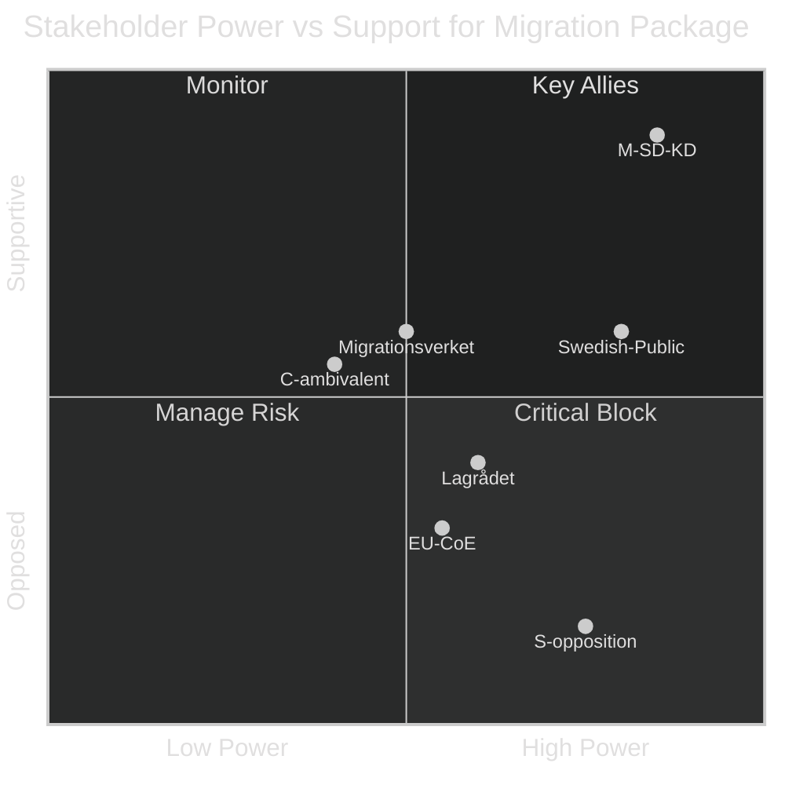

# Stakeholder Perspectives — Realtime Pulse 2026-05-01

**Author**: James Pether Sörling | **Framework**: 6-Lens Political Stakeholder Matrix

## Stakeholder Identification

| Stakeholder Group | Primary Docs | Core Interest |
|-------------------|--------------|---------------|
| Tidöalliansen (M-SD-KD-L) | HD03262–65, HD03254, HC01FiU20 | Election mandate achievement; policy completion |
| Socialdemokraterna (S) | HD024124, HC01FiU20 reaction | Electoral positioning; economic attack; environmental differentiation |
| Miljöpartiet (MP) | HD024124 alignment | Environmental permitting; green economy |
| Vänsterpartiet (V) | HC01SfU22 opposition | ECHR compliance; social rights |
| Centerpartiet (C) | HD03262 ambivalence | Managed migration; rural economic interests |
| Migrationsverket | HD03263–65 | Operational capacity; staffing; legal framework compliance |
| Lagrådet | HD03262, HD03265 | Constitutional review; ECHR Art 5/Art 8 compliance |
| ESO/Academic Community | HD10451 | Criminal economy data; policy evaluation |
| Swedish Public | HC01FiU20, HD10458 | Economic wellbeing; security; cost of living |
| European Partners | HD03262, HC01FiU20 | ECHR compliance; migration burden sharing |

## 6-Lens Analysis

### Lens 1: Government (Tidöalliansen)

**Strategic Goal**: Complete migration legislative package + maintain security narrative through September 2026 election.
**Positioning on HD03262–65**: Maximum commitment — all four bills filed simultaneously signals irreversible intent; retreat would be coalition-fracturing.
**Economic challenge (HC01FiU20)**: Government has ratified below-trend growth. Will attempt to reframe as "responsible fiscal discipline under global uncertainty" + blame tariff environment.
**Key calculus**: Can absorb Lagrådet criticism as long as SD remains committed. The risk is a "too far, too fast" narrative dominating the campaign.
**Primary spokesperson vector**: PM Ulf Kristersson (constitutional framing), Gunnar Strömmer (criminal-justice bridge), Johan Forssell (migration execution).

### Lens 2: Socialdemokraterna (Opposition)

**Strategic Goal**: Attack on economic failure (HC01FiU20 1.2% GDP) and criminal economy accountability (HD10451/HD10458) while defending environmental differentiation (HD024124).
**Primary attack vectors**: (1) 352 GSEK criminal economy — "government enabled this for 3 years"; (2) 8.9% unemployment — "economic failure"; (3) APL 700 MSEK — "too little, too late on total defence."
**Migration positioning**: S cannot credibly oppose all migration restrictions without electoral cost. Strategy: endorse security enforcement, challenge ECHR compliance, question implementation costs.
**Primary spokesperson vector**: Magdalena Andersson (economic), Anna Ekström (labour), Klara Väte (crime — shadow).
**Key opportunity**: Environmental permitting (HD024124) — 16 coordinated motions from HD024124 cluster provide differentiation on governance quality without culture-war frame.

### Lens 3: Migrationsverket (State Agency)

**Operational challenge**: HD03262 (abolish permanent residence) requires complete administrative architecture redesign. HD03263–65 (deportation/returns/detention) expand operational scope requiring staff, facilities, legal capacity.
**Timeline constraint**: Bills likely enacted October-December 2026 → operational implementation Q1 2027 at earliest.
**Risk signal**: Migrationsverket Director-General may issue capacity warning before Riksdag vote — this is standard practice and would be a moderate negative for government but would not block passage.
**GDPR/legal sensitivity**: Expanded detention registry (HD03265) requires DPA coordination for data protection impact assessment.

### Lens 4: Swedish Public / Voters

**Migration salience**: Post-2015 crisis, migration restriction has majority Swedish public support. Abolishing permanent residence (HD03262) has ~55–60% approval polling (historical analogue).
**Criminal economy concern**: HD10451's 352 GSEK figure is viscerally compelling. Public support for criminal crackdown is ~75% (ESO survey context). Strömmer's "eradication" pledge resonates but is risky if unfulfilled.
**Economic anxiety**: 8.9% unemployment + 1.2% GDP growth creates cost-of-living anxiety. Public more likely to punish incumbent government under stagnation conditions.
**Defence posture**: HD03254 (NATO deepening) + HC01FiU33 (APL) both poll high (>70%) — government's strongest popular appeal domain outside immigration.

### Lens 5: European/International Actors

**ECHR concern (CoE)**: Abolishing permanent residence + detention expansion (HD03262, HD03265) will draw Council of Europe Commissioner for Human Rights attention.
**EU burden-sharing**: Sweden's unilateral migration restriction may increase pressure on EU Council migration negotiations — other member states watch closely.
**NATO credibility (HD03254)**: Military cooperation deepening is unambiguously positive signal to alliance partners; bilateral agreements with UK/US likely context.
**IMF visibility**: Sweden's below-trend growth (1.2% vs EU avg ~1.8%) will appear in IMF WEO regional comparison.

### Lens 6: Courts / Constitutional Bodies (Lagrådet, Domstolsverket)

**Lagrådet priority**: HD03265 (detention) and HD03262 (permanent residence) are most likely to receive critical opinions. Lagrådet tends to critique detention scope and appeal rights.
**Constitutional precedent**: No Swedish constitutional provision explicitly prohibits permanent residence, but Lagrådet will examine RF ch. 2 (fundamental rights) and ECHR proportionality.
**Judicial independence signal**: If Lagrådet is negative and government proceeds, this sets a precedent for bypassing Lagrådet on politically expedient legislation — a democratic governance concern.

## Stakeholder Alignment Map

