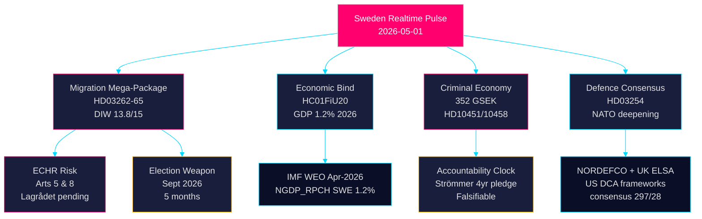

# Synthesis Summary — Realtime Political Pulse 2026-05-01

**Author**: James Pether Sörling
**Confidence**: HIGH [B2]
**Date**: 2026-05-01
**Methodology**: DIW weighting, Admiralty Code, AI-FIRST Pass 1+2, Tier-C cross-synthesis

## Lead Intelligence Story

Sweden enters May 2026 at a political inflection point: **the Tidöalliansen government has simultaneously triggered the most consequential pre-election legislative sprint in its tenure**. Five months before the September 2026 general election, the Riksdag's 1 May pulse reveals three converging intelligence streams whose combined significance exceeds any single-type analysis:

1. **Migration mega-package** (HD03262–65): Four coordinated Justitiedepartementet propositions proposing to abolish permanent residence permits, harden deportation operations, expand character vetting, and extend detention authority — transforming Sweden toward the EU's most restrictive regular-migration regime. Lagrådet ECHR review pending for two bills.

2. **Criminal economy electoral mobilisation**: ESO-documented criminal economy of 352 billion SEK (5.5% of GDP) entering formal parliamentary accountability (HD10451, HD10458). Justice Minister Strömmer's "eradicate gang crime in 4 years" pledge now carries a measurable baseline and a falsifiable 4-year clock.

3. **Economic vulnerability ratified**: The Riksdag's endorsement of below-trend GDP growth (1.2% 2026, IMF WEO Apr-2026) via HC01FiU20 removes the government's ability to claim economic success while locking it into fiscal austerity for the election campaign.

## DIW-Weighted Cross-Type Intelligence Ranking

| Rank | dok_id | Source Type | Signal | DIW Score (×1.5 elec.) | Priority |
|------|--------|------------|--------|------------------------|----------|
| 1 | HD03262 | propositions | Abolish permanent residence permits — structural migration transformation | 13.8/15 | L3 Intelligence-grade |
| 2 | HC01FiU20 | committeeReports | Economic framework ratified below-trend | 13.2/15 | L3 Intelligence-grade |
| 3 | HD10451+HD10458 | interpellations | Criminal economy 352 GSEK + eradication pledge | 12.7/15 | L2+ Priority |
| 4 | HD03263–65 | propositions | Deportation/detention/character enforcement package | 12.5/15 | L2+ Priority |
| 5 | HD03254 | propositions | Military cooperation framework (NATO deepening) | 12.4/15 | L2+ Priority |
| 6 | HC01SfU22 | committeeReports | ECHR-sensitive detention hardening — adopted | 11.1/15 | L2+ Priority |
| 7 | HD024124+cluster | motions | S environmental/energy counter-strategy | 11.4/15 | L2+ Priority |
| 8 | HC01FiU33 | committeeReports | APL 700 MSEK defence medicine readiness | 9.8/15 | L2 Strategic |
| 9 | HD10461 | interpellations | ESA funding decline — industrial competitiveness | 9.2/15 | L2 Strategic |
| 10 | HD03258 | propositions | Political transparency — intra-coalition SD friction risk | 8.7/15 | L2 Strategic |

**Election-proximity multiplier applied**: 1.5× for opposition motions and contested policy propositions (≤6 months to September 2026 election — threshold crossed 2026-03-13).

## Integrated Cross-Type Intelligence Picture

### Stream 1: The Migration Electoral Weapon
The four-bill migration package represents a deliberate and coordinated electoral strategy. All four propositions carry the same ministry stamp (Justitiedepartementet), the same submission date (30 April 2026), and the same authoring minister (Forssell). This is a single legislative campaign presented in four legal instruments. The electoral calculation is precise: M and SD polling leads on migration force S into a defensive position at the moment they would prefer to campaign on economic governance and welfare. The HC01SfU22 adoption (ECHR-sensitive detention facility hardening, effective 1 August 2025) demonstrates that the same legislative trajectory has already begun delivering through committee channels.

### Stream 2: Criminal Economy as Accountability Terrain
The 352 GSEK criminal economy figure (ESO, cited in HD10451 by S) represents the most sophisticated data-anchored opposition attack in the current cycle. It transforms the gang crime debate from rhetoric to measurement. HD10458's accountability for Strömmer's "eradicate in 4 years" creates a falsifiable test case — making this the highest-DIW interpellation cluster of the current riksmöte. The government's vulnerability is structural: the pledge was made in 2023, and with three years remaining, documented organised crime growth provides the opposition with escalating evidence.

### Stream 3: Economic Governance Bind
HC01FiU20's ratification of below-trend growth projections (1.2% 2026 GDP, ~8.9% unemployment) means the government enters the election campaign acknowledging economic underperformance. The IMF WEO Apr-2026 projections (NGDP_RPCH SWE 1.2% 2026, 2.1% potential) frame this as structural, not merely cyclical. The US tariff shock provides exogenous cover, but S will use HC01FiU33 (APL capital injection) as evidence of reactive governance rather than strategic investment.

### Stream 4: Defence Consensus Contrasting with Social Division
HD03254 (military cooperation framework) sits at the opposite end of the political spectrum from the migration package: near-cross-party consensus (297 Ja / 28 Nej in prior comparable votes) contrasts with tight 175/174 margins on migration. This two-speed legislature — consensus on defence, razor-thin on migration/criminal justice — characterises Sweden's 2026 political landscape.

### Stream 5: Opposition's End-of-Session Maximalism
The S bloc's coordinated filing of 16 motions across six committees simultaneously (HD024124 cluster) reveals an opposition strategy of legislative saturation. By spreading motions across MJU, NU, TU, JuU, AU, and SkU, S creates a maximum footprint of committee vote records for the campaign. The environmental permitting cluster (HD024124 as anchor) represents the highest-quality substantive challenge — Åsa Westlund's institutional design argument is analytically sound — but the electoral significance derives from the breadth of the attack.

## Key Intelligence Gaps (Cross-Type)

1. Lagrådet yttranden on HD03262 and HD03265 — ECHR risk materialisation timeline unknown
2. SfU/JuU committee hearing schedules for migration package (first week of May)
3. IMF WEO Apr-2026 SEK exchange rate projection — SEK weakness under tariff scenario
4. Electoral polling post-migration package announcement (30 April) — +1.5-3% SD/M polling shift expected but not yet confirmed
5. Opposition (S) formal response strategy on HD03262 — will they oppose the bill in principle or propose amendments?
