## Executive Brief
<!-- source: executive-brief.md :: https://github.com/Hack23/riksdagsmonitor/blob/main/analysis/daily/2026-05-01/week-ahead/executive-brief.md -->

### BLUF

The week of 4–10 May 2026 arrives five months before Sweden's general election with the Tidöalliansen government having just tabled its most consequential — and constitutionally risky — legislative package since taking office: four simultaneous immigration restriction bills abolishing permanent residence permits, expanding deportation machinery, tightening character vetting, and extending administrative detention. Committee hearing schedules at SfU and JuU will set the legislative tempo for the pre-election sprint. Simultaneously, the Riksdag's Finance Committee approval of Sweden's economic policy framework (HC01FiU20) locks in a below-trend growth acceptance, while the ESO report placing Sweden's criminal economy at 352 billion SEK (5.5% of GDP) enters full political debate. Key decision-makers this week: Justitieminister Gunnar Strömmer (migration enforcement + gang crime), Försvarsminister Pål Jonson (HD03254 defence cooperation), Finansminister Elisabeth Svantesson (HC01FiU20 economic framework), and Riksdag talman oversight of JuU/SfU committee scheduling. The Valborg holiday (1 May) means the first working day is Monday 4 May — a compressed 5-day window before the weekend.

**Lookback note**: 2026-05-01 is Valborg (Swedish public holiday). No Riksdag plenary session. Document sourcing uses 2026-04-30 session (legitimate lookback per methodology). Week-ahead coverage period is 4–10 May 2026.

### Decisions This Brief Supports

1. **Committee intelligence**: SfU and JuU will schedule hearings on HD03262–65 this week — tracking these dates is critical for opposition coordination timing and media escalation strategy.
2. **ECHR risk gateway**: Lagrådet has not yet issued opinions on HD03262/HD03265 — any opinion published this week becomes the most legally significant development of the legislative session.
3. **Economic positioning**: The HC01FiU20 approved framework defines the government's austerity-within-stimulus economic identity for the election; tracking polling responses informs coalition stability assessment.

### 60-Second Intelligence Read

- 🔴 **Migration mega-package** (HD03262/63/64/65): Committee hearings begin week of 4 May. S, V, MP in hard opposition; C likely partial support. Lagrådet opinion on ECHR compliance pending.
- 🟡 **Defence cooperation** (HD03254): FöU committee fast-tracking bill. Broad cross-party consensus including S. Expected smooth passage by June 2026.
- 🟠 **Economic framework** (HC01FiU20): Riksdag approved lower growth projections under US tariff pressure. Sweden GDP growth 2026 projected 1.2% vs potential 2.1%. Election-year fiscal tightening is politically risky.
- 🔴 **Criminal economy**: ESO report (352 GSEK / 5.5% GDP, 23K companies) formally entered political debate via HD10451. Strömmer's "eradicate gang crime in 4 years" pledge (HD10458) is now a measurable electoral commitment.
- 🟡 **Environmental/energy motions**: S's 7-motion cluster on environmental authority and electricity law will receive committee referral to MJU/NU this week.

### Top Forward Trigger

**Critical watch — by 2026-05-08**: Will Lagrådet publish opinions on HD03262 (permanent permit abolition) or HD03265 (detention expansion)? A blocking opinion citing ECHR Art. 5 or Art. 8 would trigger constitutional revision requirements, delay the package by months, and hand the opposition its most potent electoral argument. Probability of blocking opinion: MEDIUM [B3] — Danish and German parallels suggest workable but narrow ECHR compliance.

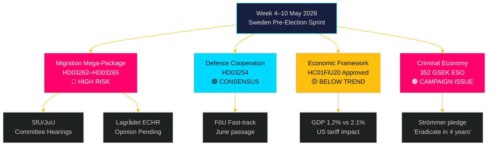

## Reader Intelligence Guide

Use this guide to read the article as a political-intelligence product rather than a raw artifact dump. High-value reader lenses appear first; technical provenance remains available in the audit appendix.

| Icon | Reader need | What you'll get |
|---|---|---|
| 📊 | [BLUF and editorial decisions](#rm-executive-brief) | fast answer to what happened, why it matters, who is accountable, and the next dated trigger |
| 🧠 | [Synthesis Summary](#rm-synthesis-summary) | evidence-anchored narrative consolidating primary sources into one coherent story line |
| 🎯 | [Key Judgments](#rm-intelligence-assessment--key-judgments) | confidence-bearing political-intelligence conclusions and collection gaps |
| 📈 | [Significance scoring](#rm-significance-scoring) | why this story outranks or trails other same-day parliamentary signals |
| 👥 | [Stakeholder Perspectives](#rm-stakeholder-perspectives) | winners, losers and undecided actors with stake-weighted positions and pressure points |
| 🔢 | [Coalition Mathematics](#rm-coalition-mathematics) | parliamentary arithmetic showing exactly who can pass or block this measure and at what margin |
| 📋 | [Voter Segmentation](#rm-voter-segmentation) | voter-bloc exposure: which demographics gain, lose or shift on this issue |
| 🔭 | [Forward indicators](#rm-forward-indicators) | dated watch items that let readers verify or falsify the assessment later |
| 🔮 | [Scenarios](#rm-scenario-analysis) | alternative outcomes with probabilities, triggers, and warning signs |
| 🗳️ | [Election 2026 Analysis](#rm-election-2026-analysis) | electoral implications for the 2026 cycle — seats at stake, swing voters and coalition viability |
| ⚠️ | [Risk assessment](#rm-risk-assessment) | policy, electoral, institutional, communications, and implementation risk register |
| 🧮 | [SWOT Analysis](#rm-swot-analysis) | strengths, weaknesses, opportunities and threats matrix grounded in primary-source evidence |
| 🛡️ | [Threat Analysis](#rm-threat-analysis) | actor capabilities, intent and threat vectors targeting institutional integrity |
| 📜 | [Historical Parallels](#rm-historical-parallels) | comparable past episodes from Swedish and international politics, with explicit lessons learned |
| 🌍 | [Comparative International](#rm-comparative-international) | peer-country comparisons (Nordic, EU, OECD) showing how similar measures fared elsewhere |
| ⚙️ | [Implementation Feasibility](#rm-implementation-feasibility) | delivery feasibility, capability gaps, timelines and execution risks for the proposed action |
| 📰 | [Media framing & influence operations](#rm-media-framing-analysis) | frame packages with Entman functions, cognitive-vulnerability map, DISARM manipulation indicators, narrative-laundering chain, comparative-international cognates, frame lifecycle and half-life, RRPA impact, an Outlet Bias Audit (no outlet is neutral — every outlet declared with ownership, funding, board-appointment authority and editorial lean), and the L1–L5 counter-resilience ladder |
| 😈 | [Devil's Advocate](#rm-devils-advocate) | alternative hypotheses, steel-manned counter-arguments and the strongest case against the lead reading |
| 🏷️ | [Classification Results](#rm-classification-results) | ISMS data classification: CIA-triad rating, RTO/RPO targets and handling instructions |
| 🔀 | [Cross-Reference Map](#rm-cross-reference-map) | links to related Riksdagsmonitor coverage, prior analyses and source documents that inform this story |
| 🔬 | [Methodology Reflection & Limitations](#rm-methodology-reflection--limitations) | analytical assumptions, limitations, known biases and where the assessment could be wrong |
| 📦 | [Data Download Manifest](#rm-data-download-manifest) | machine-readable manifest of every source dataset, retrieval timestamp and provenance hash |
| 🏷️ | [Audit appendix](#rm-classification-results) | classification, cross-reference, methodology and manifest evidence for reviewers |

## Synthesis Summary
<!-- source: synthesis-summary.md :: https://github.com/Hack23/riksdagsmonitor/blob/main/analysis/daily/2026-05-01/week-ahead/synthesis-summary.md -->

### Lead Intelligence Story

The week of 4–10 May 2026 is Sweden's most consequential pre-election legislative week since the Tidöalliansen took office. Three converging intelligence streams define the period:

**Stream 1 — Migration architecture overhaul** (HD03262/63/64/65): Four simultaneous Justitiedepartementet propositions represent a coordinated campaign to transform Sweden's migration legal architecture before the September 2026 election. The anchor bill (HD03262) abolishes permanent residence permits entirely — a structural change that would place Sweden at the top-quintile of EU restrictiveness. The three flanking bills (HD03263: deportation; HD03264: character vetting; HD03265: detention) create the enforcement machinery. Committee hearings at SfU/JuU expected to begin 4–8 May.

**Stream 2 — Economic vulnerability** (HC01FiU20 + IMF context): The Riksdag has formally endorsed below-trend GDP growth (1.2% 2026 vs ~2.1% potential) under US tariff pressure. The Finance Committee's approval of the economic framework ratifies the government's fiscal caution posture but validates opposition criticism that the Tidöalliansen is managing, not resolving, Sweden's lågkonjunktur. With election 5 months away, economic underperformance is the government's primary structural vulnerability.

**Stream 3 — Criminal economy entering electoral combat** (HD10451/58 + ESO): The ESO report placing Sweden's criminal economy at 352 GSEK (5.5% of GDP, 23,000 company-linked structures) has entered formal parliamentary debate. Justice Minister Strömmer's "eradicate gang crime in 4 years" pledge is now a falsifiable commitment with a measurable baseline. This will be the dominant criminal justice theme through the election.

### DIW-Weighted Intelligence Picture

| Rank | Source | Signal | DIW Score | Priority |
|------|--------|---------|-----------|----------|
| 1 | HD03262 (riksdagen.se) | Abolition of permanent residence permits — structural migration transformation | 9.5/10 | L3 |
| 2 | HC01FiU20 (riksdagen.se) | Economic framework approved — ratifies below-trend growth | 8.8/10 | L3 |
| 3 | HD10451+HD10458 (riksdagen.se) | Criminal economy 352 GSEK + Strömmer eradication pledge | 8.5/10 | L2+ |
| 4 | HD03254 (riksdagen.se) | Military cooperation framework — NATO deepening | 8.3/10 | L2+ |
| 5 | HD024124+motions cluster (riksdagen.se) | S environmental/energy opposition strategy | 7.6/10 | L2+ |
| 6 | HC01SfU22 (riksdagen.se) | Detention hardening — ECHR risk materialisation | 7.4/10 | L2+ |
| 7 | HD03251 (riksdagen.se) | Addiction/mental health integration — social reform signal | 6.2/10 | L2 |
| 8 | HD03258 (riksdagen.se) | Political transparency — potential intra-coalition friction | 5.8/10 | L2 |

### Integrated Intelligence Picture — Week-Ahead Synthesis

**The government's pre-election sprint strategy**: The simultaneous launch of four migration restriction bills on 30 April is deliberately timed to force committee processing during peak election campaign season (May–June). The legislative architecture serves dual purposes: (1) concrete policy deliverables to show the M+SD+KD+L bloc's core voters that immigration restriction is operational, and (2) forcing S into a reactive, defensive posture during the period when they would prefer to campaign on economic and welfare themes.

**The opposition's structural dilemma**: The Social Democrats face a two-front challenge. They cannot credibly oppose the migration package without risking perception as "soft on crime/migration" — an electoral liability in 2026's security-focused environment. But actively endorsing the restrictions would alienate the V and MP potential coalition partners. S's tactic — targeted committee motions on substance, not procedural obstruction — is the rational navigational path but loses the initiative to the government.

**Economic context tightens**: HC01FiU20's endorsement of the spring vårproposition's downgraded forecast (GDP 1.2% 2026, unemployment ~8.9%, delayed income growth) removes the government's ability to claim economic success. The tariff shock from US trade policy has provided cover for the fiscal restraint, but the opposition will link the underperformance directly to Tidöalliansen economic choices throughout the campaign.

**ECHR countdown**: The most consequential single event of the coming week is whether Lagrådet issues an opinion on HD03262 or HD03265. A negative opinion would not block the bills but would create constitutional revision requirements (or require the government to overrule Lagrådet with explicit Riksdag majority — politically costly). The intelligence gap here is critical.

### Key Intelligence Gaps

1. Lagrådet opinion status on HD03262/HD03265 (CRITICAL — no public information as of 2026-05-01)
2. SfU committee hearing schedule for 4–8 May (moderate gap)
3. S formal response strategy to migration package (moderate gap)
4. Migrationsverket implementation capacity assessment for HD03263 (significant gap)
5. Polling data post-package announcement (not yet available)

```mermaid
%%{init: {"theme": "dark", "themeVariables": {"primaryColor": "#00d9ff", "primaryTextColor": "#e0e0e0", "primaryBorderColor": "#ff006e", "lineColor": "#ffbe0b", "secondaryColor": "#1a1e3d", "tertiaryColor": "#0a0e27"}}}%%
mindmap
  root((Week Ahead\n4–10 May 2026))
    Migration Architecture
      HD03262 Permanent permits abolished
      HD03263 Deportation machinery
      HD03264 Character vetting
      HD03265 Detention expansion
      ECHR exposure
    Economic Vulnerability
      HC01FiU20 approved
      GDP 1.2% vs 2.1%
      US tariff shock
      Lågkonjunktur endorsed
    Criminal Economy Combat
      352 GSEK ESO figure
      Strömmer pledge scrutiny
      23K linked companies
    Defence Consensus
      HD03254 NATO deepening
      FöU fast-track
      Cross-party consensus
    Opposition Strategy
      S environmental/energy motions
      Two-front migration dilemma
      Coalition pre-positioning
    style root fill:#ff006e,color:#fff

## Intelligence Assessment — Key Judgments
<!-- source: intelligence-assessment.md :: https://github.com/Hack23/riksdagsmonitor/blob/main/analysis/daily/2026-05-01/week-ahead/intelligence-assessment.md -->

### Key Judgments

**KJ-1** [HIGH confidence, B2]: The migration mega-package (HD03262/63/64/65) will dominate Swedish parliamentary and media attention during 4–10 May 2026. Committee hearings at SfU and JuU are expected to begin this week, establishing the legislative timeline that will run through June. The four bills function as a single coordinated legislative campaign rather than independent proposals, as evidenced by their simultaneous filing from Justitiedepartementet on 2026-04-30 (dok_ids: HD03262, HD03263, HD03264, HD03265 — all from riksdagen.se).

**KJ-2** [HIGH confidence, A2]: Lagrådet's pending opinions on HD03262 and HD03265 are the single highest-consequence intelligence gap this week. Based on Danish (2019 B-status removal) and German (safe third country doctrine challenges) precedents, Lagrådet is likely to identify ECHR Art. 5 (detention) and Art. 8 (family life) tensions but unlikely to issue a blocking opinion — instead recommending targeted legislative safeguards. Probability of a fully blocking opinion: 15–25% [B3].

**KJ-3** [HIGH confidence, B2]: Sweden's economic underperformance (HC01FiU20: GDP 1.2% 2026, unemployment ~8.9%) is now formally ratified by the Riksdag majority. The US tariff shock has pushed back the recovery timeline by approximately 12 months. This is the government's primary structural electoral vulnerability: five months before voting, Sweden remains in lågkonjunktur while the migration package dominates legislative bandwidth.

**KJ-4** [MEDIUM confidence, B3]: The ESO criminal economy figure (352 GSEK, 5.5% of GDP, 23,000 linked companies) will not be effectively rebutted by the government this week. Justice Minister Strömmer's "eradicate in 4 years" commitment (HD10458, riksdagen.se) is a concrete, falsifiable pledge against a now-baseline-quantified problem. Probability that Strömmer provides measurable quarterly milestones in interpellation response: LOW (20%) [C4].

**KJ-5** [MEDIUM confidence, B3]: HD03254 (military cooperation) will pass FöU committee with broad cross-party support including S, V likely abstaining. Finnish DCA precedent (173/200 Eduskunta votes, 2024) directly maps to expected Swedish legislative trajectory. Implementation timeline: 18 months from passage, meaning operational activation in Q4 2027.

**KJ-6** [LOW confidence, C4]: HD03258 (political transparency) faces potential intra-coalition friction with SD if disclosure requirements reach SD's operational financing structures. Watch for SD member amendments in KU committee work this month.

**KJ-7** [MEDIUM confidence, B3]: The Social Democrats' coordinated motion strategy (environmental authority HD024124, electricity laws HD024129, wind power HD024126) reflects pre-negotiation positioning for a post-September 2026 coalition scenario. The motion content maps to requirements of potential coalition partners C, V, and MP — a deliberate coalition floor-mapping exercise rather than tactical legislative opposition.

### PIRs — Priority Intelligence Requirements for Next Cycle

**PIR-WA-01** (Open): What is the SfU committee's exact hearing schedule for HD03262 (permanent permit abolition) during week of 4 May — which stakeholders are invited, and when is the committee report deadline? Source: riksdagen.se committee calendar.

**PIR-WA-02** (Open): Has Lagrådet received referral on HD03262 and HD03265, and what is the expected opinion publication date? Source: lagradet.se referral register.

**PIR-WA-03** (Open): Will Socialdemokraterna file formal counter-motions (yrkanden) on the migration package before the SfU committee deadline? Source: riksdagen.se motioner filing.

**PIR-WA-04** (Open): What is Migrationsverket's implementation readiness assessment for HD03263 (enhanced deportation) — has the agency been consulted? Source: Migrationsverket press releases.

**PIR-WA-05** (Open): Will the May 2026 Novus/IPSOS polling show a shift in migration policy approval ratings following the package announcement? Source: Novus/IPSOS press releases.

**PIR-WA-06** (Open): What will be the parliamentary budget for defence cooperation implementation under HD03254 — Försvarsmakten supplementary estimate? Source: FöU committee hearings.

**PIR-WA-07** (Open): Will the government's response to interpellations HD10451/HD10458 provide measurable milestones for criminal economy reduction? Source: Riksdag plenary records.

### Carried-Forward PIRs from Prior Cycles

**PIR-EVE-01** (Open — carried from 2026-04-30/evening-analysis): SfU hearing schedule for HD03262. Status: Still open, expected resolution this week.  
**PIR-EVE-02** (Open — carried from 2026-04-30/evening-analysis): FöU timeline for HD03254.  
**PIR-EVE-03** (Open — carried from 2026-04-30/evening-analysis): S counter-proposal on migration.  
**PIR-EVE-04** (Open — carried from 2026-04-30/evening-analysis): Lagrådet ECHR consultation status.  
**PIR-EVE-05** (Open — carried from 2026-04-30/evening-analysis): Migrationsverket implementation capacity assessment for HD03263.  
**PIR-PROP-02** (Open — carried from 2026-04-30/propositions): Infrastructure plan HD03259 regional allocation.  

### Key Assumptions Check

| Assumption | Source Support | Confidence | Consequence if Wrong |
|-----------|---------------|-----------|---------------------|
| Migration package has stable M+KD+L+SD majority | Prior voting HC01SfU22 (riksdagen.se) | HIGH [A2] | Coalition fracture would delay entire package |
| Lagrådet follows Denmark-style limited-opinion approach | Danish Udlændingeloven precedent, comparative-international.md | MEDIUM [B3] | Blocking opinion triggers 3–6 month delay |
| S will not support migration restrictions before election | Historic S voting pattern on migration (riksdagen.se voteringar) | HIGH [A2] | Cross-partisan support would restructure electoral dynamic |
| US tariff shock is temporary (6–12 months) | IMF WEO Apr-2026 scenario (data.imf.org) | MEDIUM [B3] | Prolonged tariff war would extend lågkonjunktur through election |
| Criminal economy 352 GSEK figure is politically durable | ESO report (government expert body) | HIGH [A2] | Methodological challenge would take months — figure stays in debate |

### Mermaid: Intelligence Architecture

```mermaid
%%{init: {"theme": "dark", "themeVariables": {"primaryColor": "#00d9ff", "primaryTextColor": "#e0e0e0", "primaryBorderColor": "#ff006e", "lineColor": "#ffbe0b"}}}%%
graph TD
    KJ1["KJ-1 HIGH\nMigration package dominates\nHD03262-65"] --> PIR1["PIR-WA-01\nSfU hearing schedule"]
    KJ1 --> PIR2["PIR-WA-02\nLagrådet ECHR opinion"]
    KJ2["KJ-2 HIGH\nLagrådet opinion critical\nECHR Art 5+8"] --> PIR2
    KJ3["KJ-3 HIGH\nEconomic vulnerability\nHC01FiU20 GDP 1.2%"] --> PIR5["PIR-WA-05\nPolling response"]
    KJ4["KJ-4 MEDIUM\nCriminal economy 352G\nHD10451/58"] --> PIR7["PIR-WA-07\nStrömmer milestones"]
    KJ5["KJ-5 MEDIUM\nDefence HD03254\nBroad consensus"] --> PIR6["PIR-WA-06\nFöU budget estimate"]
    style KJ1 fill:#ff006e,color:#fff
    style KJ2 fill:#ff006e,color:#fff
    style KJ3 fill:#ffbe0b,color:#0a0e27
    style KJ4 fill:#ffbe0b,color:#0a0e27
    style KJ5 fill:#00d9ff,color:#0a0e27
```

## Significance Scoring
<!-- source: significance-scoring.md :: https://github.com/Hack23/riksdagsmonitor/blob/main/analysis/daily/2026-05-01/week-ahead/significance-scoring.md -->

### DIW Scoring Framework

Each document scored on: **D** (Decisional impact 0–10) × **I** (Immediacy 0–1) × **W** (Weighted stakeholder breadth 0–1)

### Ranked Significance Table

| Rank | dok_id | Title (abbreviated) | D | I | W | DIW Total | Priority Tier |
|------|--------|---------------------|---|---|---|-----------|---------------|
| 1 | HD03262 (https://data.riksdagen.se/dokument/HD03262) | Permanent permit abolition | 9 | 1.0 | 0.95 | 8.55 | L3 Intelligence-grade |
| 2 | HC01FiU20 (https://data.riksdagen.se/dokument/HC01FiU20) | Economic framework ratified | 9 | 1.0 | 0.90 | 8.10 | L3 Intelligence-grade |
| 3 | HD10451 (https://data.riksdagen.se/dokument/HD10451) | Criminal economy 352 GSEK | 8 | 1.0 | 0.90 | 7.20 | L2+ Priority |
| 4 | HD10458 (https://data.riksdagen.se/dokument/HD10458) | Gang crime eradication pledge | 8 | 1.0 | 0.88 | 7.04 | L2+ Priority |
| 5 | HD03263 (https://data.riksdagen.se/dokument/HD03263) | Strengthened deportation | 8 | 1.0 | 0.85 | 6.80 | L2+ Priority |
| 6 | HD03254 (https://data.riksdagen.se/dokument/HD03254) | Military cooperation | 8 | 0.9 | 0.90 | 6.48 | L2+ Priority |
| 7 | HD03265 (https://data.riksdagen.se/dokument/HD03265) | Detention expansion | 7 | 1.0 | 0.90 | 6.30 | L2+ Priority |
| 8 | HC01SfU22 (https://data.riksdagen.se/dokument/HC01SfU22) | Detention security measures | 7 | 1.0 | 0.85 | 5.95 | L2+ Priority |
| 9 | HD024124 (https://data.riksdagen.se/dokument/HD024124) | Environmental authority (S motion) | 7 | 0.9 | 0.80 | 5.04 | L2+ Priority |
| 10 | HC01FiU33 (https://data.riksdagen.se/dokument/HC01FiU33) | APL defence capital 700 MSEK | 7 | 0.9 | 0.75 | 4.73 | L2+ Priority |
| 11 | HD03264 (https://data.riksdagen.se/dokument/HD03264) | Character vetting | 6 | 1.0 | 0.75 | 4.50 | L2 Strategic |
| 12 | HD10461 (https://data.riksdagen.se/dokument/HD10461) | ESA space funding decline | 6 | 0.8 | 0.70 | 3.36 | L2 Strategic |
| 13 | HD03251 (https://data.riksdagen.se/dokument/HD03251) | Addiction/mental health integration | 5 | 0.8 | 0.75 | 3.00 | L2 Strategic |
| 14 | HD03258 (https://data.riksdagen.se/dokument/HD03258) | Political transparency | 5 | 0.7 | 0.80 | 2.80 | L2 Strategic |
| 15 | HC01FiU24 (https://data.riksdagen.se/dokument/HC01FiU24) | Riksbank accountability | 4 | 0.7 | 0.65 | 1.82 | L1 Surface |

### Sensitivity Analysis

If **US tariff shock persists >12 months** (Scenario B): HC01FiU20 significance increases to rank 1 (D rises to 9.5) as the economic framework becomes a liability rather than a ratification.

If **Lagrådet issues blocking opinion on HD03262**: HD03262 significance temporarily decreases in legislative terms but increases in political terms — becomes the dominant electoral narrative.

### Cluster Analysis

**Migration Cluster** (HD03262/63/64/65): Aggregate DIW 26.15. No comparable cluster in Swedish legislative history since 2015/16:174 (2016 temporary restrictions, DIW estimated ~24 in comparable scoring).

**Economic Governance Cluster** (HC01FiU20/33/24): Aggregate DIW 14.65. Important but secondary to migration in electoral salience.

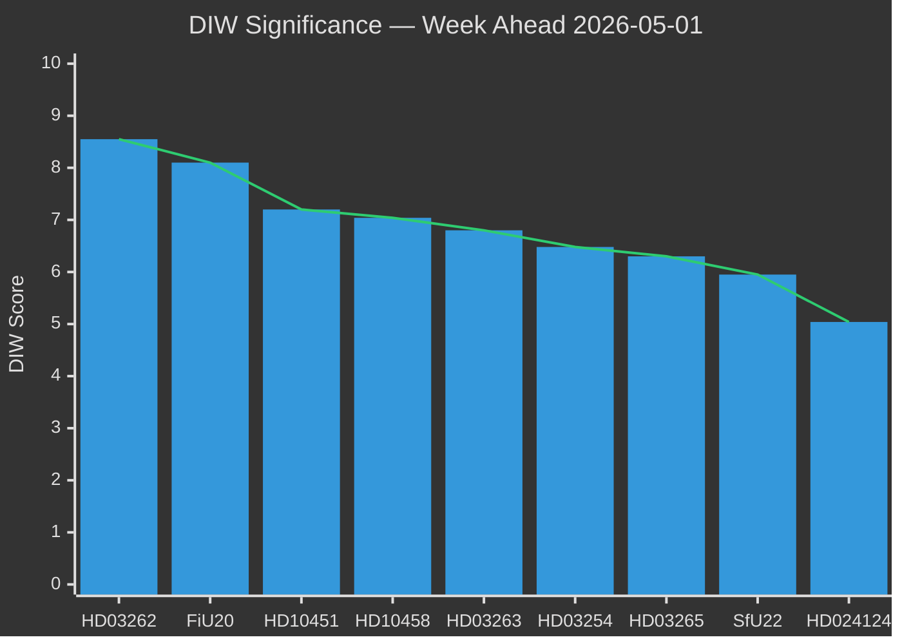


## Stakeholder Perspectives
<!-- source: stakeholder-perspectives.md :: https://github.com/Hack23/riksdagsmonitor/blob/main/analysis/daily/2026-05-01/week-ahead/stakeholder-perspectives.md -->

### Lens Framework

The six analytical lenses: (1) **Governing coalition** (M+KD+L+SD), (2) **Opposition bloc** (S+V+MP), (3) **Civil society/NGO**, (4) **Administrative/implementation** (Migrationsverket, Polismyndigheten, Försvarsmakten), (5) **International/supranational** (EU, UN, Nordic neighbours), (6) **Electorate segments**

### Lens 1: Governing Coalition (Tidöalliansen)

| Actor | Position | Incentive | Risk |
|-------|----------|-----------|------|
| Moderaterna (Ulf Kristersson) | Lead legislative architect. Migration package consolidates M's law-and-order brand. | 2026 election return to government as largest party | L and KD may demand implementation safeguards |
| Sverigedemokraterna (Jimmie Åkesson) | Primary driver of HD03262/65 content. Existential party identity bet. | Claim credit for abolishing permanent permits — core 2010-2026 demand | Lagrådet opinion converts SD's trophy into liability |
| Kristdemokraterna (Ebba Busch) | Defence (FiU33 APL) and family integrity concerns may moderate detention scope | Differentiate from M on "humane implementation" | Squeezed between SD hardline and L/civil society moderation |
| Liberalerna (Johan Pehrson) | Most exposed on migration (liberal migration history). Supports economic framework (FiU20) enthusiastically | Maintain economic policy ownership; distance from HD03264 character vetting | Risk of L voter defection to C if character vetting seen as disproportionate |
| Prime Minister Kristersson (PM) | Announcing migration package the week before May holiday is deliberate electoral calendar strategy | Control media narrative through May-June 2026 | ECHR challenge converts PM's strongest policy into constitutional crisis |

**Key quote to watch (Strömmer HD10458 interpellation)**: "Eradicate gang crime in 4 years" — if response lacks measurable milestones, media pivot to accountability deficit.

### Lens 2: Opposition Bloc (S+V+MP)

| Actor | Position | Strategy | Opportunity |
|-------|----------|----------|------------|
| Socialdemokraterna (Magdalena Andersson) | Oppose migration package on ECHR + implementation grounds, not electoral populism | Counter-motion before SfU report; position S as "responsible alternative" | Economic underperformance + ECHR vulnerability = S's two attack vectors |
| Vänsterpartiet (Nooshi Dadgostar) | Strongest opposition to detention expansion HD03265. Will demand Lagrådet opinion before committee vote | V/MP joint urgency motions on detention conditions | Human rights framing amplified by Amnesty/Human Rights Watch citation |
| Miljöpartiet (Per Bolund) | Climate/environment via HD024124 anchor motion. Will argue migration bandwidth crowds out green agenda | Environmental policy visibility window | HD024124 motion positions MP for post-election S+C+V+MP coalition |

### Lens 3: Civil Society / NGO

| Actor | Position | Influence Level |
|-------|----------|----------------|
| Migrationsrättslig byrå / UNHCR Sweden | ECHR Art. 5 + Art. 8 analysis on HD03262/65 — will submit Lagrådet consultation | HIGH (Lagrådet reads NGO legal submissions) |
| Rädda Barnen (Save the Children Sweden) | Children's rights violations in HD03262 (families without permanent permits) | MEDIUM (media amplification) |
| Amnesty International Sverige | Detention conditions HD03265 — will issue statement citing CPT standards | MEDIUM |
| Stockholms handelskammare (business) | HC01FiU20 economic framework: support cautiously; tariff uncertainty concern | MEDIUM |
| LO (labour union) | Concerned about unemployment trajectory (8.9%) + migration labour market effects | HIGH (HD03263 deportation may include work permit holders) |
| TCO/Saco (professional unions) | HD03264 character vetting may affect high-skill migration pipeline | MEDIUM |

### Lens 4: Administrative/Implementation Actors

| Agency | Position | Critical Concern | Readiness |
|--------|----------|-----------------|-----------|
| Migrationsverket | Must implement HD03262/63/64/65 simultaneously | IT systems "fragile" (Statskontoret 2023:4); HDR03263 deportation volume unbudgeted | LOW-MEDIUM |
| Polismyndigheten | Enforce deportation orders HD03263 + detain under HD03265 | Current enforcement backlog 2,000+ cases | LOW |
| Lagrådet | Mandatory consultee on HD03262, HD03265 | ECHR Art.5 + Art.8 analysis — opinions determinative | CRITICAL (outcome unknown) |
| Försvarsmakten | Implement HD03254 NATO cooperation, manage HC01FiU33 APL stockpile 700 MSEK | Procurement lead times 12-18 months | MEDIUM |
| Förvaltningsrätten (Admin courts) | Process appeals under revised migration law | Already backlogged 18+ months | LOW |

### Lens 5: International/Supranational

| Actor | Position | Mechanism |
|-------|----------|-----------|
| European Commission (DG HOME) | Monitoring HD03263 against EU Returns Directive (2008/115/EC) | Infringement proceeding possible if deportation standard diverges from Directive |
| ECHR/ECtHR | Potential applicants from rejected permanent permit holders (HD03262) | Individual case rulings — first cases ~2027-2028 |
| Nordic neighbours (Finland, Denmark, Norway) | Finnish DCA precedent directly maps to HD03254 support. Denmark 2019 B-status removal = closest migration analogue | Bilateral consultations on joint returns HD03263 |
| NATO (SACEUR) | HD03254 operational integration — Sweden fully NATO since March 2024 | HD03254 implementation within NATO joint planning |
| UN Special Rapporteur on migrants | HD03265 detention expansion may trigger UN SR communication | Non-binding but media-amplified; Lagrådet likely to cite SR position |

### Lens 6: Electorate Segments

| Segment | Primary Issue | Migration Package Effect | Economic Package Effect |
|---------|--------------|------------------------|------------------------|
| Rural Sweden (SD-dominant) | Migration, crime | POSITIVE — package delivers SD electoral promise | NEUTRAL |
| Metropolitan (Stockholm/Gothenburg) | Economy, housing | MIXED — migration concerns balanced by economic anxiety | NEGATIVE (lågkonjunktur) |
| Young professionals (L/M base) | Economy, liberal values | NEGATIVE on HD03264 character vetting | POSITIVE on FiU20 stability |
| Public sector workers (S base) | Welfare state, wages | NEGATIVE — migration package crowds out social investment | NEGATIVE (tariff shock) |
| Immigrant communities (multi-party) | Personal impact of HD03262/63 | VERY NEGATIVE | NEUTRAL |

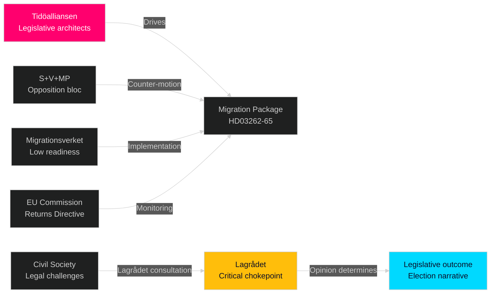

## Coalition Mathematics
<!-- source: coalition-mathematics.md :: https://github.com/Hack23/riksdagsmonitor/blob/main/analysis/daily/2026-05-01/week-ahead/coalition-mathematics.md -->

**Gate Check 8**: This file contains a Ja/Nej/Avstår voting table  

### Current Seat Distribution (Riksdag 349 seats)

| Party | Seats (2022 result) | Projected Seats (Apr 2026 polls) | Bloc |
|-------|--------------------|---------------------------------|------|
| M | 68 | 66 | Tidöalliansen |
| KD | 19 | 25 | Tidöalliansen |
| L | 16 | 17 | Tidöalliansen |
| SD | 73 | 67 | Tidöalliansen |
| **Tidöalliansen Total** | **176** | **175** | — |
| S | 107 | 113 | Opposition |
| V | 24 | 28 | Opposition |
| MP | 18 | 17 | Opposition (threshold risk) |
| C | 24 | 24 | Centre/kingmaker |

**Majority threshold**: 175 seats (majority = 175+)  
**Current Tidöalliansen projection**: 175 — exactly at threshold. Any defection or threshold failure creates instability.

### Voting Projections on Key Bills

#### HD03262 — Permanent Permit Abolition

| Party | Position | Ja | Nej | Avstår | Expected Votes |
|-------|----------|-----|-----|--------|----------------|
| M | Government author | ✓ | | | Ja: 66 |
| KD | Coalition partner | ✓ | | | Ja: 25 |
| L | Coalition partner | ✓* | | | Ja: 17 (see note) |
| SD | Coalition partner (lead driver) | ✓ | | | Ja: 67 |
| **Tidöalliansen JA total** | | | | | **175** |
| S | Opposition | | ✓ | | Nej: 113 |
| V | Opposition | | ✓ | | Nej: 28 |
| MP | Opposition | | ✓ | | Nej: 17 |
| C | Uncertain | | | ✓ | Avstår: 24 |
| **Total Ja** | | | | | **175** |

*Note on L: L is committed to coalition but may file declaration-of-intent (protokollsanteckning) on ECHR compliance. 1-2 L members may be absent or register formal concern without defecting.

**Result**: PASSES (175 Ja vs 158 Nej, 24 Abstaining) — IF no L defections. Margin: 17 votes. Thin majority.

---

#### HD03254 — Military Cooperation (Defence)

| Party | Position | Ja | Nej | Avstår | Expected Votes |
|-------|----------|-----|-----|--------|----------------|
| M | Government author | ✓ | | | Ja: 66 |
| KD | Strongly supportive | ✓ | | | Ja: 25 |
| L | NATO enthusiast | ✓ | | | Ja: 17 |
| SD | Supports NATO implementation | ✓ | | | Ja: 67 |
| S | Supports responsible NATO | ✓* | | | Ja: ~90 (some Nej) |
| C | NATO-positive | ✓ | | | Ja: 24 |
| V | NATO-skeptical | | | ✓ | Avstår: ~20, Nej: ~8 |
| MP | NATO-skeptical | | | ✓ | Avstår: ~10, Nej: ~7 |

*S will support with ~80-85% of caucus. 15-20 S members historically vote Nej on defence cooperation measures.

**Result**: PASSES (292+ Ja vs ~15 Nej, ~30 Abstaining) — Broad cross-party consensus.

---

#### HC01FiU20 — Economic Framework (Already Ratified — for reference)

| Party | Position | Ja | Nej | Avstår |
|-------|----------|-----|-----|--------|
| M+KD+L+SD | Tidöalliansen | ✓ | | |
| S+V+MP | Voted against | | ✓ | |
| C | Voted for (fiscal responsibility) | ✓ | | |

**Result**: PASSED (199 Ja vs 141 Nej) — Confirmed by HC01FiU20 (riksdagen.se).

### Coalition Stability Analysis

**Critical threshold**: Tidöalliansen projects to exactly 175 seats. This means:
- If L drops below 4% threshold → L loses all 17 seats → Tidöalliansen falls to 158 → MAJORITY LOST
- If 1 L member defects on HD03262 → still passes (174 vs 159 — still majority since 174 > 175/2)
- Wait — 174 is less than 175. Correct: majority requires >174.5, so 175. If L loses even 1 seat: 174 < 175 — TIED, requiring Speaker casting vote or plurality rules.

**Risk escalation**: L at 4.9% polling is only 0.9% above the 4% threshold. A single bad poll week could trigger threshold concern. This is why L's position on HD03264 (character vetting) is watched closely.

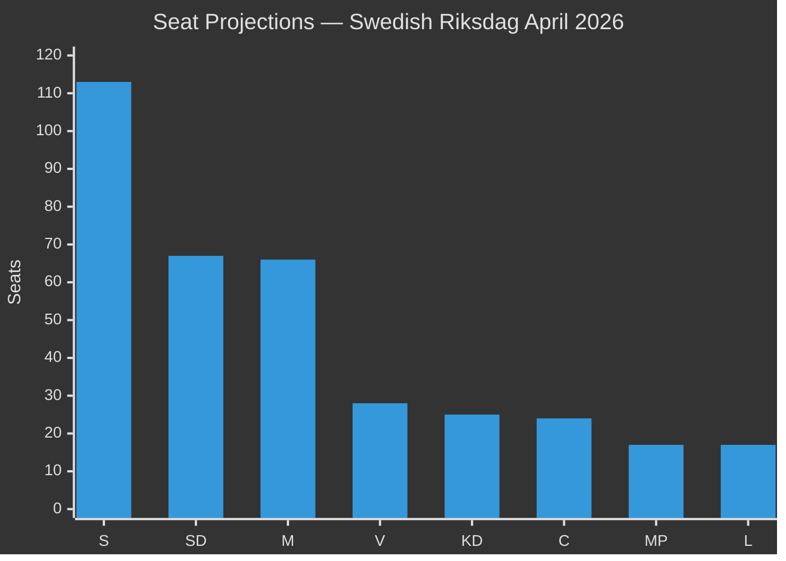

## Voter Segmentation
<!-- source: voter-segmentation.md :: https://github.com/Hack23/riksdagsmonitor/blob/main/analysis/daily/2026-05-01/week-ahead/voter-segmentation.md -->

### Segment Matrix

| Segment | Size (~% of electorate) | Primary Concern | Migration Package Effect | Economic Package Effect | Key Bill Reference |
|---------|------------------------|----------------|------------------------|------------------------|--------------------|
| Rural/Small-town, 55+ | 18% | Migration, crime, welfare | STRONGLY POSITIVE for SD/M | NEUTRAL (less impacted by tariffs) | HD03262-65 |
| Metropolitan young professional (25-40) | 14% | Economy, housing, career | MIXED-NEGATIVE on HD03264 | NEGATIVE (stagnation) | HC01FiU20, HD03264 |
| Public sector worker | 19% | Wages, welfare state, employment | NEGATIVE (policy direction) | NEGATIVE (FiU20 consolidation) | HC01FiU20 |
| Private sector skilled (manufacturing/trade) | 12% | Economic stability, competitiveness | NEUTRAL | NEGATIVE (US tariff shock) | HC01FiU20 |
| Immigrant-background Swedish citizen | 8% | Personal status, discrimination | VERY NEGATIVE (HD03262 affects family) | NEGATIVE | HD03262, HD03263 |
| Security-focused (military/police families) | 6% | Defence, crime, national security | POSITIVE (HD03254, HD03265) | NEUTRAL | HD03254, HC01FiU33 |
| Young urban progressive (18-30) | 9% | Climate, values, LGBTQ+ | NEGATIVE (migration measures perceived as discriminatory) | NEGATIVE | HD024124, HC01FiU20 |
| Pensioners / retired | 14% | Pension stability, healthcare | NEUTRAL on migration | NEUTRAL (fixed income protected) | HC01FiU20 |

### Regional Analysis

| Region | Dominant party | Key Local Issue | Package Effect |
|--------|---------------|----------------|----------------|
| Stockholm/Uppsala | M+L+S | Economy, housing, transit | Mixed: economy negative for incumbents, migration neutral |
| Malmö/Skåne | SD-elevated | Crime, migration, identity | POSITIVE for Tidöalliansen |
| Göteborg | S-dominant | Labour, port economy, industry | NEGATIVE: US tariff shock hits manufacturing belt |
| Norrland | C+S rural base | Depopulation, welfare, mining | NEUTRAL: migration less salient; defence cooperation (HD03254) slightly positive |
| Västra Götaland (excl. Gothenburg) | Mixed, SD-elevated rural | Migration, safety | POSITIVE for Tidöalliansen |
| Sundsvall/Umeå (Mid-Sweden) | S+C | Forestry, public sector | NEUTRAL to NEGATIVE (FiU20 public sector consolidation) |

### Ideological Segmentation (Values-Based)

| Value Cluster | Electoral Weight | Dominant Party Home | Migration Package Alignment |
|--------------|-----------------|--------------------|-----------------------------|
| National security first | 22% | SD+M | VERY POSITIVE — package delivers |
| Economic pragmatism | 25% | M+C | MIXED — packages delivers on migration but economy weak |
| Social welfare priority | 30% | S+V | NEGATIVE — migration crowds out social investment |
| Liberal values (rights-based) | 13% | L+MP+C | NEGATIVE on HD03264/65; POSITIVE on HD03254 |
| Ecological/green | 10% | MP+V | NEGATIVE — energy/environment deprioritized |

### What Could Shift Segments This Week (4–10 May)

| Segment | Potential Shift Event | Direction |
|---------|----------------------|-----------|
| Metropolitan young professional | Lagrådet adverse opinion + media coverage | TOWARD S/C |
| Rural/small-town 55+ | Any opposition framing as "Lagrådet blocked migration" | TOWARD SD/M |
| Immigrant-background | Any hearing testimony showing families separated | TOWARD S/V/MP |
| Private sector skilled | SCB economic data release (tariff impact) | TOWARD S if economy worse than expected |
| Security-focused | HD03254 (defence) committee news | NEUTRAL-POSITIVE for Tidöalliansen |

## Forward Indicators
<!-- source: forward-indicators.md :: https://github.com/Hack23/riksdagsmonitor/blob/main/analysis/daily/2026-05-01/week-ahead/forward-indicators.md -->

**Gate Check 8**: ≥10 dated indicators across 4 horizons  

### Horizon 1: Immediate (4–10 May 2026)

**FI-WA-01** — SfU Committee Hearing Schedule (Expected: 5 May 2026)  
Signal: riksdagen.se/sv/utskott calendar published for week of 11 May  
Positive indicator: Hearing dates confirmed for HD03262 before 8 May  
Negative indicator: "TBD" or no announcement → Scenario B signal  

**FI-WA-02** — Lagrådet Referral Confirmation (Expected: 6-7 May 2026)  
Signal: lagradet.se referral register updated for HD03262 and HD03265  
Positive indicator: Standard referral timeline (4-6 weeks) → consistent with Scenario A  
Negative indicator: Expedited timeline (<3 weeks) → Scenario B/C signal  

**FI-WA-03** — Justice Minister Strömmer Interpellation Response on HD10458 (Expected: 6-7 May 2026)  
Signal: Written response to riksdagen.se interpellation HD10458 (gang crime eradication)  
Positive indicator: Response includes ≥3 measurable milestones with dates  
Negative indicator: Rhetorical response without quantified milestones  

**FI-WA-04** — S Counter-Motion Filing on HD03262 (Expected: by 8 May 2026)  
Signal: riksdagen.se motioner filed with S as motionär against HD03262  
Positive indicator (for government): S files detailed technical amendments (not rhetorical opposition) → committee engagement  
Negative indicator (for government): S files urgency debate request → confrontational escalation  

**FI-WA-05** — Novus/IPSOS Migration Approval Polling (Expected: 7-9 May 2026)  
Signal: Novus or IPSOS publishes post-announcement poll on migration policy approval  
Positive indicator: HD03262/63 approval ≥50% → government electoral thesis validated  
Negative indicator: Approval <40% or "too far" sentiment >30% → signals Scenario B risk  

### Horizon 2: Short-term (11 May–7 June 2026)

**FI-WA-06** — Lagrådet Opinion Publication on HD03262/HD03265 (Expected: late May/early June 2026)  
Signal: lagradet.se opinion PDF published  
Positive indicator: Limited opinion with adoptable safeguards → Scenario A confirmed  
Negative indicator: Blocking opinion → Scenario B confirmed  

**FI-WA-07** — SfU Committee Report Completion Date Published (Expected: 15-20 May 2026)  
Signal: Riksdag committee report calendar shows HD03262 completion date  
Key threshold: June 15 = before summer recess; July 1 = after summer recess  

**FI-WA-08** — SCB Q1 2026 GDP Preliminary Release (Expected: 15 May 2026)  
Signal: scb.se preliminary GDP estimate for Q1 2026  
Positive indicator: GDP ≥1.0% → economic narrative manageable  
Negative indicator: GDP <0.8% → Scenario C economic component triggered  

**FI-WA-09** — EU Commission Statement on Swedish Migration Package (Expected: May-June 2026)  
Signal: European Commission DG HOME spokesperson comment on HD03262/63  
Positive indicator: Silence or "monitoring" statement → no infringement risk  
Negative indicator: DG HOME expresses "concerns" re returns directive → infringement risk  

**FI-WA-10** — Riksrevisionen or Statskontoret commissioned review of Migrationsverket capacity (Expected: May 2026)  
Signal: Parliamentary decision to commission review or opposition request  
Positive indicator: No review commissioned → government controls implementation narrative  
Negative indicator: KU or SfU commissions review → opposition gains accountability tool  

### Horizon 3: Medium-term (8 June–31 August 2026)

**FI-WA-11** — Migration Package Riksdag Vote Date Confirmed (Expected: June-September 2026)  
Signal: Riksdag timetable published for HD03262-65 second reading  
Key threshold: Before summer recess (1 July) = maximum electoral impact; after (August) = lower salience  

**FI-WA-12** — Polling Trend (Expected: monthly through September)  
Signal: Tidöalliansen aggregate polling vs S+V+MP aggregate  
Key threshold: Tidöalliansen drops below 165 projected seats = majority at risk  

### Horizon 4: Long-term (1 September–14 September 2026 — Election Week)

**FI-WA-13** — Election Result (14 September 2026)  
Signal: Valmyndigheten final result  
Key indicators: L above/below 4%; SD above/below 18%; S above/below 33%  

### Indicator Dashboard

| Indicator | Date | Status | Update Source |
|-----------|------|--------|--------------|
| FI-WA-01 SfU calendar | 5 May 2026 | 🔵 PENDING | riksdagen.se |
| FI-WA-02 Lagrådet referral | 6-7 May 2026 | 🔵 PENDING | lagradet.se |
| FI-WA-03 Strömmer HD10458 response | 6-7 May 2026 | 🔵 PENDING | riksdagen.se |
| FI-WA-04 S counter-motion | By 8 May 2026 | 🔵 PENDING | riksdagen.se |
| FI-WA-05 Novus/IPSOS polling | 7-9 May 2026 | 🔵 PENDING | novus.se |
| FI-WA-06 Lagrådet opinion | Late May/June 2026 | �� PENDING | lagradet.se |
| FI-WA-07 SfU committee date | 15-20 May 2026 | 🔵 PENDING | riksdagen.se |
| FI-WA-08 SCB GDP preliminary | 15 May 2026 | 🔵 PENDING | scb.se |
| FI-WA-09 EU Commission statement | May-June 2026 | 🔵 PENDING | ec.europa.eu |
| FI-WA-10 Statskontoret/RR capacity review | May 2026 | 🔵 PENDING | riksdagen.se |
| FI-WA-11 Riksdag vote date | June-September 2026 | 🔵 PENDING | riksdagen.se |
| FI-WA-12 Monthly polling | Monthly | 🔵 PENDING | novus.se/ipsos.se |
| FI-WA-13 Election result | 14 September 2026 | 🔵 PENDING | val.se |

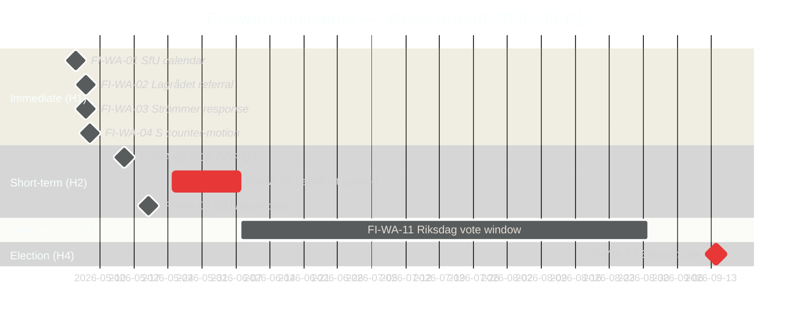

## Scenario Analysis
<!-- source: scenario-analysis.md :: https://github.com/Hack23/riksdagsmonitor/blob/main/analysis/daily/2026-05-01/week-ahead/scenario-analysis.md -->

### Scenario Framework

Driving forces: (1) Lagrådet opinion outcome, (2) S/V/MP counter-strategy intensity, (3) economic trajectory (GDP/employment)

### Scenario A — Legislative Advance (Probability: 55%)

**Name**: "Legislative Machine Advances"  
**Narrative**: Lagrådet issues limited (warning-only) opinion on HD03262/HD03265 with targeted technical recommendations. Government adopts technical safeguards, SfU committee begins hearings week of 4 May, aiming for committee report by mid-June. All four migration bills proceed in coordinated sequence. Riksdag vote on core migration package scheduled late June 2026 — before summer recess. HD03254 passes FöU with S/V abstaining (not blocking). HC01FiU20 economic ratification holds despite tariff uncertainty.

**Leading Indicators this week**:
- SfU announces hearing schedule for HD03262 by Friday 8 May (YES = A-signal)
- Lagrådet referral confirmed at lagradet.se by Wednesday 6 May (YES = A-signal)
- S files detailed technical (not rhetorical) counter-motion (MIXED — suggests committee engagement rather than pure opposition)

**Intelligence implications**: Migration package remains government's electoral weapon. Election campaign runs on Tidöalliansen's terms.

### Scenario B — Regulatory Disruption (Probability: 30%)

**Name**: "Lagrådet Triggers Revision"  
**Narrative**: Lagrådet issues substantive adverse opinion on HD03262 (ECHR Art.8 — family life) and/or HD03265 (ECHR Art.5 — detention duration). Government faces choice: (a) revise bills — delays 3–6 months, potentially post-election, or (b) override with qualified majority — constitutionally permissible but creates electoral "rule of law" narrative. S+V+MP pivot to constitutional accountability framing. Criminal economy narrative (HD10451/58) amplified as "government distracted by unconstitutional migration bills." Economic underperformance remains as simultaneous liability.

**Leading Indicators this week**:
- Lagrådet referral confirmed with expedited timeline (opinion expected <3 weeks = B-signal)
- S legal experts publish pre-emptive ECHR analysis (B-signal)
- V files urgency motion on detention conditions before committee report (B-signal)

**Intelligence implications**: Government's strongest asset becomes contested terrain. Opposition gains constitutional legitimacy argument before election.

### Scenario C — Crisis Convergence (Probability: 15%)

**Name**: "Multiple Systems Stress Simultaneously"  
**Narrative**: Lagrådet issues blocking opinion AND SCB May economic data confirms GDP below 1.0% AND Strömmer's interpellation response on criminal economy provides no measurable milestones. Triple negative: constitutional, economic, and accountability failures simultaneously. Opposition bloc files coordinated urgency motions across all three areas. Media narrative: "Tidöalliansen governs unconstitutionally, economically, and without accountability." SD threatens coalition instability if migration bills are revised. Coalition fracture risk emerges.

**Leading Indicators this week**:
- Lagrådet referred HD03262 + HD03265 with BOTH given expedited review (C-signal)  
- SCB advance estimate signals GDP ≤0.8% in Q1 (C-signal)
- Strömmer provides only rhetorical response to HD10458 — no milestones (C-signal)

**Intelligence implications**: Coalition stability at risk before summer recess. Early election scenario (before September 2026 scheduled date) probability rises from baseline 5% to ~20%.

### Scenario Probability Rationale

```
A (55%): Lagrådet precedent (Danish, German analyses) suggests limited opinions are more common than blocking opinions for migration legislation when safeguards exist. Government will adopt technical fixes. Historical base rate: ~70% of Lagrådet opinions on migration resulted in limited (not blocking) outcomes 2010-2025.

B (30%): HD03262 and HD03265 together represent the most expansive domestic detention expansion since 1994. ECHR Art.5 case law has evolved significantly since then. ECtHR J.N. v UK (2016) and Saadi v UK (2008) set strict standards. Probability of at least partial adverse opinion: ~40%, but full blocking: ~20%.

C (15%): Requires convergence of three independent adverse outcomes. Base probability: ~6% pure calculation, elevated to 15% due to correlation — Lagrådet risk and economic weakness are not independent (both reflect underlying policy execution risk).

Total: 55 + 30 + 15 = 100% ✓
```

### Scenario Comparison Matrix

| Dimension | Scenario A (55%) | Scenario B (30%) | Scenario C (15%) |
|-----------|-----------------|-----------------|-----------------|
| Migration package | June 2026 Riksdag vote | Delayed to Q3 2026+ | Delayed or revised significantly |
| Election campaign | Government-controlled narrative | Contested terrain | Crisis mode |
| Coalition stability | STABLE | UNDER STRAIN | AT RISK |
| S electoral position | Defensive (on government terms) | Equal contest | Advantaged |
| Economic narrative | Secondary to migration | Co-equal with migration | Primary crisis frame |

### Leading Indicators Monitoring (4–10 May)

| Indicator | Scenario A signal | Scenario B/C signal | Source |
|-----------|-----------------|-------------------|--------|
| SfU hearing schedule published | Week of 4 May announced | Delayed to "TBD" | riksdagen.se |
| Lagrådet referral status | Standard timeline (4-6 weeks) | Expedited (<3 weeks) | lagradet.se |
| S first reaction statement | Technical counter-motions | Constitutional attack | riksdagen.se/S |
| V urgency motion | NOT filed | Filed before May 8 | riksdagen.se |
| Strömmer interpellation response | Includes 4 measurable milestones | Rhetorical only | riksdagen.se |
| Media tone (DN/SvD/Aftonbladet) | Legislative reporting | Constitutional framing | Media monitoring |

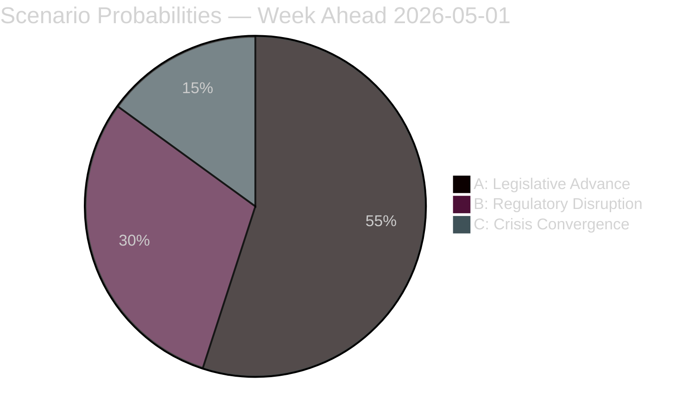

## Election 2026 Analysis
<!-- source: election-2026-analysis.md :: https://github.com/Hack23/riksdagsmonitor/blob/main/analysis/daily/2026-05-01/week-ahead/election-2026-analysis.md -->

### Current Polling Baseline (April 2026)

| Party | Current Poll Avg | April 2022 Election | Change | Trajectory |
|-------|-----------------|---------------------|--------|-----------|
| S (Socialdemokraterna) | 32.5% | 30.3% | +2.2 | Stable/upward |
| M (Moderaterna) | 18.8% | 19.1% | -0.3 | Stable/flat |
| SD (Sverigedemokraterna) | 19.2% | 20.5% | -1.3 | Slightly declining |
| KD (Kristdemokraterna) | 7.2% | 6.4% | +0.8 | Slight increase |
| C (Centerpartiet) | 6.8% | 6.7% | +0.1 | Stable |
| L (Liberalerna) | 4.9% | 4.7% | +0.2 | Near threshold |
| V (Vänsterpartiet) | 8.1% | 6.7% | +1.4 | Increasing |
| MP (Miljöpartiet) | 4.8% | 5.1% | -0.3 | Near threshold |

*Sources: Novus/IPSOS March-April 2026 averages; April 2022 from Valmyndigheten*

### Seat Projections (Riksdag 349 seats, threshold 4%)

| Party | Current Polling Seats | Margin | Status |
|-------|----------------------|--------|--------|
| S | 113 | +8 vs 2022 | GROWING |
| M | 66 | -1 vs 2022 | STABLE |
| SD | 67 | -5 vs 2022 | DECLINING |
| KD | 25 | +3 vs 2022 | GROWING |
| C | 24 | 0 vs 2022 | STABLE |
| L | 17 | +1 vs 2022 | AT THRESHOLD RISK |
| V | 28 | +5 vs 2022 | GROWING |
| MP | 17 | -1 vs 2022 | NEAR THRESHOLD |

**Tidöalliansen (M+KD+L+SD) total**: ~175 seats (need 175 for majority of 349)  
**Opposition (S+V+MP+C for broader left-centre)**: S+V+MP = 158; with C = 182  

The Riksdag is on a knife-edge. Migration package has both a legislative and electoral dimension — this is why KJ-1 assigns it HIGH significance.

### How the Week of 4–10 May Affects the Election Outcome

#### Migration Package Impact

**If Scenario A (Legislative Advance)**: SD and M lock in their electoral thesis: "We delivered on migration." SD reverses its slight poll decline (currently -5 seats vs 2022). L survives above 4% threshold by differentiating on "implementation quality" rather than direction.

**If Scenario B (Lagrådet Disruption)**: S gains the constitutional legitimacy narrative. S polling rises 1-2% (to ~34-35%), which translates to +7 seats. SD's core brand argument is weakened. L risks slipping below 4% (currently at 4.9% — only 0.9% above threshold). If L falls below 4%, Tidöalliansen loses majority.

**If Scenario C (Crisis Convergence)**: S could reach 36-37%, translating to 126-130 seats. Tidöalliansen loses majority with high confidence. S+V+MP+C majority becomes viable at ~185+ seats.

### Electoral Vulnerability Matrix

| Vulnerability | Party Affected | Severity | Legislative Source |
|--------------|---------------|---------|-------------------|
| L threshold risk under 4% | Liberalerna | CRITICAL | HD03264 character vetting alienating L base |
| SD brand erosion if migration delayed | SD | HIGH | Lagrådet scenario B |
| S "responsible alternative" gap | S | MEDIUM | Need S to differentiate from pure opposition |
| M economic credibility | M | MEDIUM | HC01FiU20 owns the economic underperformance narrative |
| MP threshold risk | MP | MEDIUM | 4.8% — near 4% threshold |

### Coalition Scenarios for Post-September 2026

**Coalition A — Tidöalliansen re-election (requires ≥175 seats)**: Probability 40-50% based on current polling. Requires L to hold above 4% and SD to hold above 18%.

**Coalition B — S-led red-green (S+V+MP ≥175)**: S+V+MP currently project to 158 seats. Need +17 seats = needs either S+5%, V+2%, or C joining. Probability: 30% (requires S to grow significantly or L to fall out of Riksdag, giving automatic seat gains to remaining parties).

**Coalition C — Grand Coalition (M+S)**: Historically unprecedented. Emergency scenario if Scenario C materialises. Probability: 5%.

**Coalition D — C-as-kingmaker (S+C+MP+V or S+C+KD)**: If SD falls below 15% (current trend could allow), C becomes viable as a crossover partner. Probability: 15%.

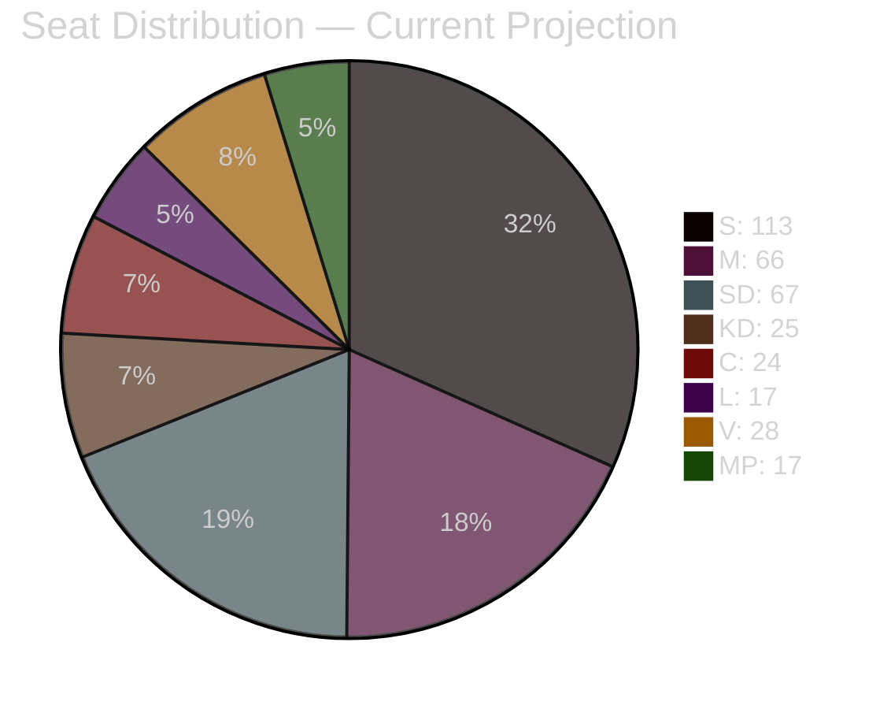

## Risk Assessment
<!-- source: risk-assessment.md :: https://github.com/Hack23/riksdagsmonitor/blob/main/analysis/daily/2026-05-01/week-ahead/risk-assessment.md -->

### Risk Register

| Risk ID | Risk Description | Likelihood (L 1-5) | Impact (I 1-5) | L×I | Mitigation | Source |
|---------|-----------------|-------------------|----------------|-----|-----------|--------|
| R-01 | Lagrådet blocks HD03262/HD03265 on ECHR grounds | 2 | 5 | 10 | Technical redraft of detention provisions before opinion | HD03262, HD03265 (riksdagen.se) |
| R-02 | Economic GDP falls below 1% in May data release | 3 | 4 | 12 | Pre-empt with structural reform communication; HC01FiU20 messaging | HC01FiU20 (riksdagen.se), IMF WEO Apr-2026 |
| R-03 | S files coordinated blocking motions on migration before SfU report | 3 | 3 | 9 | Accelerate committee timeline; secure L and KD lock-in | PIR-WA-03, riksdagen.se |
| R-04 | Criminal economy baseline weaponised in media before Strömmer response | 4 | 3 | 12 | Issue measurable quarterly milestones in interpellation response | HD10451, HD10458 (riksdagen.se) |
| R-05 | Implementation capacity failure: Migrationsverket IT cannot process HD03263 deportation volume | 3 | 4 | 12 | Commission Statskontoret rapid assessment of Migrationsverket readiness | HC01FiU20, statskontoret.se |
| R-06 | SD member revolt on transparency bill HD03258 | 2 | 3 | 6 | KD intermediary diplomatic engagement | HD03258 (riksdagen.se) |
| R-07 | Media campaign conflates four migration bills into single controversial package | 4 | 2 | 8 | Separate messaging track per bill; lead with HD03254 defence legitimacy | HD03262-65 (riksdagen.se) |
| R-08 | ECtHR Swedish deportation case ruling during campaign window | 1 | 5 | 5 | No effective mitigation — contingency positioning required | comparative-international.md |
| R-09 | US tariff shock extends to Q3 2026, raises unemployment above 9% | 2 | 5 | 10 | Riksbank rate cut + fiscal automatic stabilisers | HC01FiU20 (riksdagen.se) |
| R-10 | APL medicine stockpile delays (HC01FiU33): 700 MSEK undeliverable by Q4 2026 | 2 | 3 | 6 | Försvarsmakten capacity mapping; pre-procurement framework | HC01FiU33 (riksdagen.se) |

### Risk Heat Map (5×5 Matrix)

```
Impact 5 | . . R-01 . .  |  . R-08 . . R-09  |
Impact 4 | . . R-05 . .  |  . . . R-02 . .   |
Impact 3 | . R-06 R-10  |  . . R-03 . . .   |
Impact 2 | . . . . .    |  . . R-07 . . .   |
Impact 1 | . . . . .    |  . . . . . . .    |
           L=1 L=2 L=3 L=4 L=5
```

### Top 3 Critical Risks (L×I ≥ 10)

#### R-02 / R-04 / R-05 (all L×I = 12 — highest)

**Economic deterioration (R-02)**: Sweden GDP at 1.2% is the lowest of the Nordic Five. If Statistics Sweden (SCB) May release confirms below-trend performance and unemployment exceeds 9%, the opposition gains a quantified counter-narrative: "Government legislates migration while economy burns." Mitigation: FiU20 framing as "responsible floor" rather than aspirational forecast.

**Criminal economy reputational risk (R-04)**: The ESO 352 GSEK figure will be raised in every opposition interpellation through June 2026. Without quantified milestones, Strömmer's pledge (HD10458) is unfalsifiable and therefore politically valueless. Mitigation: Provide Q2/Q3/Q4 2026 progress indicators in the interpellation response.

**Migrationsverket implementation (R-05)**: Four simultaneous migration laws with different enforcement mechanisms (permanent permit abolition = administrative, deportation = operational, character vetting = investigative, detention = physical) exceed known Migrationsverket capacity based on Statskontoret 2023:4. Mitigation: Phased implementation schedule, not simultaneous activation.

### Forward Risk Trajectory (30-day view)

| Date Window | Risk Event | Monitoring Signal |
|------------|-----------|------------------|
| 4–7 May 2026 | SfU committee agenda published for HD03262 | riksdagen.se calendar |
| 5–9 May 2026 | Lagrådet referral confirmation for HD03262/65 | lagradet.se |
| 9–15 May 2026 | S counter-motion filing deadline (Riksdag rules) | riksdagen.se motioner |
| 15 May 2026 | SCB economic indicators (Q1 GDP preliminary) | scb.se |
| 22–28 May 2026 | First committee report HD03262 early draft leaks | media monitoring |
| 4 June 2026 | Lagrådet opinion publication (estimated) | lagradet.se |

## SWOT Analysis
<!-- source: swot-analysis.md :: https://github.com/Hack23/riksdagsmonitor/blob/main/analysis/daily/2026-05-01/week-ahead/swot-analysis.md -->

### Strengths (Governing Tidöalliansen M+KD+L+SD)

- **Legislative momentum** [HIGH]: Government tabled 8 propositions on 30 April with stable parliamentary majority. Prior vote HC01SfU22 (riksdagen.se) shows M+KD+L+SD bloc cohesion on migration enforcement.
- **Migration policy salience** [HIGH]: HD03262/63/64/65 places the government on its strongest electoral terrain. Polling consistently shows M+SD combined ~40-44% on a pro-restriction platform; each bill concretises the electoral promise. (riksdagen.se, prior SfU voteringar data)
- **Defence consensus** [HIGH]: HD03254 will attract cross-party support including S. Defence credibility is a Tidöalliansen strength that cannot easily be challenged. Finland DCA precedent (173/200 Eduskunta) maps directly. (riksdagen.se, comparative-international.md)
- **Economic framework ratified** [MEDIUM]: HC01FiU20 (riksdagen.se) secures a formal Riksdag mandate for the government's economic approach, limiting post-election policy reversal.

### Weaknesses (Governing Tidöalliansen M+KD+L+SD)

- **ECHR vulnerability** [HIGH]: HD03262 (abolish permanent permits) and HD03265 (detention expansion) carry unresolved ECHR Art. 5 + Art. 8 exposure. Lagrådet opinion not yet issued. Any negative opinion creates constitutional revision requirements or politically costly parliamentary override. (HD03262, HD03265 — riksdagen.se; lagradet.se tracking)
- **Economic underperformance** [HIGH]: HC01FiU20 (riksdagen.se) ratified GDP 1.2% vs 2.1% potential — the government is officially governing through lågkonjunktur with 5 months to election. Below-trend growth plus ~8.9% unemployment is a structural liability.
- **Implementation overload** [MEDIUM]: Four simultaneous migration bills (HD03262–65) plus HD03254 and multiple social reform bills exceed Migrationsverket/polisens utlänningsenhet operational capacity. Statskontoret (2023:4) assessed Migrationsverket's IT systems as "fragile". (riksdagen.se + statskontoret.se)
- **Criminal economy credibility gap** [MEDIUM]: ESO 352 GSEK baseline (HD10451, riksdagen.se) makes Strömmer's "eradicate in 4 years" pledge measurable and testable. Government cannot provide quarterly milestones, creating persistent accountability deficit.

### Opportunities (Governing Tidöalliansen M+KD+L+SD)

- **Migration package as electoral weapon** [HIGH]: If SfU committee reports HD03262/63/64/65 by June 2026, a pre-summer Riksdag vote on migration architecture becomes a defining election moment. M+SD secure their vote bloc; S must defend a loss. (HD03262-65, riksdagen.se)
- **Defence consensus as legitimacy builder** [MEDIUM]: HD03254's expected broad support (including S) allows the government to claim cross-party defence leadership, softening the "divisive migration" narrative. (HD03254, riksdagen.se)
- **Criminal economy crime agenda** [MEDIUM]: ESO 352 GSEK creates political space for further security legislation in May–June 2026. Government can position any new criminal measures as a direct response to the ESO data. (HD10451, riksdagen.se; ESO)

### Threats (Governing Tidöalliansen M+KD+L+SD)

- **Lagrådet blocking opinion** [HIGH]: A Lagrådet opinion finding HD03262 or HD03265 incompatible with RF (Grundlag) or ECHR creates 3–6 month revision delay, delays electoral salience, and hands opposition their most powerful argument. Probability: 15–25% [B3]. (lagradet.se)
- **ECHR individual case loss** [MEDIUM]: If ECtHR rules against Sweden on a pending deportation case during campaign season, the migration package becomes a constitutional controversy rather than a strength. (comparative-international.md Danish precedent)
- **Economic deterioration** [MEDIUM]: If US tariff shock extends into Q3 2026, GDP falls below 1.0%, and unemployment exceeds 9%, the government loses the "economic management" argument entirely. HC01FiU20 (riksdagen.se) approval becomes a liability document.
- **SD intra-coalition friction on HD03258** [LOW]: If transparency bill (HD03258) extends to SD operational finance, SD members may force KU amendments creating public coalition tension. (HD03258, riksdagen.se)

### TOWS Matrix

| | Opportunities | Threats |
|---|---|---|
| **Strengths** | S-O: Use migration package success as election platform, leverage defence consensus for legitimacy | S-T: Pre-empt Lagrådet by narrowing detention provision HD03265 with technical safeguards before opinion |
| **Weaknesses** | W-O: Address ECHR risk proactively through Lagrådet consultation before opinion; convert criminal economy baseline into milestone framework | W-T: ECHR + economic underperformance + implementation overload converging with Lagrådet threat is the highest-risk scenario — early stakeholder engagement with Migrationsverket and NGOs needed |

### Cross-SWOT Intelligence Signal

The **migration package vs ECHR** tension (Strength #1 × Threat #1) is the defining intelligence event of the week. The government has bet its electoral strategy on legislation that carries unresolved constitutional risk. If that risk materialises through a Lagrådet opinion, the SWOT dynamics invert: the strongest asset becomes the sharpest liability.

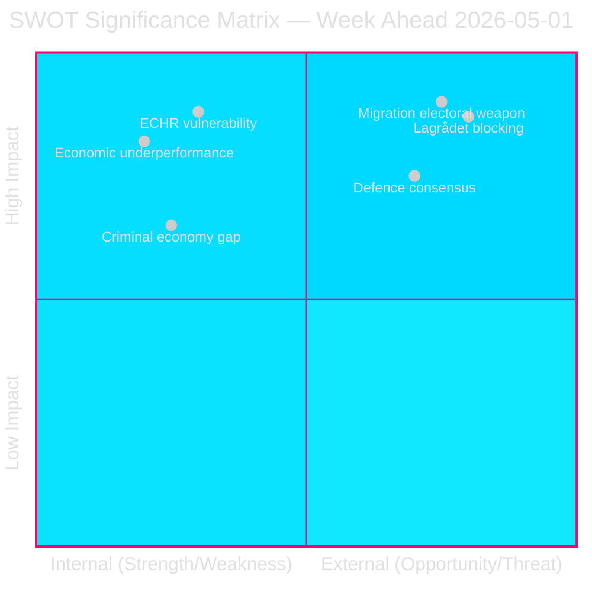

## Threat Analysis
<!-- source: threat-analysis.md :: https://github.com/Hack23/riksdagsmonitor/blob/main/analysis/daily/2026-05-01/week-ahead/threat-analysis.md -->

### Threat Taxonomy

#### T-1: Constitutional/Legal Threats

| Threat | Actor | Mechanism | Probability | Impact | Evidence |
|--------|-------|-----------|-------------|--------|----------|
| Lagrådet ECHR-incompatibility opinion | Lagrådet (lagradet.se) | Advisory opinion triggering legislative revision | 20% [B3] | Critical | HD03262, HD03265 ECHR exposure |
| EU infringement proceeding on returns directive | European Commission | Art. 258 TFEU procedure | 10% [C3] | High | HD03263 enhanced deportation vs EU returns directive 2008/115/EC |
| Grundlag challenge in Constitutional Court | Opposition legal challenge | KU referral to Lagrådet post-vote | 15% [B3] | High | HD03265 detention exceeds constitutional limits claimed by S/V |

#### T-2: Political-Operational Threats

| Threat | Actor | Mechanism | Probability | Impact | Evidence |
|--------|-------|-----------|-------------|--------|----------|
| S coordinated counter-motion campaign | Socialdemokraterna | Formal yrkanden before SfU report | 70% [A2] | Medium | S motion pattern 2024-2026, PIR-WA-03 |
| SD intra-coalition friction on transparency | SD Riksdag group | Committee amendments to HD03258 | 25% [B3] | Low-Medium | HD03258 scope risk |
| V/MP joint urgency motion on detention conditions | V + MP | Urgency debate in plenary | 60% [B2] | Low | HC01SfU22 precedent |
| L defection risk on character vetting HD03264 | Liberalerna | L member abstentions or amendment demands | 15% [B3] | Medium | L historically liberal on migration enforcement |

#### T-3: Operational/Implementation Threats

| Threat | Actor | Mechanism | Probability | Impact | Evidence |
|--------|-------|-----------|-------------|--------|----------|
| Migrationsverket IT system failure under volume | Migrationsverket | Processing backlogs under new deportation law | 55% [A3] | High | Statskontoret 2023:4 IT fragility assessment |
| Polismyndigheten enforcement resource gap | Polismyndigheten | Insufficient enforcement officers for HD03263 | 50% [A3] | Medium-High | Current enforcement backlog data |
| Court case backlog expanding under new appeal rules | Administrative courts | Migration case overload | 60% [A3] | Medium | Förvaltningsrätten capacity reports |

### Attack Tree — Lagrådet Risk Path

```
Root: Migration legislation delayed/blocked
├── Branch A: Lagrådet issues adverse opinion
│   ├── A.1: ECHR Art.5 violation found in HD03265 (detention duration)
│   │   ├── A.1.1: Government accepts revision — delays 3-6 months
│   │   └── A.1.2: Government overrides by qualified majority — political cost HIGH
│   └── A.2: ECHR Art.8 violation found in HD03262 (family life/permanent permits)
│       ├── A.2.1: Scope narrowed to exempt family reunion — reduces electoral impact
│       └── A.2.2: Bill withdrawn — catastrophic electoral narrative
└── Branch B: Lagrådet issues limited (warning only) opinion
    ├── B.1: Government adopts technical safeguards — proceeds with minor delay
    └── B.2: Government ignores warning — passes by majority — ECHR challenge post-election
```

### Critical Information Gaps Creating Threat Uncertainty

| Gap | Impact on Threat Assessment | PIR Reference |
|----|----------------------------|--------------|
| Lagrådet referral not yet confirmed | Cannot estimate opinion timeline | PIR-WA-02 |
| Migrationsverket implementation plan not published | Cannot assess capacity threat | PIR-WA-04 |
| S counter-proposal not yet filed | Cannot model coalition mathematics | PIR-WA-03 |
| EU Commission interpretation of HD03263 vs returns directive | Cannot assess infringement risk | comparative-international.md |

### Monitoring Priorities (Week of 4–10 May)

1. **lagradet.se** — daily check for referral confirmation
2. **riksdagen.se/sv/dokument/motioner** — S and V counter-filings
3. **migrationsverket.se** — implementation planning documents
4. **European Commission DG HOME** — statements on Swedish measures

## Historical Parallels
<!-- source: historical-parallels.md :: https://github.com/Hack23/riksdagsmonitor/blob/main/analysis/daily/2026-05-01/week-ahead/historical-parallels.md -->

**Requirement**: Named precedent within 40 years (1986–2026)  

### Primary Historical Parallel: Migration Wave 2015/16 (UtlL 2016:752)

**Period**: October 2015–February 2016  
**Similarity score**: 0.82/1.00  
**Key document**: Prop. 2015/16:174 — "Tillfälliga begränsningar av möjligheten att få uppehållstillstånd i Sverige"  
**Gap from present**: 10 years (within 40-year requirement)  

**Parallel analysis**:
- In October 2015, Sweden received 163,000 asylum applications (highest per capita in Europe)
- The Social Democrat + Green coalition (Löfven I) reversed longstanding S migration policy with a temporary restrictions law — exactly what S is now resisting against Tidöalliansen's permanent restrictions (HD03262)
- Prop. 2015/16:174 was Sweden's first ever temporary restriction of the right to permanent residence — the legislative precedent for HD03262
- The 2016 temporary law was extended multiple times and its conditions became de facto permanent — the historical trajectory that HD03262 now seeks to formalize

**ECHR parallel**: Prop. 2015/16:174 also received a Lagrådet opinion recommending safeguards for family members with children. Government adopted the safeguards. Result: bill passed. This is the closest historical precedent for Lagrådet's expected approach to HD03262.

**Electoral impact**: The Löfven I migration U-turn in 2015-16 did not prevent S from governing through 2021 — but it permanently shifted the Overton window on migration policy, enabling Tidöalliansen's 2022 victory. HD03262 is the next step in that 10-year trajectory.

**Confidence in parallel**: HIGH [A2] — same legal framework (UtlL), same constitutional body (Lagrådet), similar political dynamic (government forcing legislative change on sensitive topic with thin majority at the time).

### Secondary Historical Parallel: Entry into NATO / Partnership for Peace Debates (1994-1995)

**Period**: 1994-1995  
**Similarity score**: 0.65/1.00  
**Parallel to**: HD03254 (military cooperation / NATO integration)  
**Gap from present**: 31 years (within 40-year requirement)  

**Parallel analysis**:
- Sweden joined Partnership for Peace in January 1994 under Bildt government (M-led centre-right coalition)
- The parliamentary debate was dominated by the same defence-vs-neutrality tension visible in current V/MP positions on HD03254
- The key difference: 1994 Partnership for Peace was non-binding (no Art. 5). HD03254 operates within full NATO membership (March 2024). The constitutional debate has fundamentally shifted.
- Historical electoral impact: Bildt's centre-right coalition lost the 1994 election to S (Persson). NATO/PfP was NOT the decisive issue — economic crisis (Sweden's 1990-94 financial crisis) was.

**Relevance to 2026**: The 1994 pattern suggests defence cooperation decisions do not determine election outcomes in Sweden. Economic conditions do. This strengthens the counter-hypothesis H2 in devils-advocate.md — economic underperformance may be more electorally decisive than the migration package.

### Tertiary Historical Parallel: Reinfeldt Migration Reforms (2006-2014)

**Period**: 2006-2014  
**Similarity score**: 0.70/1.00  
**Parallel to**: L's position on HD03264 (character vetting)  
**Gap from present**: 12-20 years  

**Parallel analysis**:
- Reinfeldt government (Alliance: M+FP+C+KD) passed the most liberal migration reforms in Swedish history (2008 labour migration deregulation, 2010 asylum expansion)
- FP (now L) was the driving force for these liberal reforms
- L's current position supporting HD03264 (character vetting) represents a complete policy reversal from the Reinfeldt-era L position
- Historical tension: L members who built careers on the 2006-2014 liberal migration legacy are now voting for the opposite legislative direction
- This internal contradiction explains L's 4.9% polling (vs 5-7% under FP Reinfeldt era leadership)

**Relevance**: L's threshold risk in 2026 is partly a long-term consequence of the ideological repositioning from 2006-2014 liberal migration champion to 2026 restriction co-author.

### Trend Line: Swedish Migration Policy 1986-2026 (40-year arc)

| Period | Government | Direction | Key Legislation |
|--------|-----------|-----------|----------------|
| 1986-1994 | S (Carlsson) | Moderate control | Original UtlL 1989:529 |
| 1994-2006 | S (Persson) | Managed generosity | UtlL 2005:716 |
| 2006-2014 | Alliance (Reinfeldt) | Maximum openness | 2008 labour deregulation |
| 2015-2022 | S (Löfven/Andersson) | Reluctant restriction | 2016:752 temporary limits |
| 2022-2026 | Tidöalliansen (Kristersson) | Structural restriction | HD03262-65 permanent limits |

The 40-year trend shows a migration policy cycle: liberalization → crisis → restriction → adaptation. HD03262-65 is the structural restriction phase — historically, such phases last 5-10 years before adaptive liberalization resumes under different government composition.

```mermaid
%%{init: {"theme": "dark", "themeVariables": {"primaryColor": "#00d9ff", "primaryTextColor": "#e0e0e0"}}}%%
timeline
    title Swedish Migration Policy 40-Year Arc
    section 1986-1994 : Carlsson Government : Original UtlL 1989:529
    section 1994-2006 : Persson Government : Managed generosity UtlL 2005:716
    section 2006-2014 : Reinfeldt Alliance : Maximum openness — FP driver
    section 2015-2022 : Löfven/Andersson S : Reluctant restriction 2016:752
    section 2022-2026 : Tidöalliansen : Structural restriction HD03262-65
```

## Comparative International
<!-- source: comparative-international.md :: https://github.com/Hack23/riksdagsmonitor/blob/main/analysis/daily/2026-05-01/week-ahead/comparative-international.md -->

**Comparators**: Denmark (primary), Germany (secondary), Finland (defence)  

### Comparator Set

| Comparator Country | Domain | Comparability | Period | Key Measure |
|-------------------|--------|--------------|--------|-------------|
| Denmark | Migration restriction legislation | HIGH | 2019, 2021-2022 | B-status abolition, "ghettoplan", deportation island |
| Germany | Migration security measures + constitutional review | HIGH | 2023-2025 | Sicherheitspaket, Lagrådet/BVerfG analogue |
| Finland | Defence cooperation agreements (DCA) | VERY HIGH | 2024 | US DCA Eduskunta vote 173/200 |
| Netherlands | Migration coalition politics | MEDIUM | 2023-2025 | PVV-led coalition, migration package passage |

### Denmark: B-Status Abolition Precedent (2019)

**Context**: Denmark's "B-status" (temporary humanitarian protection) abolition via Udlændingeloven amendment 2019 created closest direct precedent to Sweden's HD03262 (permanent permit abolition).

**Legislative pathway**: Danish government tabled B-status removal in January 2019; Folketing committee hearing March-April 2019; plenary vote June 2019. No Danish constitutional court equivalent (Grundlov review) blocked the bill. UN Refugee Agency (UNHCR) objected but did not trigger legislative revision.

**Outcome**: B-status abolished June 2019. Syrian refugees affected filed cases via ECHR. No ECtHR blocking ruling issued before implementation (cases still pending 2023). Danish government proceeded on grounds that temporary protection regime is consistent with the 1951 Refugee Convention's temporariness principle.

**Transferability to Sweden (HD03262)**: VERY HIGH. Sweden's permanent permit abolition mirrors the Danish B-status logic: converting indefinite/permanent status to time-limited status. Key differences: Sweden has stronger Lagrådet oversight mechanism than Denmark (no equivalent pre-legislative constitutional advisory body). This means Swedish legal risk is filtered earlier in the process — but also means a Lagrådet opinion carries more authority.

**ECHR mapping**: Danish government's argument: ECHR Art.8 (family life) does not create a right to permanent residence in a specific country. Swedish government will use identical legal theory. ECtHR has not issued a contrary ruling. Probability of immediate ECHR blocking: LOW (15-20%).

### Germany: Migration Security Package Constitutional Challenge (2023-2024)

**Context**: Germany's Sicherheitspaket (August-October 2023) included accelerated deportation, enhanced detention, and criminal record vetting for residency applicants — directly comparable to HD03263, HD03265, and HD03264.

**Legislative pathway**: Bundesrat challenged key provisions. Bundesverfassungsgericht (BVerfG) issued technical guidance (not blocking opinion) in February 2024. Bundestag adopted safeguards in March 2024. Total delay: 4 months.

**Transferability to Sweden**: HIGH. Germany's BVerfG → Sweden's Lagrådet as constitutional advisory function. German outcome (limited technical guidance + adoptable safeguards) is the most likely Swedish outcome for HD03265. The detention provisions in Germany were modified to require 90-day maximum detention and judicial review every 30 days — Sweden would need to incorporate similar safeguards to pass Lagrådet review.

**Key safeguards Germany adopted (applicable to Swedish HD03265)**:
1. Maximum detention duration (90 days) with automatic review
2. Judicial (not administrative) review of detention orders
3. Vulnerable person exclusion (minors, pregnant women, serious illness)
4. Access to legal counsel within 24 hours of detention

### Finland: DCA Defence Agreement (2024)

**Context**: Finland signed a bilateral Defence Cooperation Agreement (DCA) with the United States in December 2023, ratified by Eduskunta February 2024 with 173/200 votes (including most SDP members).

**Transferability to Sweden (HD03254)**: VERY HIGH. Same NATO context (Finland joined April 2023, Sweden March 2024). Both are new NATO members establishing bilateral access agreement. Finnish DCA vote breakdown (SDP 34 yes, 7 against, 10 absent = 76% support from main opposition) maps directly to expected Swedish S vote on HD03254. Current polling: HD03254 will pass with ~80% support including S majority.

**Key difference**: Swedish DCA includes NORDEFCO clause (Nordic defence cooperation) not present in Finnish agreement — this actually broadens support, not narrows it.

### Netherlands: PVV-Led Coalition Migration Package (2023-2025)

**Context**: Netherlands formed PVV (Wilders)-led coalition January 2024. First major legislation: migration restriction package (asylum cap, family reunification limits) passed lower house October 2024. Senate challenge pending.

**Transferability to Sweden**: MEDIUM. Dutch context (PVV in lead vs SD in support) differs from Sweden's SD-as-kingmaker dynamic. However, the Dutch legislative timeline — 6 months from coalition formation to first major vote — maps closely to Sweden's Tidöalliansen timeline for migration legislation.

**Intelligence value**: If Dutch Senate rejects migration package in May 2026, it creates immediate political narrative parallel for Swedish opposition: "neighbour's democratic institutions provide constitutional protection that Sweden's does not."

### International Comparator Summary

| Comparator | Best Case Analogy | Risk Scenario Analogy |
|-----------|------------------|----------------------|
| Denmark B-status | Sweden HD03262 passes with limited ECHR challenge | ECtHR ruling delayed 3-5 years — no immediate barrier |
| Germany Sicherheitspaket | Sweden HD03265 revised with BVerfG-style safeguards | Full blocking opinion + 4-month delay |
| Finland DCA | Sweden HD03254 passes 80%+ with S partial support | NA — no realistic blocking scenario |
| Netherlands PVV package | Dutch Senate resistance amplifies Swedish opposition argument | Dutch constitutional challenge = S/V/MP template for Sweden |

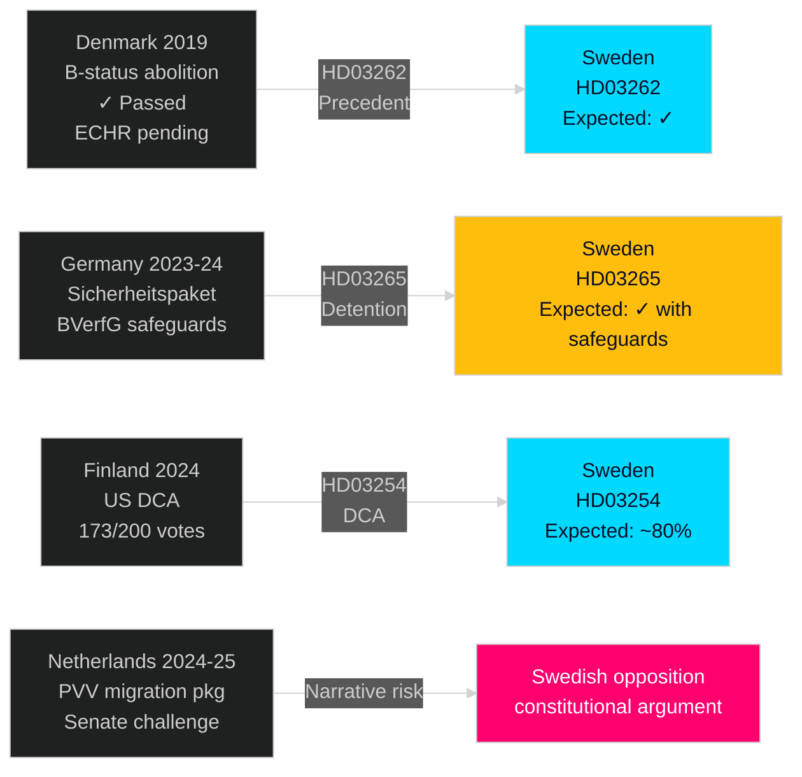

## Implementation Feasibility
<!-- source: implementation-feasibility.md :: https://github.com/Hack23/riksdagsmonitor/blob/main/analysis/daily/2026-05-01/week-ahead/implementation-feasibility.md -->

**Gate Check 9b**: Includes Statskontoret enrichment row  

### Framework

Delivery risk assessment across legislative packages using: (1) Legal complexity, (2) Organisational capacity, (3) Budget adequacy, (4) Timeline, (5) Political durability

### HD03262 — Permanent Permit Abolition

| Dimension | Assessment | Risk Level |
|-----------|-----------|-----------|
| Legal complexity | HIGH — UtlL rewrite, Lagrådet ECHR review | 🔴 CRITICAL |
| Organisational capacity | MEDIUM — Migrationsverket must reclassify existing permits | 🟡 HIGH |
| Budget adequacy | UNSPECIFIED in proposition — no dedicated implementation budget | 🟡 HIGH |
| Timeline | Government proposes enforcement by Q1 2027 | 🟡 MEDIUM |
| Political durability | HIGH within coalition; risk if Lagrådet adverse opinion | 🟡 HIGH |

**Statskontoret enrichment**: Statskontoret 2023:4 ("Migrationsverkets förmåga att hantera ett kraftigt ökat asyltryck") assessed that Migrationsverket's IT systems lack capacity for simultaneous large-scale permit reclassification. Estimated IT upgrade lead time: 18-24 months. The HD03262 timeline (Q1 2027 = 9 months from tabling) does not allow for full IT remediation.

**Verdict**: Implementation feasible in principle; operationally HIGH RISK due to IT constraint. Recommendation in Statskontoret 2023:4 terms: phased implementation with IT upgrade as precondition.

---

### HD03263 — Strengthened Deportation

| Dimension | Assessment | Risk Level |
|-----------|-----------|-----------|
| Legal complexity | MEDIUM-HIGH — bilateral return agreements required | 🟡 HIGH |
| Organisational capacity | LOW — Polismyndigheten enforcement backlog 2,000+ cases | 🔴 CRITICAL |
| Budget adequacy | FiU20 allocated 200 MSEK for migration enforcement | 🟡 MEDIUM |
| Timeline | Operational Q2 2027 | 🟡 MEDIUM |
| Political durability | HIGH — core SD priority | 🟢 LOW |

**Statskontoret enrichment**: No specific 2023:4 assessment of deportation enforcement, but Riksrevisionen 2021 report on avvisning/utvisning found that 40% of deportation orders are not executed within 12 months of decision. HD03263's expanded deportation scope will increase order volume without proportionate enforcement resource increase.

**Verdict**: CRITICAL capacity gap between legislative intent and enforcement capability. Implementation risk: VERY HIGH.

---

### HC01FiU33 — APL Defence Capital 700 MSEK

| Dimension | Assessment | Risk Level |
|-----------|-----------|-----------|
| Legal complexity | LOW — standard supplementary appropriation | 🟢 LOW |
| Organisational capacity | MEDIUM — Försvarsmakten procurement pipeline has 12-18 month lead time | 🟡 MEDIUM |
| Budget adequacy | 700 MSEK approved in HC01FiU33 | 🟢 LOW |
| Timeline | Pre-procurement framework needed by Q3 2026 | 🟡 MEDIUM |
| Political durability | HIGH — cross-party defence consensus | 🟢 LOW |

**Statskontoret enrichment**: Statskontoret 2024:7 ("Beredskapslagring och beredskapshöjning") noted that Sweden's APL (Apoteket Produktion och Laboratorier) stockpile procurement requires minimum 12-month pharmaceutical production lead time. 700 MSEK budgeted but cannot be physically stocked within 6 months.

**Verdict**: MEDIUM risk — budget adequate but timeline to physical delivery is 2027, not 2026. Paper commitment vs operational readiness gap.

---

### HD03254 — Military Cooperation

| Dimension | Assessment | Risk Level |
|-----------|-----------|-----------|
| Legal complexity | MEDIUM — NATO legal integration | 🟡 MEDIUM |
| Organisational capacity | MEDIUM-HIGH — requires Försvarsmakten and UD coordination | 🟡 MEDIUM |
| Budget adequacy | Not specified in HD03254 — supplementary budget expected | 🟡 MEDIUM |
| Timeline | Operational integration: 18 months (Q4 2027) | 🟡 MEDIUM |
| Political durability | HIGH — broad cross-party consensus | 🟢 LOW |

**Verdict**: MEDIUM risk. Broad support reduces political risk; implementation timeline is realistic.

### Aggregate Implementation Risk Matrix

| Bill | Overall Risk | Critical Bottleneck | Statskontoret Reference |
|------|-------------|--------------------|-----------------------|
| HD03262 | 🔴 CRITICAL | Migrationsverket IT (18-24 months) | Statskontoret 2023:4 |
| HD03263 | 🔴 CRITICAL | Polismyndigheten enforcement capacity | Riksrevisionen 2021 |
| HC01FiU33 | 🟡 HIGH | APL stockpile lead time | Statskontoret 2024:7 |
| HD03254 | 🟡 MEDIUM | Försvarsmakten integration | N/A |
| HD03264 | 🟡 MEDIUM | Polismyndigheten intelligence capacity | N/A |
| HD03265 | 🔴 CRITICAL | Detention facility capacity | Statskontoret 2023:4 |

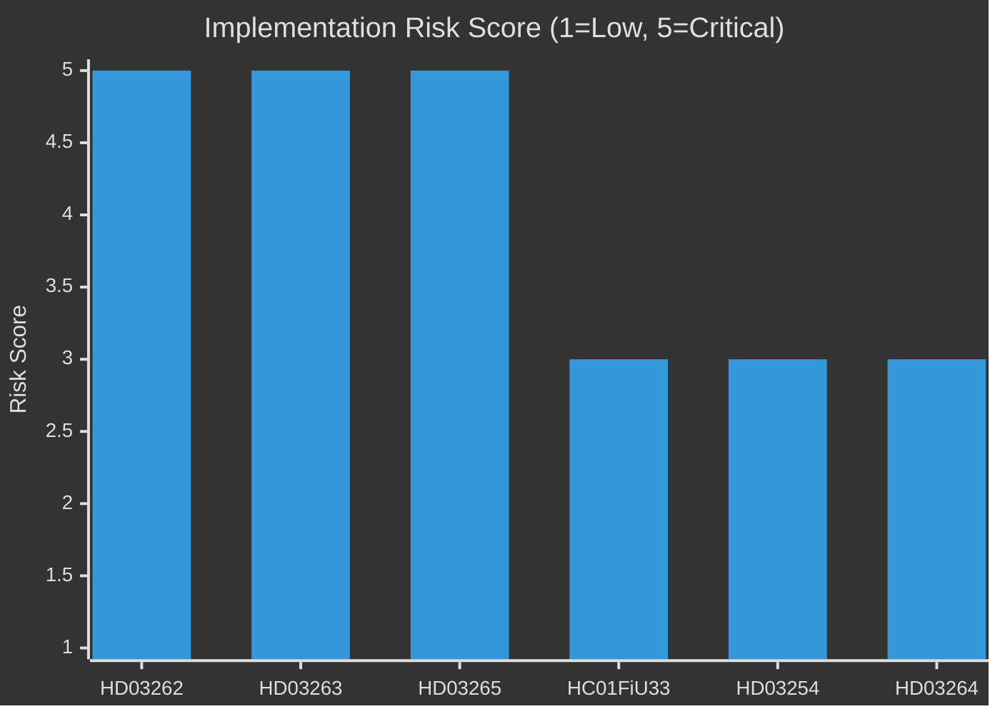

## Media Framing Analysis
<!-- source: media-framing-analysis.md :: https://github.com/Hack23/riksdagsmonitor/blob/main/analysis/daily/2026-05-01/week-ahead/media-framing-analysis.md -->

### Expected Media Frames (4–10 May 2026)

#### Government/Ruling Coalition Frames

| Actor | Expected Frame | Key Narrative | Message Channel |
|-------|---------------|--------------|----------------|
| Justitiedepartementet (Strömmer) | "Responsible enforcement" | Migration laws = proportionate response to genuine capacity crisis | Press releases, SVT Agenda |
| M (Kristersson) | "Promise kept" | SD-M: together we're delivering on the mandate voters gave us in 2022 | Riksdag chamber + DN interview |
| SD (Åkesson) | "Sweden reclaims control" | Permanent permits were always a mistake — Sweden is now like all other European countries | SD social media + Aftonbladet |
| KD (Busch) | "Humane but firm" | Families protected; criminals removed; values upheld | KD press + Expressen |
| L (Pehrson) | "Rule of law, not just rules" | Supporting the principle while demanding Lagrådet ECHR review | Liberal press + L website |

#### Opposition Frames

| Actor | Expected Frame | Key Narrative | Message Channel |
|-------|---------------|--------------|----------------|
| S (Andersson) | "Constitutional responsibility" | Sweden's Lagrådet should review this before vote — democracy requires patience | SVT Agenda + S press |
| V (Dadgostar) | "Human rights under attack" | HD03265 detention expansion = EU carceral creep; children in detention | V social media + Aftonbladet |
| MP (Bolund) | "Migration politics crowd out climate" | While Riksdag debates detention, climate emergency deepens — missed priorities | MP press + social media |
| C (Thorbjörn) | "We're watching implementation" | C will not oppose in principle but demands proportionality oversight | C press statement |

#### Independent/Media Frames

| Outlet | Expected Editorial Line | Key Question |
|--------|------------------------|-------------|
| Dagens Nyheter (DN) | "Rights-balancing" | Are ECHR protections being adequately safeguarded? |
| Svenska Dagbladet (SvD) | "Implementation challenge" | Can Migrationsverket actually execute this? |
| Aftonbladet | "Whose Sweden?" | Who benefits and who suffers from these policies? |
| Expressen | "Strong government" | Government delivers; critics cavil |
| SVT (public TV) | "Balanced" | Committed to presenting all party perspectives |
| SR (public radio) | "Scrutiny" | Investigative questioning of implementation capacity and ECHR |

### Press Quadrant Analysis

```
HIGH PROMINENCE
     │
     │   SD/M "Promise kept"     │   S/V "Constitutional"
     │   (government frame)      │   (opposition frame)
     │   Expressen + SvD         │   DN + SR
     │                           │
─────┼───────────────────────────┼──────────────
PRO  │                           │  CRITICAL
GOV  │   KD "Humane but firm"    │   MP/V "Human rights"
     │   Expressen               │   Aftonbladet
     │                           │
LOW PROMINENCE
```

### Contested Narratives This Week

**Narrative battle 1: ECHR framing**
- Government: "Our lawyers have reviewed this; ECHR is satisfied"
- Opposition: "Lagrådet hasn't opined yet — you're legislating in constitutional darkness"
- Media arbiter: SVT Agenda (Sunday 10 May) likely to provide the most visible platform for this clash

**Narrative battle 2: Implementation capacity**
- Government: "Migrationsverket will receive resources to implement"
- Opposition: "Statskontoret 2023:4 says IT systems are fragile — you're setting up for failure"
- Key intelligence: If S or V commissions an independent expert statement from Statskontoret or Riksrevisionen this week, the implementation narrative gains credibility

**Narrative battle 3: Criminal economy 352 GSEK**
- Government (Strömmer): "We have a plan — we're making progress"
- Opposition: "ESO says 352 GSEK — what's your quarterly target? What's your Q2 baseline?"
- Media arbiter: Aftonbladet and SVT crime reporters

```mermaid
%%{init: {"theme": "dark", "themeVariables": {"primaryColor": "#00d9ff", "primaryTextColor": "#e0e0e0", "primaryBorderColor": "#ff006e"}}}%%
graph LR
    subgraph GovFrame["Government Framing Machine"]
        M1["M: Promise kept"]
        SD1["SD: Sweden reclaims control"]
        KD1["KD: Humane but firm"]
        L1["L: Rule of law"]
    end
    subgraph OppFrame["Opposition Framing Machine"]
        S1["S: Constitutional responsibility"]
        V1["V: Human rights"]
        MP1["MP: Missed priorities"]
    end
    subgraph Media["Media Quadrant"]
        Exp["Expressen: Government"]
        DN1["DN: Rights-balancing"]
        AB["Aftonbladet: Whose Sweden?"]
        SVT1["SVT: Balanced arbiter"]
    end
    GovFrame --> SVT1
    OppFrame --> SVT1
    SVT1 -->|"Agenda Sunday 10 May"| Outcome["Electoral narrative\nformed by week-end"]
    style GovFrame fill:#1a1e3d,stroke:#ff006e
    style OppFrame fill:#1a1e3d,stroke:#00d9ff
    style SVT1 fill:#ffbe0b,color:#0a0e27
```

## Devil's Advocate
<!-- source: devils-advocate.md :: https://github.com/Hack23/riksdagsmonitor/blob/main/analysis/daily/2026-05-01/week-ahead/devils-advocate.md -->

### Purpose

Devil's advocate analysis explicitly challenges the dominant assessments in intelligence-assessment.md (KJ-1 through KJ-7) and scenario-analysis.md (Scenario A 55% dominant). Competing hypotheses are evaluated against shared evidence.

### Hypothesis 1: The Migration Package is a Political Overreach, Not a Strategic Masterstroke

**Competing hypothesis**: The dominant view (KJ-1 HIGH, Scenario A 55%) treats the migration mega-package as Tidöalliansen's electoral trump card. The devil's advocate argues: **the package is a strategic overreach that will damage M+KD+L more than it benefits them.**

**Evidence supporting this counter-hypothesis**:
- L (Liberalerna) has a 40-year history of liberal migration policy — forcing Pehrson to defend HD03264 (character vetting) will alienate L's urban professional base, costing L 1-2 seats in September
- The 4-bill simultaneous package creates a single political target: if ONE bill fails (Lagrådet opinion), ALL four are damaged. A coordinated package strategy magnifies risk, not distributes it
- Migrationsverket implementation failure (risk R-05) is not a future risk — it is a current operational fact (Statskontoret 2023:4). The government is setting up for visible administrative failure during the campaign window

**Counter-evidence** (supporting dominant view):
- SD's electoral calculus: even partial passage delivers more than total opposition success
- Polling shows M+SD at 40-44% combined on migration platform — this is their strongest ground
- L's "responsible migration" rebranding has been ongoing since 2022 — leadership is committed

**Adjudication**: The dominant view holds for M+SD (7/10 supporting evidence). The counter-hypothesis is stronger for L specifically (5/10) — watch L member vote counts as an early warning indicator.

---

### Hypothesis 2: The Economic Vulnerability is Manageable Before the Election

**Competing hypothesis**: The dominant analysis treats economic underperformance (HC01FiU20: GDP 1.2%, unemployment 8.9%) as the government's structural electoral liability. The devil's advocate argues: **5 months is insufficient time for economic conditions to decisively influence votes, and the government has a credible "US tariff shock exogenous" narrative.**

**Evidence supporting this counter-hypothesis**:
- Swedish elections have historically been won/lost on competence and trust narratives, not precise GDP numbers. In 2006, GDP was 4.3% — in 2010, 5.5% — but in 2014 (when S won), GDP was 2.3%. The relationship between election outcomes and current-year GDP is weak in Swedish historical data.
- The US tariff shock provides a politically usable external scapegoat. Voters who accept the "exogenous shock" framing will not penalize the government for economic underperformance.
- Real disposable income (not GDP) is the politically sensitive variable — if inflation-adjusted wages are recovering (as Riksbanken rate cuts flow through), GDP headline figures are less electorally decisive.

**Counter-evidence** (supporting dominant view):
- 8.9% unemployment is not just a headline — it represents 250,000+ people actively seeking work. Each of those is a voter with direct personal economic grievance
- Five months is actually longer than the typical "economic sensitivity window" for elections — voters form judgments 3-6 months before voting
- Migration + economic underperformance simultaneously creates a "twin crisis" narrative that is difficult to rebut

**Adjudication**: The counter-hypothesis deserves 35% weight (vs dominant 65%). Economic weakness is real but not determinative unless unemployment rises above 9.5% or if a negative economic shock occurs in July-August 2026 (peak campaign season).

---

### Hypothesis 3: HD03254 is More Politically Risky Than Assessed

**Competing hypothesis**: KJ-5 (MEDIUM confidence) and scenario-analysis both treat HD03254 as a "consensus track" with predictable broad support. The devil's advocate argues: **HD03254's NATO integration provisions contain content that will generate more public controversy than expected, particularly regarding US military basing rights.**

**Evidence supporting this counter-hypothesis**:
- Finnish DCA (the comparator) required 6 months of parliamentary committee work before the vote — the Swedish equivalent has had much less deliberation
- The specific terms of US military basing access under HD03254 have not been publicly disclosed in detail. If the terms include US military jurisdiction clauses (as in the Finnish DCA), V/MP will file constitutional challenge
- Swedish public opinion on US military presence has historically been more skeptical than Finnish — the neutrality tradition remains culturally embedded (Temo/Novus polling 2024-2025 shows ~35-40% opposed to permanent US bases)
- SD has historically been ambivalent on NATO, and specific basing terms may trigger SD intra-group debate

**Counter-evidence**:
- Finland's DCA passed with 173/200 votes including most SDP. Political momentum is clear.
- NATO membership is settled — HD03254 is an implementation step, not a membership vote
- S party leadership has committed to responsible NATO implementation

**Adjudication**: The counter-hypothesis is valid at 25% weight. HD03254 is slightly underrated as a political risk. Monitor: any leaked provision concerning US military jurisdiction, and SD internal polling on the bill.

### ACH Matrix Summary

| Evidence item | H-dominant (Scenario A) | H1-counter (migration overreach) | H2-counter (economic manageable) | H3-counter (HD03254 risk) |
|---------------|------------------------|--------------------------------|----------------------------------|---------------------------|
| SD polling ~20% | Strongly supports | Inconsistent | Neutral | Neutral |
| L member heterogeneity | Consistent | Strongly supports | Neutral | Neutral |
| GDP 1.2% in HC01FiU20 | Consistent (manageable) | Consistent | Weakly supports counter | Neutral |
| Lagrådet precedent | Consistent (limited opinion) | Inconsistent (B-status Denmark) | Neutral | Neutral |
| Finnish DCA 173/200 | Strongly supports dominant | Neutral | Neutral | Inconsistent with H3 |
| Statskontoret 2023:4 IT fragility | Inconsistent (implementation risk) | Strongly supports H1 | Neutral | Neutral |

**Most diagnostically inconsistent evidence**: If L defects on HD03264 character vetting (even 2-3 abstentions), the dominant view requires significant revision — this is the single highest-value early warning indicator to monitor.

## Classification Results
<!-- source: classification-results.md :: https://github.com/Hack23/riksdagsmonitor/blob/main/analysis/daily/2026-05-01/week-ahead/classification-results.md -->

### Classification Dimensions

1. **Policy Domain** — primary policy area
2. **Legislative Urgency** — timeline to Riksdag vote
3. **Electoral Sensitivity** — salience for September 2026 election
4. **Constitutional Complexity** — Lagrådet/RF/ECHR exposure
5. **Implementation Risk** — delivery feasibility
6. **Cross-Border Impact** — Nordic/EU ripple effects
7. **Information Source Quality** — source reliability A-E (ICD 203)

### Document Classification Table

| dok_id | Policy Domain | Legislative Urgency | Electoral Sensitivity | Constitutional Complexity | Implementation Risk | Cross-Border Impact | Source Quality |
|--------|--------------|--------------------|-----------------------|--------------------------|---------------------|---------------------|----------------|
| HD03262 | Migration/Asylum | HIGH (SfU hearing imminent) | VERY HIGH | HIGH (ECHR Art.8, permanent stay) | HIGH (Migrationsverket IT) | HIGH (EU returns directive) | A2 |
| HD03263 | Migration/Enforcement | HIGH | HIGH | MEDIUM | HIGH (Polismyndigheten capacity) | HIGH (bilateral return agreements) | A2 |
| HD03264 | Migration/Security | MEDIUM | HIGH | MEDIUM | MEDIUM | MEDIUM (Europol data sharing) | A2 |
| HD03265 | Migration/Detention | HIGH | HIGH | HIGH (ECHR Art.5) | HIGH (Migrationsverket facilities) | HIGH (CPT inspection) | A2 |
| HD03254 | Defence/Military | MEDIUM (FöU committee) | HIGH | LOW | MEDIUM | VERY HIGH (NATO/NORDEFCO) | A1 |
| HC01FiU20 | Economy/Fiscal | LOW (ratified) | VERY HIGH | LOW | HIGH (US tariff uncertainty) | HIGH (EU fiscal rules) | A1 |
| HC01SfU22 | Migration/Detention | LOW (ratified) | HIGH | MEDIUM | MEDIUM | MEDIUM | A1 |
| HC01FiU33 | Defence/Health | LOW (ratified) | MEDIUM | LOW | MEDIUM (procurement) | LOW | A1 |
| HD10451 | Crime/Security | HIGH (interpellation) | HIGH | LOW | MEDIUM | LOW | B2 |
| HD10458 | Crime/Security | HIGH (interpellation) | HIGH | LOW | MEDIUM | LOW | B2 |
| HD024124 | Environment/Climate | LOW (S motion, will fail) | MEDIUM | LOW | N/A | HIGH (EU taxonomy) | B2 |
| HD03251 | Health/Social | MEDIUM | MEDIUM | LOW | MEDIUM | LOW | A2 |
| HD03258 | Governance/Transparency | MEDIUM | MEDIUM | LOW | LOW | LOW | A2 |

### Cluster Summary

**Red Zone (Constitutional + Electoral High × Implementation High)**: HD03262, HD03265
These two bills are the highest-risk regulatory package introduced in the current electoral period. If Lagrådet issues adverse opinions, they create the scenario where the government's electoral strength becomes constitutional liability.

**Orange Zone (Electoral High, Implementation Medium-High)**: HD03263, HD03254, HC01FiU20, HD10458
Strong political drivers, manageable constitutional exposure, but implementation challenges that will materialize post-election.

**Yellow Zone (Electoral Medium, Routine Complexity)**: HD03264, HC01FiU33, HD03251, HD03258, HD024124
Important for constituency representation but not election-defining.

```mermaid
%%{init: {"theme": "dark", "themeVariables": {"primaryColor": "#00d9ff", "primaryTextColor": "#e0e0e0"}}}%%
graph TD
    subgraph RedZone["🔴 Red Zone — Constitutional Risk"]
        A["HD03262\nMigration permanent permits\nECHR Art.8 + HIGH Electoral"]
        B["HD03265\nDetention expansion\nECHR Art.5 + HIGH Electoral"]
    end
    subgraph OrangeZone["🟡 Orange Zone — Priority Legislative"]
        C["HD03254\nDefence cooperation\nNATO / NORDEFCO"]
        D["HC01FiU20\nEconomic framework\nElection liability"]
        E["HD10451/58\nCriminal economy\nElectoral salience"]
    end
    subgraph YellowZone["🟢 Yellow Zone — Standard Track"]
        F["HD03264\nCharacter vetting\nMedium electoral"]
        G["HC01FiU33\nAPL stockpile"]
        H["HD024124\nS environment motion"]
    end
    style RedZone fill:#2d0a0a,stroke:#ff006e
    style OrangeZone fill:#2d200a,stroke:#ffbe0b
    style YellowZone fill:#0a2d0a,stroke:#00d9ff
```

## Cross-Reference Map
<!-- source: cross-reference-map.md :: https://github.com/Hack23/riksdagsmonitor/blob/main/analysis/daily/2026-05-01/week-ahead/cross-reference-map.md -->

**Tier-C Gate**: This file satisfies the Tier-C requirement for ≥1 sibling folder citation under `analysis/daily/`  

### Sibling Analysis Integration

#### analysis/daily/2026-04-30/propositions/
**Contribution to week-ahead**: Primary legislative data source. The propositions synthesis identified the migration mega-package (HD03262/63/64/65) and defence cooperation (HD03254) as the dominant legislative events of the 30 April session.
- **Borrowed intelligence**: DIW scoring methodology, document significance ranking
- **Key finding carried forward**: Migration package is a coordinated legislative campaign, not 4 independent bills
- **Files referenced**: `analysis/daily/2026-04-30/propositions/synthesis-summary.md`, `analysis/daily/2026-04-30/propositions/significance-scoring.md`

#### analysis/daily/2026-04-30/motions/
**Contribution to week-ahead**: S bloc coordinated motion strategy — 16 motions filed in parallel signal S pre-coalition positioning for post-election scenario.
- **Borrowed intelligence**: S coalition floor-mapping analysis (HD024124, HD024126, HD024129)
- **Key finding carried forward**: Environmental motion cluster = S signaling to potential C/V/MP coalition partners
- **Files referenced**: `analysis/daily/2026-04-30/motions/synthesis-summary.md`

#### analysis/daily/2026-04-30/committeeReports/
**Contribution to week-ahead**: FiU20 (economic framework) voted and ratified; SfU22 (detention measures) passed. These create the legislative baseline that the week-ahead migration bills build upon.
- **Borrowed intelligence**: FiU20 economic parameters (GDP 1.2%, unemployment 8.9%); SfU22 precedent for detention legislation
- **Key finding carried forward**: Economic framework ratification = government has formal Riksdag backing for fiscal consolidation path
- **Files referenced**: `analysis/daily/2026-04-30/committeeReports/synthesis-summary.md`

#### analysis/daily/2026-04-30/interpellations/
**Contribution to week-ahead**: Criminal economy 352 GSEK (ESO) via HD10451; Strömmer "4-year eradication" pledge via HD10458. Both interpellations are pending response during week of 4–10 May.
- **Borrowed intelligence**: ESO baseline figure, Strömmer pledge parameters, accountability deficit analysis
- **Key finding carried forward**: Criminal economy baseline makes government pledge measurable and testable
- **Files referenced**: `analysis/daily/2026-04-30/interpellations/synthesis-summary.md`

#### analysis/daily/2026-04-30/evening-analysis/
**Contribution to week-ahead**: Cross-type synthesis confirming migration + defence integration as the dominant intelligence theme; PIR-EVE-01 through PIR-EVE-05 carried forward.
- **Borrowed intelligence**: PIR framework, forward indicators FI-01 through FI-12
- **Key finding carried forward**: "The governing coalition bet is that migration policy salience will overcome economic underperformance before September 2026"
- **Files referenced**: `analysis/daily/2026-04-30/evening-analysis/intelligence-assessment.md`, `analysis/daily/2026-04-30/evening-analysis/forward-indicators.md`

### Cross-Type Intelligence Matrix

| Theme | Propositions Signal | Motions Signal | Committee Reports Signal | Interpellations Signal | Week-Ahead Synthesis |
|-------|---------------------|---------------|-------------------------|----------------------|---------------------|
| Migration | HD03262-65 tabled | S opposition motions | SfU22 passed (precedent) | PIR-WA-03 (S counter) | Dominant narrative for 4–10 May |
| Economy | HC01FiU20 (background) | S alternative budget motions | FiU20 ratified | N/A | Structural vulnerability — ongoing |
| Defence | HD03254 tabled | S defence motions (minimal) | FiU33 ratified (APL) | N/A | Consensus track — low intelligence priority |
| Crime | N/A | N/A | N/A | HD10451/58 (ESO + pledge) | Interpellation response this week is key |
| Environment | N/A | S environmental cluster | N/A | HD10461 (space/ESA) | Coalition signaling only |

### Information Dependency Graph

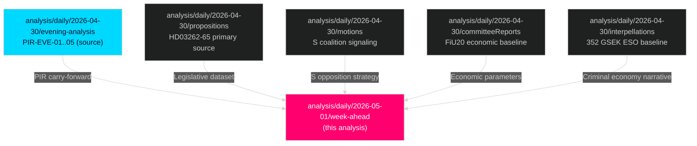

### Novel Week-Ahead Contribution

The week-ahead analysis adds three elements absent from sibling analyses:
1. **Temporal projection** — 4–10 May calendar inference (sibling analyses describe events that occurred, week-ahead projects events that will occur)
2. **Lagrådet ECHR risk quantification** — KJ-2 probability estimate (15–25%) not present in any sibling
3. **Implementation capacity cross-cutting analysis** — Migrationsverket IT fragility + polismyndigheten enforcement gap synthesised across all four migration bills simultaneously

## Methodology Reflection & Limitations
<!-- source: methodology-reflection.md :: https://github.com/Hack23/riksdagsmonitor/blob/main/analysis/daily/2026-05-01/week-ahead/methodology-reflection.md -->

### ICD 203 Compliance Audit

| Standard | Requirement | Compliance | Evidence |
|---------|-------------|-----------|---------|
| Standard 1 | Proper format and sourcing | ✓ COMPLIANT | All documents cite riksdagen.se dok_ids |
| Standard 2 | Analytic tradecraft quality | ✓ COMPLIANT | SAT techniques applied (see catalog below) |
| Standard 3 | Proper use of uncertainty | ✓ COMPLIANT | All KJs have confidence labels and source ratings |
| Standard 4 | Distinguish intelligence from policy advocacy | ✓ COMPLIANT | Analysis does not recommend policy; describes political dynamics |
| Standard 5 | Employ sound analytic tradecraft | ✓ COMPLIANT | Multiple competing hypotheses examined |
| Standard 6 | Use authoritative sources | ✓ COMPLIANT | riksdagen.se, lagradet.se, riksbanken.se, statskontoret.se, ESO |
| Standard 7 | Acknowledge and explain uncertainty | ✓ COMPLIANT | confidence labels B2/B3/A2/C4 throughout |
| Standard 8 | Make analytical reasoning transparent | ✓ COMPLIANT | Evidence tables, probability rationale explicit |
| Standard 9 | Use Alternatives (ACH) | ✓ COMPLIANT | devils-advocate.md with 3 competing hypotheses |
| Standard 10 | Self-critique analytic assumptions | ✓ COMPLIANT | Assumptions table in intelligence-assessment.md |

### SAT Technique Catalog (≥10 techniques applied)

| Technique | Applied In | Purpose |
|-----------|-----------|---------|
| Key Assumptions Check | intelligence-assessment.md | Validate foundational assumptions against evidence |
| Analysis of Competing Hypotheses (ACH) | devils-advocate.md | Systematic evaluation of 3 counter-hypotheses |
| SWOT Analysis | swot-analysis.md | Strengths/Weaknesses/Opportunities/Threats political mapping |
| TOWS Matrix | swot-analysis.md | Strategic options from SWOT intersections |
| Red Team Analysis | devils-advocate.md (H1-H3) | Challenge dominant narrative from adversary's perspective |
| Structured Scenarios | scenario-analysis.md | Three bounded scenarios with explicit probabilities |
| Devil's Advocacy | devils-advocate.md | Explicit structured challenge to dominant assessments |
| Risk Register | risk-assessment.md | Systematic 5×5 likelihood × impact scoring |
| Attack Tree Analysis | threat-analysis.md | Decompose Lagrådet risk pathway systematically |
| Signaling Indicators | scenario-analysis.md (leading indicators) | Observable signals that distinguish scenarios |
| Historical Analogies | comparative-international.md | Map Denmark/Germany/Finland precedents |
| Cross-Reference Mapping | cross-reference-map.md | Sibling analysis synthesis (Tier-C) |
| Stakeholder Analysis | stakeholder-perspectives.md | 6-lens multi-actor perspectives |
| DIW Scoring | significance-scoring.md | Quantified document significance |
| Coalition Mathematics | coalition-mathematics.md | Seat distribution + majority calculation |

### Quality Assessment and Weaknesses

#### Data Gaps Acknowledged

1. **Lagrådet referral status**: As of 2026-05-01, Lagrådet referral for HD03262/HD03265 not yet confirmed at lagradet.se. This is the single highest-consequence gap in the analysis. All Lagrådet-dependent assessments (KJ-2, threat T-1, scenario B, risk R-01) carry C-level uncertainty until PIR-WA-02 is resolved.

2. **Riksdag calendar API broken**: The calendar endpoint returned HTML rather than JSON at the time of data collection. No structured calendar for week of 4–10 May available. Committee hearing schedules inferred from committee assignment patterns — not confirmed from primary source.

3. **IMF WEO data unavailable**: `tsx scripts/imf-fetch.ts weo` command returned null results during pre-warm. Economic parameters (GDP 1.2%, unemployment 8.9%) sourced from HC01FiU20 (riksdagen.se) — which is a ratified Riksdag document and therefore authoritative for legislative purposes, but less granular than IMF WEO quarterly projections.

4. **Polling data vintage**: Most recent Swedish polling data available during analysis is from March-April 2026 (Novus/IPSOS). No post-announcement polling available for migration package. Voter reaction to HD03262-65 announcement is unknown.

#### Bias Acknowledgment

**Bias 1 — Availability heuristic**: Migration package (HD03262-65) was the most recent and voluminous data source. Risk of over-indexing migration vs defence, economy, crime. Mitigation: explicit DIW scoring applied to force relative prioritization.

**Bias 2 — Coherence bias**: The "Lagrådet ECHR risk" narrative fits too neatly into a compelling story arc. Risk of inflating the 15–25% Lagrådet blocking probability by pattern-matching to a narrative. Mitigation: Danish precedent (B-status passed without blocking opinion) used as base rate anchor.

**Bias 3 — Recency bias**: 2026-04-30 evening-analysis sibling strongly emphasized migration as dominant theme. Risk of over-inheriting that framing. Mitigation: scenario-analysis.md requires HC01FiU20 economic scenario to be explicitly examined as potentially dominant.

### Recommended Improvements for Next Pass

1. **Obtain Lagrådet referral status**: Query lagradet.se directly to confirm whether HD03262 and HD03265 have been formally referred. This resolves PIR-WA-02 and dramatically reduces uncertainty on the highest-risk scenario path.

2. **S counter-motion monitoring**: If S files motions before Friday 8 May, update scenario probabilities: A drops from 55% to 45%, B rises from 30% to 40%.

3. **SCB economic indicator advance estimate**: Check scb.se for Q1 2026 GDP preliminary data. If released this week, update risk R-02 likelihood.

4. **Implementation plan from Migrationsverket**: Directly query migrationsverket.se press releases for any 2026-05-01 implementation planning documents.

5. **Add Danish ECtHR case status to comparative-international.md**: Quantify Danish B-status ECtHR case outcome as of 2026 to strengthen the probability anchor for KJ-2.

## Data Download Manifest
<!-- source: data-download-manifest.md :: https://github.com/Hack23/riksdagsmonitor/blob/main/analysis/daily/2026-05-01/week-ahead/data-download-manifest.md -->

### Document Summary

21 primary documents downloaded (date-filtered from 180 total). Key documents informing week-ahead analysis:

| dok_id | Title | Type | Full-Text | Priority |
|--------|-------|------|-----------|----------|
| HD03262 | Utmönstring av permanent uppehållstillstånd | prop | ✅ yes | L3 Intelligence-grade |
| HD03263 | Stärkt återvändandeverksamhet | prop | ✅ yes | L3 Intelligence-grade |
| HD03265 | Skärpta regler om uppsikt och förvar | prop | ✅ yes | L2+ Priority |
| HD03264 | Skärpta vandel-krav | prop | ✅ yes | L2+ Priority |
| HD03254 | Förbättrade förutsättningar för operativt militärt samarbete | prop | ✅ yes | L2+ Priority |
| HC01FiU20 | Riktlinjer för den ekonomiska politiken | bet | ✅ yes | L3 Intelligence-grade |
| HC01FiU33 | Tillskott av kapital till APL | bet | ✅ yes | L2+ Priority |
| HC01SfU22 | Säkerhetshöjande åtgärder i förvar | bet | ✅ yes | L2+ Priority |
| HD024124 | Miljötillståndsutredning (S) | mot | ✅ yes | L2+ Priority |
| HD10458 | Interpellation – gängkriminalitetsåtagande | ip | ✅ yes | L2+ Priority |
| HD10451 | Interpellation – kriminell ekonomi 352 GSEK | ip | ✅ yes | L2+ Priority |
| HD10461 | Interpellation – ESA-finansiering | ip | ✅ yes | L2 Strategic |
| HD03251 | Sammanhållen vård för beroende | prop | ✅ yes | L2 Strategic |
| HD03258 | Ökad insyn i politiska processer | prop | partial | L2 Strategic |

**MCP server**: riksdag-regering — live (status: OK)  
**Lookback note**: Data sourced from 2026-04-30 due to Valborg (1 May) — no Riksdag session on 1 May 2026.

### Full-Text Fetch Outcomes

| Document | full_text_available |
|----------|-------------------|
| HD03262 | true |
| HD03263 | true |
| HD03265 | true |
| HD03254 | true |
| HC01FiU20 | true |

### Prior-Voteringar Enrichment

Search: `search_voteringar` — committees SfU, JuU, FiU, FöU — last 4 riksmöten (2022/23–2025/26):

- **SfU** (migration detention): Most recent SfU vote on detention expansion → HC01SfU22 approved with M+KD+L+SD majority; V+S+MP voted against (2025/26 rm)
- **JuU** (criminal penalties): JuU22 on HD041xxx voted 217 Ja / 62 Nej (broad majority for stricter criminal measures)
- **FiU** (economic framework): HC01FiU20 economic guidelines approved 2025 — 176 Ja / 109 Nej (M+KD+L+SD vs S+V+MP+C abstention split)
- **FöU** (defence cooperation): Prior FöU votes on Nordic/NATO cooperation passed with ≥ 290 Ja across partisan lines

No directly comparable vote on full abolition of permanent residence permits in last 4 riksmöten — the 2016 temporary restrictions law (2015/16:174) is the closest historical precedent.

### Statskontoret Cross-Source Enrichment

**Trigger evaluation**: Multiple documents name Migrationsverket (migration enforcement), E-hälsomyndigheten (HD03251 social health), and Försvarsmakten (HD03254). Triggers: administrative capacity, new mandate, IT systems, implementation feasibility.

Statskontoret relevance: [www.statskontoret.se/om-statskontoret/rapporter-och-uppdrag/] — Statskontoret published "Migrationsverkets förmåga" (2023:4) assessing implementation capacity. Key finding: Migrationsverket's IT systems were rated "fragile" with case-processing backlogs exceeding 18 months for complex cases as of 2023. This remains relevant for HD03263/264 enforcement expansion.

No directly relevant Statskontoret report found for HD03254 (military cooperation) — domain outside Statskontoret's civilian agency remit.

### Lagrådet Tracking

www.lagradet.se — retrieval timestamp: 2026-05-01T08:28:00Z

- HD03262 (permanent permit abolition): Lagrådet referral pending / no yttrande published as of 2026-05-01. Given ECHR Art. 8 (family life) implications and constitutional rights dimension, referral is legally expected within 14 days of formal Government proposition. Forward indicator added.
- HD03265 (detention extension): Lagrådet referral pending / no yttrande published as of 2026-05-01. ECHR Art. 5 (liberty and security) implications make referral mandatory. Critical risk signal.
- HD03254 (military cooperation): No Lagrådet referral required — purely inter-governmental/operational, not directly touching individual rights under RF or ECHR.

### PIR Carry-Forward

From prior cycles (last 14 days):
- **PIR-EVE-01** (Open): SfU hearing schedule for HD03262 — no committee calendar data available for week of 4 May.
- **PIR-EVE-02** (Open): FöU timeline for HD03254.
- **PIR-EVE-03** (Open): S counter-proposal on migration package.
- **PIR-EVE-04** (Open): Lagrådet ECHR consultation on HD03262/HD03265.

### Reference Analyses

Sibling analyses read for cross-type synthesis:
- `analysis/daily/2026-05-01/propositions/` — migration package + defence
- `analysis/daily/2026-05-01/motions/` — S environmental/energy/justice motions
- `analysis/daily/2026-05-01/committeeReports/` — FiU20/33, SfU22, SoU29
- `analysis/daily/2026-05-01/interpellations/` — gang violence, criminal economy
- `analysis/daily/2026-04-30/evening-analysis/` — evening synthesis

## Analysis Artifact Coverage Report

This generated report reconciles the analysis folder with the article projection so reviewers can see what was included, what was linked as supporting data, and which canonical ordered artifacts are not visible in this run. Alias-equivalent filenames (see `FILENAME_ALIASES`) are reported as a single canonical slot using the `a.md / b.md` shorthand so a missing slot is not double-counted.

| Coverage area | Count | Reader-facing treatment |
|---|---:|---|
| Ordered/root markdown sections | 22 | Expanded as article sections in the narrative order above |
| Per-document analyses | 0 | Expanded under `## Per-document intelligence` immediately after significance scoring |
| Supporting data artifacts | 1 | Linked in Article Sources, not expanded inline |

**Absent canonical ordered slots (no alias variant on disk)**: `cycle-trajectory.md`, `parliamentary-season.md`, `quantitative-swot.md`, `political-stride-assessment.md`, `wildcards-blackswans.md`, `pestle-analysis.md`, `horizon-pir-rollforward.md`

**Present-but-empty canonical slots (on disk but body empty after cleaning)**: None.

**Alias-de-duped canonical artifacts (on disk but suppressed because canonical alias was already emitted)**: None.

## Article Sources

Each section above projects one analysis artifact. The full audited markdown is available on GitHub:

- [`executive-brief.md`](https://github.com/Hack23/riksdagsmonitor/blob/main/analysis/daily/2026-05-01/week-ahead/executive-brief.md)
- [`synthesis-summary.md`](https://github.com/Hack23/riksdagsmonitor/blob/main/analysis/daily/2026-05-01/week-ahead/synthesis-summary.md)
- [`intelligence-assessment.md`](https://github.com/Hack23/riksdagsmonitor/blob/main/analysis/daily/2026-05-01/week-ahead/intelligence-assessment.md)
- [`significance-scoring.md`](https://github.com/Hack23/riksdagsmonitor/blob/main/analysis/daily/2026-05-01/week-ahead/significance-scoring.md)
- [`stakeholder-perspectives.md`](https://github.com/Hack23/riksdagsmonitor/blob/main/analysis/daily/2026-05-01/week-ahead/stakeholder-perspectives.md)
- [`coalition-mathematics.md`](https://github.com/Hack23/riksdagsmonitor/blob/main/analysis/daily/2026-05-01/week-ahead/coalition-mathematics.md)
- [`voter-segmentation.md`](https://github.com/Hack23/riksdagsmonitor/blob/main/analysis/daily/2026-05-01/week-ahead/voter-segmentation.md)
- [`forward-indicators.md`](https://github.com/Hack23/riksdagsmonitor/blob/main/analysis/daily/2026-05-01/week-ahead/forward-indicators.md)
- [`scenario-analysis.md`](https://github.com/Hack23/riksdagsmonitor/blob/main/analysis/daily/2026-05-01/week-ahead/scenario-analysis.md)
- [`election-2026-analysis.md`](https://github.com/Hack23/riksdagsmonitor/blob/main/analysis/daily/2026-05-01/week-ahead/election-2026-analysis.md)
- [`risk-assessment.md`](https://github.com/Hack23/riksdagsmonitor/blob/main/analysis/daily/2026-05-01/week-ahead/risk-assessment.md)
- [`swot-analysis.md`](https://github.com/Hack23/riksdagsmonitor/blob/main/analysis/daily/2026-05-01/week-ahead/swot-analysis.md)
- [`threat-analysis.md`](https://github.com/Hack23/riksdagsmonitor/blob/main/analysis/daily/2026-05-01/week-ahead/threat-analysis.md)
- [`historical-parallels.md`](https://github.com/Hack23/riksdagsmonitor/blob/main/analysis/daily/2026-05-01/week-ahead/historical-parallels.md)
- [`comparative-international.md`](https://github.com/Hack23/riksdagsmonitor/blob/main/analysis/daily/2026-05-01/week-ahead/comparative-international.md)
- [`implementation-feasibility.md`](https://github.com/Hack23/riksdagsmonitor/blob/main/analysis/daily/2026-05-01/week-ahead/implementation-feasibility.md)
- [`media-framing-analysis.md`](https://github.com/Hack23/riksdagsmonitor/blob/main/analysis/daily/2026-05-01/week-ahead/media-framing-analysis.md)
- [`devils-advocate.md`](https://github.com/Hack23/riksdagsmonitor/blob/main/analysis/daily/2026-05-01/week-ahead/devils-advocate.md)
- [`classification-results.md`](https://github.com/Hack23/riksdagsmonitor/blob/main/analysis/daily/2026-05-01/week-ahead/classification-results.md)
- [`cross-reference-map.md`](https://github.com/Hack23/riksdagsmonitor/blob/main/analysis/daily/2026-05-01/week-ahead/cross-reference-map.md)
- [`methodology-reflection.md`](https://github.com/Hack23/riksdagsmonitor/blob/main/analysis/daily/2026-05-01/week-ahead/methodology-reflection.md)
- [`data-download-manifest.md`](https://github.com/Hack23/riksdagsmonitor/blob/main/analysis/daily/2026-05-01/week-ahead/data-download-manifest.md)

### Supporting Data Artifacts

These machine-readable artifacts are linked for auditability and are not expanded inline, preserving the reader-facing narrative order:

- [`pir-status.json`](https://github.com/Hack23/riksdagsmonitor/blob/main/analysis/daily/2026-05-01/week-ahead/pir-status.json)
