# Classification Results — Week Ahead 4–10 May 2026

**Author**: James Pether Sörling  
**Date**: 2026-05-01  
**Framework**: 7-Dimension Document Classification  

## Classification Dimensions

1. **Policy Domain** — primary policy area
2. **Legislative Urgency** — timeline to Riksdag vote
3. **Electoral Sensitivity** — salience for September 2026 election
4. **Constitutional Complexity** — Lagrådet/RF/ECHR exposure
5. **Implementation Risk** — delivery feasibility
6. **Cross-Border Impact** — Nordic/EU ripple effects
7. **Information Source Quality** — source reliability A-E (ICD 203)

## Document Classification Table

| dok_id | Policy Domain | Legislative Urgency | Electoral Sensitivity | Constitutional Complexity | Implementation Risk | Cross-Border Impact | Source Quality |
|--------|--------------|--------------------|-----------------------|--------------------------|---------------------|---------------------|----------------|
| HD03262 | Migration/Asylum | HIGH (SfU hearing imminent) | VERY HIGH | HIGH (ECHR Art.8, permanent stay) | HIGH (Migrationsverket IT) | HIGH (EU returns directive) | A2 |
| HD03263 | Migration/Enforcement | HIGH | HIGH | MEDIUM | HIGH (Polismyndigheten capacity) | HIGH (bilateral return agreements) | A2 |
| HD03264 | Migration/Security | MEDIUM | HIGH | MEDIUM | MEDIUM | MEDIUM (Europol data sharing) | A2 |
| HD03265 | Migration/Detention | HIGH | HIGH | HIGH (ECHR Art.5) | HIGH (Migrationsverket facilities) | HIGH (CPT inspection) | A2 |
| HD03254 | Defence/Military | MEDIUM (FöU committee) | HIGH | LOW | MEDIUM | VERY HIGH (NATO/NORDEFCO) | A1 |
| HC01FiU20 | Economy/Fiscal | LOW (ratified) | VERY HIGH | LOW | HIGH (US tariff uncertainty) | HIGH (EU fiscal rules) | A1 |
| HC01SfU22 | Migration/Detention | LOW (ratified) | HIGH | MEDIUM | MEDIUM | MEDIUM | A1 |
| HC01FiU33 | Defence/Health | LOW (ratified) | MEDIUM | LOW | MEDIUM (procurement) | LOW | A1 |
| HD10451 | Crime/Security | HIGH (interpellation) | HIGH | LOW | MEDIUM | LOW | B2 |
| HD10458 | Crime/Security | HIGH (interpellation) | HIGH | LOW | MEDIUM | LOW | B2 |
| HD024124 | Environment/Climate | LOW (S motion, will fail) | MEDIUM | LOW | N/A | HIGH (EU taxonomy) | B2 |
| HD03251 | Health/Social | MEDIUM | MEDIUM | LOW | MEDIUM | LOW | A2 |
| HD03258 | Governance/Transparency | MEDIUM | MEDIUM | LOW | LOW | LOW | A2 |

## Cluster Summary

**Red Zone (Constitutional + Electoral High × Implementation High)**: HD03262, HD03265
These two bills are the highest-risk regulatory package introduced in the current electoral period. If Lagrådet issues adverse opinions, they create the scenario where the government's electoral strength becomes constitutional liability.

**Orange Zone (Electoral High, Implementation Medium-High)**: HD03263, HD03254, HC01FiU20, HD10458
Strong political drivers, manageable constitutional exposure, but implementation challenges that will materialize post-election.

**Yellow Zone (Electoral Medium, Routine Complexity)**: HD03264, HC01FiU33, HD03251, HD03258, HD024124
Important for constituency representation but not election-defining.

```mermaid
%%{init: {"theme": "dark", "themeVariables": {"primaryColor": "#00d9ff", "primaryTextColor": "#e0e0e0"}}}%%
graph TD
    subgraph RedZone["🔴 Red Zone — Constitutional Risk"]
        A["HD03262\nMigration permanent permits\nECHR Art.8 + HIGH Electoral"]
        B["HD03265\nDetention expansion\nECHR Art.5 + HIGH Electoral"]
    end
    subgraph OrangeZone["🟡 Orange Zone — Priority Legislative"]
        C["HD03254\nDefence cooperation\nNATO / NORDEFCO"]
        D["HC01FiU20\nEconomic framework\nElection liability"]
        E["HD10451/58\nCriminal economy\nElectoral salience"]
    end
    subgraph YellowZone["🟢 Yellow Zone — Standard Track"]
        F["HD03264\nCharacter vetting\nMedium electoral"]
        G["HC01FiU33\nAPL stockpile"]
        H["HD024124\nS environment motion"]
    end
    style RedZone fill:#2d0a0a,stroke:#ff006e
    style OrangeZone fill:#2d200a,stroke:#ffbe0b
    style YellowZone fill:#0a2d0a,stroke:#00d9ff
```

