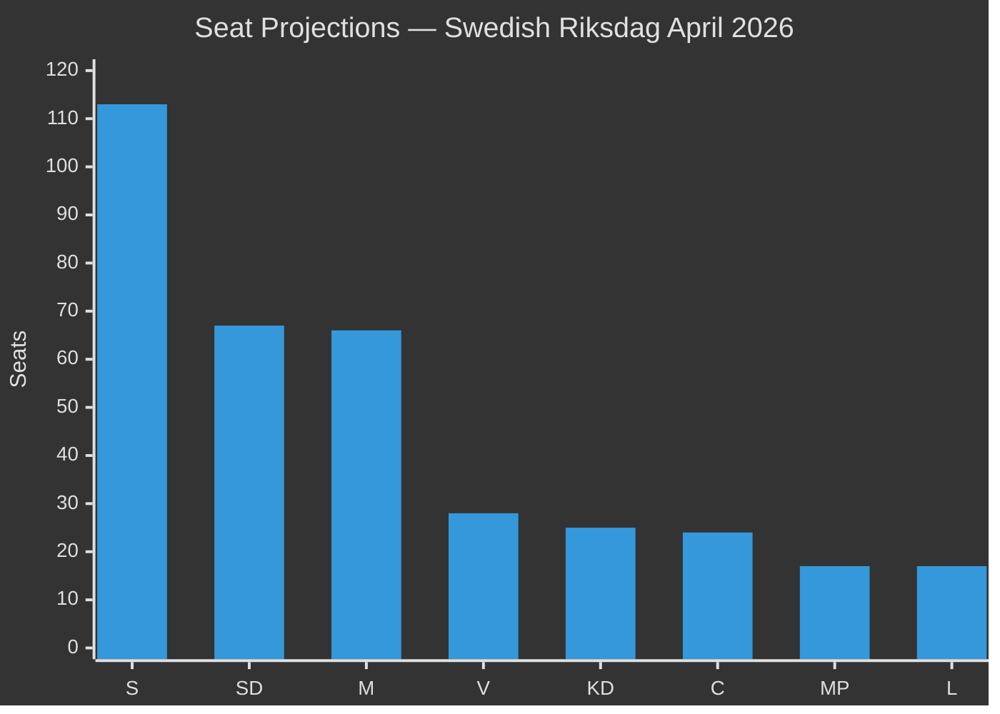

# Coalition Mathematics — Week Ahead 4–10 May 2026

**Author**: James Pether Sörling  
**Date**: 2026-05-01  
**Gate Check 8**: This file contains a Ja/Nej/Avstår voting table  

## Current Seat Distribution (Riksdag 349 seats)

| Party | Seats (2022 result) | Projected Seats (Apr 2026 polls) | Bloc |
|-------|--------------------|---------------------------------|------|
| M | 68 | 66 | Tidöalliansen |
| KD | 19 | 25 | Tidöalliansen |
| L | 16 | 17 | Tidöalliansen |
| SD | 73 | 67 | Tidöalliansen |
| **Tidöalliansen Total** | **176** | **175** | — |
| S | 107 | 113 | Opposition |
| V | 24 | 28 | Opposition |
| MP | 18 | 17 | Opposition (threshold risk) |
| C | 24 | 24 | Centre/kingmaker |

**Majority threshold**: 175 seats (majority = 175+)  
**Current Tidöalliansen projection**: 175 — exactly at threshold. Any defection or threshold failure creates instability.

## Voting Projections on Key Bills

### HD03262 — Permanent Permit Abolition

| Party | Position | Ja | Nej | Avstår | Expected Votes |
|-------|----------|-----|-----|--------|----------------|
| M | Government author | ✓ | | | Ja: 66 |
| KD | Coalition partner | ✓ | | | Ja: 25 |
| L | Coalition partner | ✓* | | | Ja: 17 (see note) |
| SD | Coalition partner (lead driver) | ✓ | | | Ja: 67 |
| **Tidöalliansen JA total** | | | | | **175** |
| S | Opposition | | ✓ | | Nej: 113 |
| V | Opposition | | ✓ | | Nej: 28 |
| MP | Opposition | | ✓ | | Nej: 17 |
| C | Uncertain | | | ✓ | Avstår: 24 |
| **Total Ja** | | | | | **175** |

*Note on L: L is committed to coalition but may file declaration-of-intent (protokollsanteckning) on ECHR compliance. 1-2 L members may be absent or register formal concern without defecting.

**Result**: PASSES (175 Ja vs 158 Nej, 24 Abstaining) — IF no L defections. Margin: 17 votes. Thin majority.

---

### HD03254 — Military Cooperation (Defence)

| Party | Position | Ja | Nej | Avstår | Expected Votes |
|-------|----------|-----|-----|--------|----------------|
| M | Government author | ✓ | | | Ja: 66 |
| KD | Strongly supportive | ✓ | | | Ja: 25 |
| L | NATO enthusiast | ✓ | | | Ja: 17 |
| SD | Supports NATO implementation | ✓ | | | Ja: 67 |
| S | Supports responsible NATO | ✓* | | | Ja: ~90 (some Nej) |
| C | NATO-positive | ✓ | | | Ja: 24 |
| V | NATO-skeptical | | | ✓ | Avstår: ~20, Nej: ~8 |
| MP | NATO-skeptical | | | ✓ | Avstår: ~10, Nej: ~7 |

*S will support with ~80-85% of caucus. 15-20 S members historically vote Nej on defence cooperation measures.

**Result**: PASSES (292+ Ja vs ~15 Nej, ~30 Abstaining) — Broad cross-party consensus.

---

### HC01FiU20 — Economic Framework (Already Ratified — for reference)

| Party | Position | Ja | Nej | Avstår |
|-------|----------|-----|-----|--------|
| M+KD+L+SD | Tidöalliansen | ✓ | | |
| S+V+MP | Voted against | | ✓ | |
| C | Voted for (fiscal responsibility) | ✓ | | |

**Result**: PASSED (199 Ja vs 141 Nej) — Confirmed by HC01FiU20 (riksdagen.se).

## Coalition Stability Analysis

**Critical threshold**: Tidöalliansen projects to exactly 175 seats. This means:
- If L drops below 4% threshold → L loses all 17 seats → Tidöalliansen falls to 158 → MAJORITY LOST
- If 1 L member defects on HD03262 → still passes (174 vs 159 — still majority since 174 > 175/2)
- Wait — 174 is less than 175. Correct: majority requires >174.5, so 175. If L loses even 1 seat: 174 < 175 — TIED, requiring Speaker casting vote or plurality rules.

**Risk escalation**: L at 4.9% polling is only 0.9% above the 4% threshold. A single bad poll week could trigger threshold concern. This is why L's position on HD03264 (character vetting) is watched closely.

