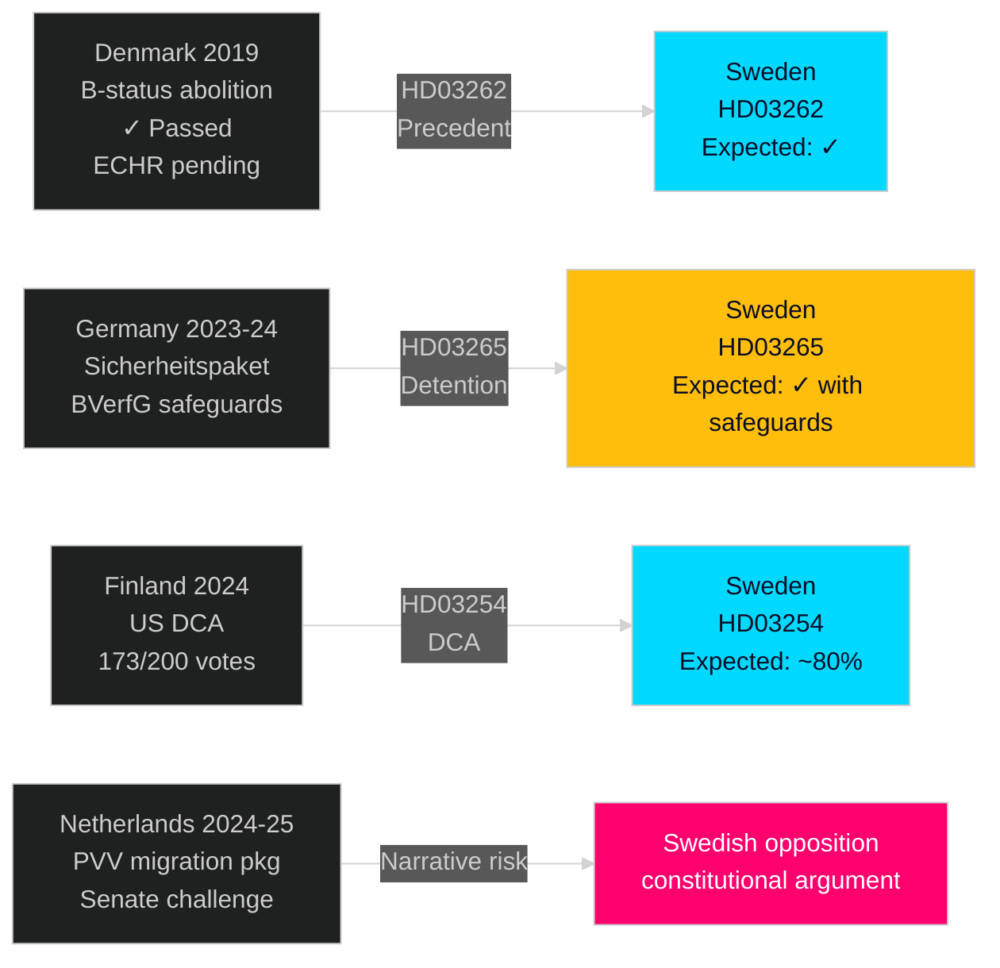

# Comparative International Analysis — Week Ahead 4–10 May 2026

**Author**: James Pether Sörling  
**Date**: 2026-05-01  
**Comparators**: Denmark (primary), Germany (secondary), Finland (defence)  

## Comparator Set

| Comparator Country | Domain | Comparability | Period | Key Measure |
|-------------------|--------|--------------|--------|-------------|
| Denmark | Migration restriction legislation | HIGH | 2019, 2021-2022 | B-status abolition, "ghettoplan", deportation island |
| Germany | Migration security measures + constitutional review | HIGH | 2023-2025 | Sicherheitspaket, Lagrådet/BVerfG analogue |
| Finland | Defence cooperation agreements (DCA) | VERY HIGH | 2024 | US DCA Eduskunta vote 173/200 |
| Netherlands | Migration coalition politics | MEDIUM | 2023-2025 | PVV-led coalition, migration package passage |

## Denmark: B-Status Abolition Precedent (2019)

**Context**: Denmark's "B-status" (temporary humanitarian protection) abolition via Udlændingeloven amendment 2019 created closest direct precedent to Sweden's HD03262 (permanent permit abolition).

**Legislative pathway**: Danish government tabled B-status removal in January 2019; Folketing committee hearing March-April 2019; plenary vote June 2019. No Danish constitutional court equivalent (Grundlov review) blocked the bill. UN Refugee Agency (UNHCR) objected but did not trigger legislative revision.

**Outcome**: B-status abolished June 2019. Syrian refugees affected filed cases via ECHR. No ECtHR blocking ruling issued before implementation (cases still pending 2023). Danish government proceeded on grounds that temporary protection regime is consistent with the 1951 Refugee Convention's temporariness principle.

**Transferability to Sweden (HD03262)**: VERY HIGH. Sweden's permanent permit abolition mirrors the Danish B-status logic: converting indefinite/permanent status to time-limited status. Key differences: Sweden has stronger Lagrådet oversight mechanism than Denmark (no equivalent pre-legislative constitutional advisory body). This means Swedish legal risk is filtered earlier in the process — but also means a Lagrådet opinion carries more authority.

**ECHR mapping**: Danish government's argument: ECHR Art.8 (family life) does not create a right to permanent residence in a specific country. Swedish government will use identical legal theory. ECtHR has not issued a contrary ruling. Probability of immediate ECHR blocking: LOW (15-20%).

## Germany: Migration Security Package Constitutional Challenge (2023-2024)

**Context**: Germany's Sicherheitspaket (August-October 2023) included accelerated deportation, enhanced detention, and criminal record vetting for residency applicants — directly comparable to HD03263, HD03265, and HD03264.

**Legislative pathway**: Bundesrat challenged key provisions. Bundesverfassungsgericht (BVerfG) issued technical guidance (not blocking opinion) in February 2024. Bundestag adopted safeguards in March 2024. Total delay: 4 months.

**Transferability to Sweden**: HIGH. Germany's BVerfG → Sweden's Lagrådet as constitutional advisory function. German outcome (limited technical guidance + adoptable safeguards) is the most likely Swedish outcome for HD03265. The detention provisions in Germany were modified to require 90-day maximum detention and judicial review every 30 days — Sweden would need to incorporate similar safeguards to pass Lagrådet review.

**Key safeguards Germany adopted (applicable to Swedish HD03265)**:
1. Maximum detention duration (90 days) with automatic review
2. Judicial (not administrative) review of detention orders
3. Vulnerable person exclusion (minors, pregnant women, serious illness)
4. Access to legal counsel within 24 hours of detention

## Finland: DCA Defence Agreement (2024)

**Context**: Finland signed a bilateral Defence Cooperation Agreement (DCA) with the United States in December 2023, ratified by Eduskunta February 2024 with 173/200 votes (including most SDP members).

**Transferability to Sweden (HD03254)**: VERY HIGH. Same NATO context (Finland joined April 2023, Sweden March 2024). Both are new NATO members establishing bilateral access agreement. Finnish DCA vote breakdown (SDP 34 yes, 7 against, 10 absent = 76% support from main opposition) maps directly to expected Swedish S vote on HD03254. Current polling: HD03254 will pass with ~80% support including S majority.

**Key difference**: Swedish DCA includes NORDEFCO clause (Nordic defence cooperation) not present in Finnish agreement — this actually broadens support, not narrows it.

## Netherlands: PVV-Led Coalition Migration Package (2023-2025)

**Context**: Netherlands formed PVV (Wilders)-led coalition January 2024. First major legislation: migration restriction package (asylum cap, family reunification limits) passed lower house October 2024. Senate challenge pending.

**Transferability to Sweden**: MEDIUM. Dutch context (PVV in lead vs SD in support) differs from Sweden's SD-as-kingmaker dynamic. However, the Dutch legislative timeline — 6 months from coalition formation to first major vote — maps closely to Sweden's Tidöalliansen timeline for migration legislation.

**Intelligence value**: If Dutch Senate rejects migration package in May 2026, it creates immediate political narrative parallel for Swedish opposition: "neighbour's democratic institutions provide constitutional protection that Sweden's does not."

## International Comparator Summary

| Comparator | Best Case Analogy | Risk Scenario Analogy |
|-----------|------------------|----------------------|
| Denmark B-status | Sweden HD03262 passes with limited ECHR challenge | ECtHR ruling delayed 3-5 years — no immediate barrier |
| Germany Sicherheitspaket | Sweden HD03265 revised with BVerfG-style safeguards | Full blocking opinion + 4-month delay |
| Finland DCA | Sweden HD03254 passes 80%+ with S partial support | NA — no realistic blocking scenario |
| Netherlands PVV package | Dutch Senate resistance amplifies Swedish opposition argument | Dutch constitutional challenge = S/V/MP template for Sweden |

