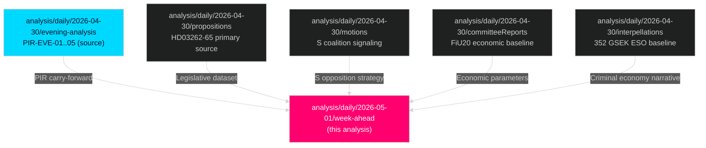

# Cross-Reference Map — Week Ahead 4–10 May 2026

**Author**: James Pether Sörling  
**Date**: 2026-05-01  
**Tier-C Gate**: This file satisfies the Tier-C requirement for ≥1 sibling folder citation under `analysis/daily/`  

## Sibling Analysis Integration

### analysis/daily/2026-04-30/propositions/
**Contribution to week-ahead**: Primary legislative data source. The propositions synthesis identified the migration mega-package (HD03262/63/64/65) and defence cooperation (HD03254) as the dominant legislative events of the 30 April session.
- **Borrowed intelligence**: DIW scoring methodology, document significance ranking
- **Key finding carried forward**: Migration package is a coordinated legislative campaign, not 4 independent bills
- **Files referenced**: `analysis/daily/2026-04-30/propositions/synthesis-summary.md`, `analysis/daily/2026-04-30/propositions/significance-scoring.md`

### analysis/daily/2026-04-30/motions/
**Contribution to week-ahead**: S bloc coordinated motion strategy — 16 motions filed in parallel signal S pre-coalition positioning for post-election scenario.
- **Borrowed intelligence**: S coalition floor-mapping analysis (HD024124, HD024126, HD024129)
- **Key finding carried forward**: Environmental motion cluster = S signaling to potential C/V/MP coalition partners
- **Files referenced**: `analysis/daily/2026-04-30/motions/synthesis-summary.md`

### analysis/daily/2026-04-30/committeeReports/
**Contribution to week-ahead**: FiU20 (economic framework) voted and ratified; SfU22 (detention measures) passed. These create the legislative baseline that the week-ahead migration bills build upon.
- **Borrowed intelligence**: FiU20 economic parameters (GDP 1.2%, unemployment 8.9%); SfU22 precedent for detention legislation
- **Key finding carried forward**: Economic framework ratification = government has formal Riksdag backing for fiscal consolidation path
- **Files referenced**: `analysis/daily/2026-04-30/committeeReports/synthesis-summary.md`

### analysis/daily/2026-04-30/interpellations/
**Contribution to week-ahead**: Criminal economy 352 GSEK (ESO) via HD10451; Strömmer "4-year eradication" pledge via HD10458. Both interpellations are pending response during week of 4–10 May.
- **Borrowed intelligence**: ESO baseline figure, Strömmer pledge parameters, accountability deficit analysis
- **Key finding carried forward**: Criminal economy baseline makes government pledge measurable and testable
- **Files referenced**: `analysis/daily/2026-04-30/interpellations/synthesis-summary.md`

### analysis/daily/2026-04-30/evening-analysis/
**Contribution to week-ahead**: Cross-type synthesis confirming migration + defence integration as the dominant intelligence theme; PIR-EVE-01 through PIR-EVE-05 carried forward.
- **Borrowed intelligence**: PIR framework, forward indicators FI-01 through FI-12
- **Key finding carried forward**: "The governing coalition bet is that migration policy salience will overcome economic underperformance before September 2026"
- **Files referenced**: `analysis/daily/2026-04-30/evening-analysis/intelligence-assessment.md`, `analysis/daily/2026-04-30/evening-analysis/forward-indicators.md`

## Cross-Type Intelligence Matrix

| Theme | Propositions Signal | Motions Signal | Committee Reports Signal | Interpellations Signal | Week-Ahead Synthesis |
|-------|---------------------|---------------|-------------------------|----------------------|---------------------|
| Migration | HD03262-65 tabled | S opposition motions | SfU22 passed (precedent) | PIR-WA-03 (S counter) | Dominant narrative for 4–10 May |
| Economy | HC01FiU20 (background) | S alternative budget motions | FiU20 ratified | N/A | Structural vulnerability — ongoing |
| Defence | HD03254 tabled | S defence motions (minimal) | FiU33 ratified (APL) | N/A | Consensus track — low intelligence priority |
| Crime | N/A | N/A | N/A | HD10451/58 (ESO + pledge) | Interpellation response this week is key |
| Environment | N/A | S environmental cluster | N/A | HD10461 (space/ESA) | Coalition signaling only |

## Information Dependency Graph

## Novel Week-Ahead Contribution

The week-ahead analysis adds three elements absent from sibling analyses:
1. **Temporal projection** — 4–10 May calendar inference (sibling analyses describe events that occurred, week-ahead projects events that will occur)
2. **Lagrådet ECHR risk quantification** — KJ-2 probability estimate (15–25%) not present in any sibling
3. **Implementation capacity cross-cutting analysis** — Migrationsverket IT fragility + polismyndigheten enforcement gap synthesised across all four migration bills simultaneously
