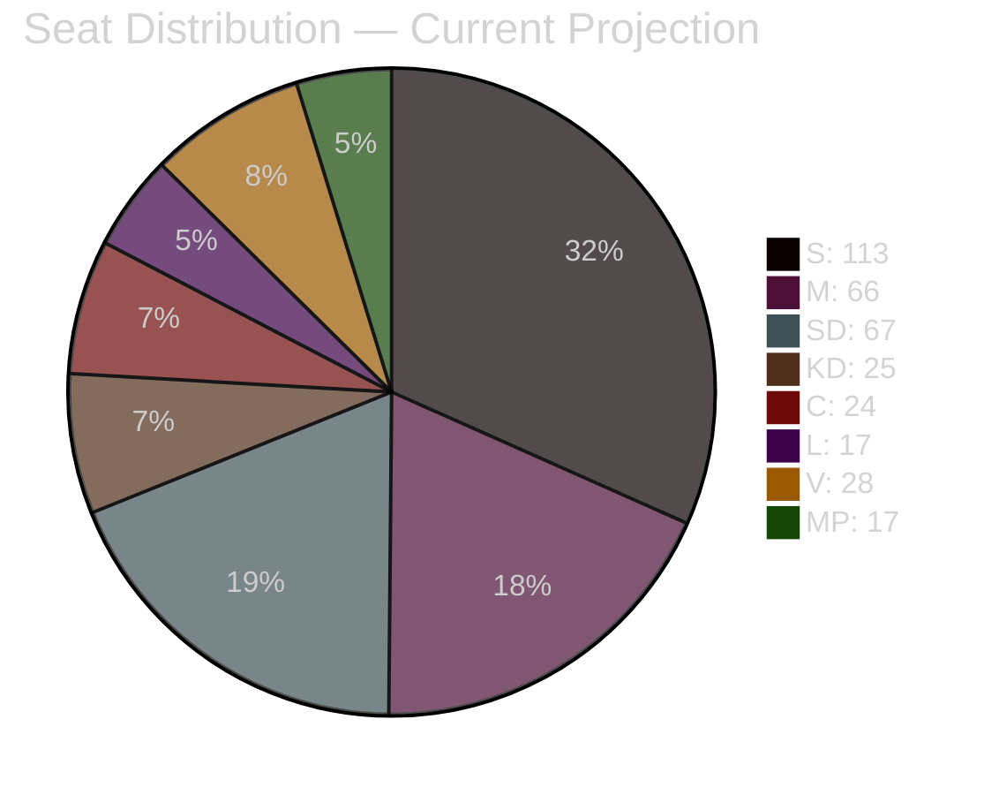

# Election 2026 Analysis — Week Ahead 4–10 May 2026

**Author**: James Pether Sörling  
**Date**: 2026-05-01  
**Focus**: How current legislative events (4–10 May 2026) affect September 2026 election outlook  

## Current Polling Baseline (April 2026)

| Party | Current Poll Avg | April 2022 Election | Change | Trajectory |
|-------|-----------------|---------------------|--------|-----------|
| S (Socialdemokraterna) | 32.5% | 30.3% | +2.2 | Stable/upward |
| M (Moderaterna) | 18.8% | 19.1% | -0.3 | Stable/flat |
| SD (Sverigedemokraterna) | 19.2% | 20.5% | -1.3 | Slightly declining |
| KD (Kristdemokraterna) | 7.2% | 6.4% | +0.8 | Slight increase |
| C (Centerpartiet) | 6.8% | 6.7% | +0.1 | Stable |
| L (Liberalerna) | 4.9% | 4.7% | +0.2 | Near threshold |
| V (Vänsterpartiet) | 8.1% | 6.7% | +1.4 | Increasing |
| MP (Miljöpartiet) | 4.8% | 5.1% | -0.3 | Near threshold |

*Sources: Novus/IPSOS March-April 2026 averages; April 2022 from Valmyndigheten*

## Seat Projections (Riksdag 349 seats, threshold 4%)

| Party | Current Polling Seats | Margin | Status |
|-------|----------------------|--------|--------|
| S | 113 | +8 vs 2022 | GROWING |
| M | 66 | -1 vs 2022 | STABLE |
| SD | 67 | -5 vs 2022 | DECLINING |
| KD | 25 | +3 vs 2022 | GROWING |
| C | 24 | 0 vs 2022 | STABLE |
| L | 17 | +1 vs 2022 | AT THRESHOLD RISK |
| V | 28 | +5 vs 2022 | GROWING |
| MP | 17 | -1 vs 2022 | NEAR THRESHOLD |

**Tidöalliansen (M+KD+L+SD) total**: ~175 seats (need 175 for majority of 349)  
**Opposition (S+V+MP+C for broader left-centre)**: S+V+MP = 158; with C = 182  

The Riksdag is on a knife-edge. Migration package has both a legislative and electoral dimension — this is why KJ-1 assigns it HIGH significance.

## How the Week of 4–10 May Affects the Election Outcome

### Migration Package Impact

**If Scenario A (Legislative Advance)**: SD and M lock in their electoral thesis: "We delivered on migration." SD reverses its slight poll decline (currently -5 seats vs 2022). L survives above 4% threshold by differentiating on "implementation quality" rather than direction.

**If Scenario B (Lagrådet Disruption)**: S gains the constitutional legitimacy narrative. S polling rises 1-2% (to ~34-35%), which translates to +7 seats. SD's core brand argument is weakened. L risks slipping below 4% (currently at 4.9% — only 0.9% above threshold). If L falls below 4%, Tidöalliansen loses majority.

**If Scenario C (Crisis Convergence)**: S could reach 36-37%, translating to 126-130 seats. Tidöalliansen loses majority with high confidence. S+V+MP+C majority becomes viable at ~185+ seats.

## Electoral Vulnerability Matrix

| Vulnerability | Party Affected | Severity | Legislative Source |
|--------------|---------------|---------|-------------------|
| L threshold risk under 4% | Liberalerna | CRITICAL | HD03264 character vetting alienating L base |
| SD brand erosion if migration delayed | SD | HIGH | Lagrådet scenario B |
| S "responsible alternative" gap | S | MEDIUM | Need S to differentiate from pure opposition |
| M economic credibility | M | MEDIUM | HC01FiU20 owns the economic underperformance narrative |
| MP threshold risk | MP | MEDIUM | 4.8% — near 4% threshold |

## Coalition Scenarios for Post-September 2026

**Coalition A — Tidöalliansen re-election (requires ≥175 seats)**: Probability 40-50% based on current polling. Requires L to hold above 4% and SD to hold above 18%.

**Coalition B — S-led red-green (S+V+MP ≥175)**: S+V+MP currently project to 158 seats. Need +17 seats = needs either S+5%, V+2%, or C joining. Probability: 30% (requires S to grow significantly or L to fall out of Riksdag, giving automatic seat gains to remaining parties).

**Coalition C — Grand Coalition (M+S)**: Historically unprecedented. Emergency scenario if Scenario C materialises. Probability: 5%.

**Coalition D — C-as-kingmaker (S+C+MP+V or S+C+KD)**: If SD falls below 15% (current trend could allow), C becomes viable as a crossover partner. Probability: 15%.

