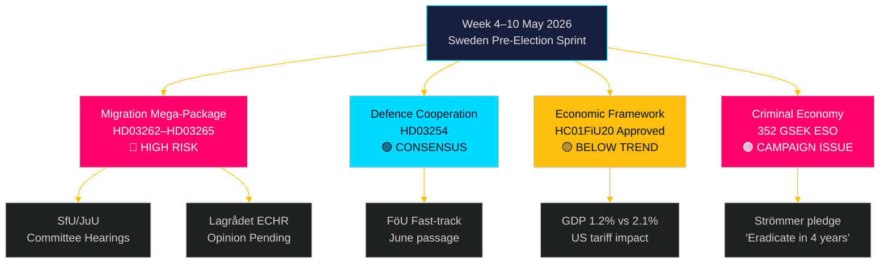

# Week Ahead: Sweden's Pre-Election Legislative Storm — 4–10 May 2026

**Author**: James Pether Sörling  
**Date**: 2026-05-01  
**Classification**: OSINT — Public Sources  
**Confidence**: HIGH [B2]  
**Run ID**: 25207939386  

## BLUF

The week of 4–10 May 2026 arrives five months before Sweden's general election with the Tidöalliansen government having just tabled its most consequential — and constitutionally risky — legislative package since taking office: four simultaneous immigration restriction bills abolishing permanent residence permits, expanding deportation machinery, tightening character vetting, and extending administrative detention. Committee hearing schedules at SfU and JuU will set the legislative tempo for the pre-election sprint. Simultaneously, the Riksdag's Finance Committee approval of Sweden's economic policy framework (HC01FiU20) locks in a below-trend growth acceptance, while the ESO report placing Sweden's criminal economy at 352 billion SEK (5.5% of GDP) enters full political debate. Key decision-makers this week: Justitieminister Gunnar Strömmer (migration enforcement + gang crime), Försvarsminister Pål Jonson (HD03254 defence cooperation), Finansminister Elisabeth Svantesson (HC01FiU20 economic framework), and Riksdag talman oversight of JuU/SfU committee scheduling. The Valborg holiday (1 May) means the first working day is Monday 4 May — a compressed 5-day window before the weekend.

**Lookback note**: 2026-05-01 is Valborg (Swedish public holiday). No Riksdag plenary session. Document sourcing uses 2026-04-30 session (legitimate lookback per methodology). Week-ahead coverage period is 4–10 May 2026.

## Decisions This Brief Supports

1. **Committee intelligence**: SfU and JuU will schedule hearings on HD03262–65 this week — tracking these dates is critical for opposition coordination timing and media escalation strategy.
2. **ECHR risk gateway**: Lagrådet has not yet issued opinions on HD03262/HD03265 — any opinion published this week becomes the most legally significant development of the legislative session.
3. **Economic positioning**: The HC01FiU20 approved framework defines the government's austerity-within-stimulus economic identity for the election; tracking polling responses informs coalition stability assessment.

## 60-Second Intelligence Read

- 🔴 **Migration mega-package** (HD03262/63/64/65): Committee hearings begin week of 4 May. S, V, MP in hard opposition; C likely partial support. Lagrådet opinion on ECHR compliance pending.
- 🟡 **Defence cooperation** (HD03254): FöU committee fast-tracking bill. Broad cross-party consensus including S. Expected smooth passage by June 2026.
- 🟠 **Economic framework** (HC01FiU20): Riksdag approved lower growth projections under US tariff pressure. Sweden GDP growth 2026 projected 1.2% vs potential 2.1%. Election-year fiscal tightening is politically risky.
- 🔴 **Criminal economy**: ESO report (352 GSEK / 5.5% GDP, 23K companies) formally entered political debate via HD10451. Strömmer's "eradicate gang crime in 4 years" pledge (HD10458) is now a measurable electoral commitment.
- 🟡 **Environmental/energy motions**: S's 7-motion cluster on environmental authority and electricity law will receive committee referral to MJU/NU this week.

## Top Forward Trigger

**Critical watch — by 2026-05-08**: Will Lagrådet publish opinions on HD03262 (permanent permit abolition) or HD03265 (detention expansion)? A blocking opinion citing ECHR Art. 5 or Art. 8 would trigger constitutional revision requirements, delay the package by months, and hand the opposition its most potent electoral argument. Probability of blocking opinion: MEDIUM [B3] — Danish and German parallels suggest workable but narrow ECHR compliance.

