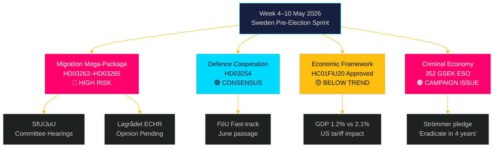

‏# الأسبوع القادم: عاصفة تشريعية في السويد قبيل الانتخابات — 4–10 مايو 2026

‏**المؤلف**: جيمس بيذر سورلينغ
‏**التاريخ**: 2026-05-01
‏**التصنيف**: OSINT — مصادر عامة
‏**مستوى الثقة**: عالٍ [B2]
‏**معرّف التشغيل**: 25207939386

‏## الخلاصة التنفيذية

‏تأتي أسبوع 4–10 مايو 2026 قبل خمسة أشهر من الانتخابات السويدية، وقد قدّمت تحالف تيدو للتو أكبر حزمة تشريعية لها — والأكثر خطورة دستورياً — منذ توليها السلطة: أربعة قوانين متزامنة لتقييد الهجرة تُلغي تصاريح الإقامة الدائمة، وتوسّع جهاز الترحيل، وتشدّد التحقق من السجل الجنائي، وتوسّع الاحتجاز الإداري. ستحدد جداول جلسات استماع اللجنتين SfU وJuU وتيرة التشريع في السباق قبيل الانتخابات. في الوقت ذاته، يؤكد اعتماد لجنة المالية في الريكسداج للإطار الاقتصادي (HC01FiU20) قبولاً بنمو دون المتوسط، في حين يدخل تقرير ESO الذي يقدّر الاقتصاد الجنائي السويدي بـ352 مليار كرونة (5.5% من الناتج المحلي) النقاش السياسي الكامل. أبرز صانعي القرار هذا الأسبوع: وزير العدل غونار ستروميرغ (تطبيق قوانين الهجرة + جريمة العصابات)، ووزير الدفاع بول يونسون (HD03254 التعاون الدفاعي)، ووزيرة المالية إليزابيث سفانتيسون (HC01FiU20 الإطار الاقتصادي)، ورئيس الريكسداج فيما يخص تخطيط لجنتي JuU/SfU. يعني عيد فالبورغ (1 مايو) أن أول يوم عمل هو الاثنين 4 مايو — نافذة مضغوطة من 5 أيام قبل عطلة نهاية الأسبوع.

‏**ملاحظة استرجاعية**: 2026-05-01 هو عيد فالبورغ (عطلة رسمية سويدية). لا جلسة عامة للريكسداج. يستخدم جمع الوثائق جلسة 2026-04-30 (استرجاع مشروع وفق المنهجية). الفترة المستقبلية للتغطية هي 4–10 مايو 2026.

‏## القرارات التي يدعمها هذا التقرير

‏1. **استخبارات اللجان**: ستجدول SfU وJuU جلسات استماع حول HD03262–65 هذا الأسبوع — تتبع هذه التواريخ بالغ الأهمية لتوقيت تنسيق المعارضة واستراتيجيات التصعيد الإعلامي.
‏2. **بوابة مخاطر الاتفاقية الأوروبية**: لم يُصدر لاغروديت بعد آراء حول HD03262/HD03265 — أي رأي يصدر هذا الأسبوع سيكون الحدث الأكثر أهمية قانونياً في الدورة التشريعية.
‏3. **التمركز الاقتصادي**: يحدد الإطار المعتمد HC01FiU20 هوية التقشف-ضمن-التحفيز الاقتصادية للحكومة في الانتخابات؛ تتبع ردود الرأي العام يُعلم تحليل استقرار الائتلاف.

‏## قراءة استخباراتية في 60 ثانية

‏- 🔴 **حزمة الهجرة الكبرى** (HD03262/63/64/65): تبدأ جلسات اللجان أسبوع 4 مايو. S وV وMP في معارضة قوية؛ C على الأرجح مؤيدة جزئياً. رأي لاغروديت حول الامتثال للاتفاقية الأوروبية لحقوق الإنسان لا يزال معلقاً.
‏- 🟡 **التعاون الدفاعي** (HD03254): لجنة FöU تُمرّر مشروع القانون بالمسار السريع. توافق واسع عابر للأحزاب يشمل S. تُتوقع المصادقة السلسة بحلول يونيو 2026.
‏- 🟠 **الإطار الاقتصادي** (HC01FiU20): أقرّ الريكسداج توقعات نمو أدنى تحت ضغط الرسوم الجمركية الأمريكية. نمو الناتج المحلي السويدي 2026 متوقع عند 1.2% مقابل إمكانية 2.1%. التشديد المالي في سنة انتخابية محفوف بمخاطر سياسية.
‏- 🔴 **الاقتصاد الجنائي**: تقرير ESO (352 مليار كرونة / 5.5% ناتج محلي، 23,000 شركة) دخل رسمياً النقاش السياسي عبر HD10451. وعد ستروميرغ بـ"القضاء على جريمة العصابات في 4 سنوات" (HD10458) أصبح الآن وعداً انتخابياً قابلاً للقياس.
‏- 🟡 **مقترحات البيئة/الطاقة**: ستحصل مجموعة السبعة مقترحات لحزب S حول هيئة البيئة وقانون الكهرباء على إحالة لجنتي MJU/NU هذا الأسبوع.

‏## المحفّز الاستشرافي الرئيسي

‏**ملاحظة حيوية — قبل 2026-05-08**: هل سيصدر لاغروديت آراء حول HD03262 (إلغاء التصاريح الدائمة) أو HD03265 (توسيع الاحتجاز)؟ رأي معارض يستند إلى المادة 5 أو 8 من الاتفاقية الأوروبية سيُطلق متطلبات مراجعة دستورية، ويؤخر الحزمة أشهراً، ويمنح المعارضة حجتها الانتخابية الأقوى. احتمال رأي معارض: متوسط [B3] — النظائر الدنماركية والألمانية تقترح امتثالاً للاتفاقية قابلاً للتطبيق لكنه ضيّق.

<!-- source-sha: 0662dfda88b9d02453368e18ec4258559dd23f48 -->
