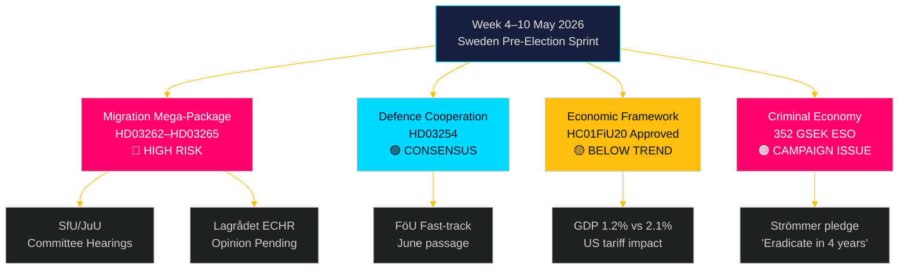

# Ugen frem: Sveriges valgkamplovgivningsstorm — 4.–10. maj 2026

**Forfatter**: James Pether Sörling
**Dato**: 2026-05-01
**Klassificering**: OSINT — Offentlige kilder
**Konfidens**: HØJ [B2]
**Kørselsnummer**: 25207939386

## Konklusion

Ugen 4.–10. maj 2026 ankommer fem måneder inden Sveriges valg med Tidöalliansen, der netop har fremsat sin mest konsekvente — og forfatningsmæssigt risikable — lovgivningspakke siden regeringsdannelsen: fire samtidige immigrationsbegrænsningslove, der afskaffer permanente opholdstilladelser, udvider deportationsapparatet, strammer vandelskontrollen og udvider administrativ frihedsberøvelse. Udvalgshoringers skemaer ved SfU og JuU vil sætte tempoet for lovgivningssprinten op til valget. Samtidig låser Riksdagens finansudvalgs godkendelse af rammerne for den økonomiske politik (HC01FiU20) en accept af under-trend-vækst fast, mens ESO-rapporten, der placerer Sveriges kriminaløkonomi på 352 milliarder SEK (5,5 % af BNP), træder ind i den fulde politiske debat. Centrale beslutningstagere denne uge: Justitieminister Gunnar Strömmer (migrationsapplikation + bandeforbrydelse), Forsvarsminister Pål Jonson (HD03254 forsvarssamarbejde), Finansminister Elisabeth Svantesson (HC01FiU20 økonomisk ramme) og Riksdagens talman angående JuU/SfU's udvalgsplanlægning. Valborg-helligdagen (1. maj) betyder, at den første arbejdsdag er mandag 4. maj — et komprimeret 5-dages vindue inden weekenden.

**Tilbagebliksnote**: 2026-05-01 er Valborg (svensk helligdag). Ingen Riksdag-plenumssession. Dokumenthentning bruger sessionen fra 2026-04-30 (lovligt tilbageblik per metodologi). Fremadrettet dækningsperiode er 4.–10. maj 2026.

## Beslutninger dette notat understøtter

1. **Udvalgsefterretning**: SfU og JuU vil planlægge høringer om HD03262–65 denne uge — sporing af disse datoer er afgørende for oppositionens koordineringstiming og medieeskaleringsstrategier.
2. **EMRK-risikoport**: Lagrådet har endnu ikke udstedt yttranden om HD03262/HD03265 — ethvert yttrande offentliggjort denne uge bliver den mest juridisk signifikante begivenhed i lovgivningssessionen.
3. **Økonomisk positionering**: Det HC01FiU20-godkendte rammeværk definerer regeringens stramning-inden-for-stimulus-identitet til valget; sporing af opinionsundersøgelsessvar informerer om koalitionens stabilitetsanalyse.

## 60-sekunders efterretningslæsning

- 🔴 **Migrations-megapakke** (HD03262/63/64/65): Udvalgshoringer begynder ugen den 4. maj. S, V, MP i hård opposition; C sandsynligvis delvis støtte. Lagrådets yttrande om EMRK-overholdelse afventes.
- 🟡 **Forsvarssamarbejde** (HD03254): FöU-udvalget ekspederer lovforslaget. Bred tværpolitisk konsensus inklusive S. Forventes at passere problemfrit inden juni 2026.
- 🟠 **Økonomisk rammeværk** (HC01FiU20): Riksdagen godkendte lavere vækstprognoser under amerikansk tolpres. Svensk BNP-vækst 2026 prognosticeret til 1,2 % mod potentielle 2,1 %. Finanspolitisk stramning i valgåret er politisk risikabelt.
- 🔴 **Kriminaløkonomi**: ESO-rapport (352 GSEK / 5,5 % af BNP, 23.000 virksomheder) trådte formelt ind i politisk debat via HD10451. Strömmers løfte om at "udrydde bandekriminalitet på 4 år" (HD10458) er nu et målbart valgengagement.
- 🟡 **Miljø-/energimotioner**: S's 7-motionsklynge om miljømyndighed og ellov vil modtage udvalgshenvisning til MJU/NU denne uge.

## Ledende fremadrettet udløser

**Kritisk observation — inden 2026-05-08**: Vil Lagrådet offentliggøre yttranden om HD03262 (afskaffelse af permanente tilladelser) eller HD03265 (udvidelse af frihedsberøvelse)? Et blokerende yttrande, der citerer EMRK Art. 5 eller Art. 8, ville udløse krav om grundlovsrevision, forsinke pakken med måneder og give oppositionen sit mest potente valgargument. Sandsynlighed for blokerende yttrande: MEDIUM [B3] — danske og tyske paralleller antyder en gennemførlig men snæver EMRK-overholdelse.

<!-- source-sha: 0662dfda88b9d02453368e18ec4258559dd23f48 -->
