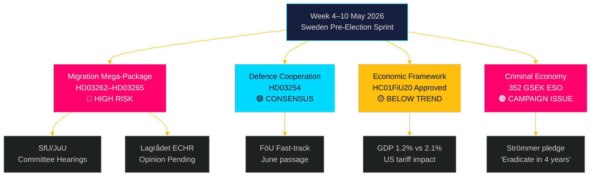

# Die Woche voraus: Schwedens Vorwahlgesetzgebungssturm — 4.–10. Mai 2026

**Autor**: James Pether Sörling
**Datum**: 2026-05-01
**Klassifizierung**: OSINT — Öffentliche Quellen
**Konfidenz**: HOCH [B2]
**Lauf-ID**: 25207939386

## Fazit

Die Woche des 4.–10. Mai 2026 steht fünf Monate vor Schwedens Wahl mit der Tidöalliansen, die gerade ihr folgenreichstes — und verfassungsrechtlich riskantestes — Gesetzgebungspaket seit Regierungsantritt vorgelegt hat: vier gleichzeitige Einwanderungsbeschränkungsgesetze, die dauerhaften Aufenthalt abschaffen, den Abschiebungsapparat erweitern, die Charakter-Überprüfung verschärfen und die Verwaltungshaft ausweiten. Die Ausschussanhörungspläne bei SfU und JuU bestimmen das Gesetzgebungstempo des Vorwahlsprints. Gleichzeitig bestätigt die Zustimmung des Finanzausschusses des Riksdags zum wirtschaftspolitischen Rahmen (HC01FiU20) eine Akzeptanz unterdurchschnittlichen Wachstums, während der ESO-Bericht, der Schwedens Kriminalwirtschaft auf 352 Milliarden SEK (5,5 % des BIP) beziffert, in die volle politische Debatte eintritt. Wichtige Entscheidungsträger diese Woche: Justizminister Gunnar Strömmer (Migrationsanwendung + Bandenverbrechen), Verteidigungsminister Pål Jonson (HD03254 Verteidigungskooperation), Finanzminister Elisabeth Svantesson (HC01FiU20 wirtschaftlicher Rahmen) und der Riksdags-Talman bezüglich der JuU/SfU-Ausschussplanung. Der Valborgstag (1. Mai) bedeutet, dass der erste Arbeitstag Montag, der 4. Mai ist — ein verdichtetes 5-Tages-Fenster vor dem Wochenende.

**Rückblick-Hinweis**: 2026-05-01 ist Valborg (schwedischer gesetzlicher Feiertag). Keine Riksdag-Plenarsitzung. Die Dokumentenbeschaffung verwendet die Sitzung vom 2026-04-30 (legitimer Rückblick gemäß Methodik). Vorausschauende Abdeckungsperiode ist der 4.–10. Mai 2026.

## Entscheidungen, die dieser Bericht unterstützt

1. **Ausschussaufklärung**: SfU und JuU planen Anhörungen zu HD03262–65 in dieser Woche — die Verfolgung dieser Daten ist entscheidend für das Koordinierungstiming der Opposition und Medieneskaliationsstrategien.
2. **EMRK-Risikotor**: Lagrådet hat bisher keine Gutachten zu HD03262/HD03265 ausgestellt — ein in dieser Woche veröffentlichtes Gutachten wird das rechtlich bedeutendste Ereignis der Legislaturperiode.
3. **Wirtschaftliche Positionierung**: Das HC01FiU20-angenommene Rahmenwerk definiert die wirtschaftliche Identität der Regierung als Sparmaßnahmen-im-Stimulus-Rahmen für die Wahl; die Verfolgung der Meinungsumfrageantworten informiert die Koalitionsstabilitätsanalyse.

## 60-Sekunden-Nachrichtenlektüre

- 🔴 **Migrationsmegapaket** (HD03262/63/64/65): Ausschussanhörungen beginnen Woche des 4. Mai. S, V, MP in harter Opposition; C wahrscheinlich partiell unterstützend. Lagrådets Gutachten zur EMRK-Konformität ausstehend.
- 🟡 **Verteidigungskooperation** (HD03254): FöU-Ausschuss zieht Gesetzentwurf durch. Breiter parteiübergreifender Konsens einschließlich S. Erwartet wird reibungslose Verabschiedung bis Juni 2026.
- 🟠 **Wirtschaftliches Rahmenwerk** (HC01FiU20): Riksdag genehmigte niedrigere Wachstumsprognosen unter US-Zolldruck. Schwedens BIP-Wachstum 2026 prognostiziert auf 1,2 % gegenüber potentiellen 2,1 %. Finanzpolitische Straffung im Wahljahr ist politisch riskant.
- 🔴 **Kriminalwirtschaft**: ESO-Bericht (352 Mrd. SEK / 5,5 % des BIP, 23.000 Unternehmen) trat formal in die politische Debatte über HD10451 ein. Strömmers Versprechen, „Bandenkriminalität in 4 Jahren auszurotten" (HD10458), ist jetzt ein messbares Wahlversprechen.
- 🟡 **Umwelt-/Energieanträge**: S's 7-Antragscluster zu Umweltbehörde und Stromgesetz erhält Ausschussverweisung zu MJU/NU diese Woche.

## Führender vorausschauender Auslöser

**Kritische Beobachtung — bis 2026-05-08**: Wird Lagrådet Gutachten zu HD03262 (Abschaffung dauerhafter Genehmigungen) oder HD03265 (Ausweitung der Haft) veröffentlichen? Ein blockierendes Gutachten, das EMRK Art. 5 oder Art. 8 zitiert, würde Anforderungen für Verfassungsrevisionen auslösen, das Paket um Monate verzögern und der Opposition ihr schlagkräftigstes Wahlargument liefern. Wahrscheinlichkeit eines blockierenden Gutachtens: MITTEL [B3] — dänische und deutsche Parallelen legen eine praktikable, aber knappe EMRK-Konformität nahe.

<!-- source-sha: 0662dfda88b9d02453368e18ec4258559dd23f48 -->
