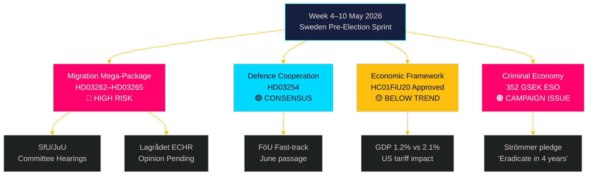

# La semana por delante: La tormenta legislativa preelectoral de Suecia — 4–10 mayo 2026

**Autor**: James Pether Sörling
**Fecha**: 2026-05-01
**Clasificación**: OSINT — Fuentes públicas
**Confianza**: ALTA [B2]
**ID de ejecución**: 25207939386

## Conclusión

La semana del 4 al 10 de mayo de 2026 llega cinco meses antes de las elecciones suecas con la Tidöalliansen habiendo presentado su paquete legislativo más consecuente —y constitucionalmente arriesgado— desde que tomó el poder: cuatro leyes simultáneas de restricción migratoria que abolirán los permisos de residencia permanente, ampliarán el aparato de expulsión, endurecerán la verificación de antecedentes penales y extenderán la detención administrativa. Los calendarios de audiencias de los comités SfU y JuU determinarán el ritmo legislativo del sprint preelectoral. Simultáneamente, la aprobación por el Comité de Finanzas del Riksdag del marco de política económica (HC01FiU20) confirma la aceptación de un crecimiento por debajo de la tendencia, mientras el informe ESO que sitúa la economía criminal sueca en 352.000 millones de SEK (5,5 % del PIB) entra en el pleno debate político. Principales tomadores de decisiones esta semana: el Ministro de Justicia Gunnar Strömmer (aplicación migratoria + crimen organizado), el Ministro de Defensa Pål Jonson (HD03254 cooperación en defensa), la Ministra de Finanzas Elisabeth Svantesson (HC01FiU20 marco económico) y el Talman del Riksdag respecto a la planificación de los comités JuU/SfU. El Día de Valborg (1 de mayo) significa que el primer día hábil es el lunes 4 de mayo — una ventana comprimida de 5 días antes del fin de semana.

**Nota retrospectiva**: El 2026-05-01 es Valborg (festivo nacional sueco). No hay sesión plenaria en el Riksdag. La recopilación de documentos utiliza la sesión del 2026-04-30 (retrospectiva legítima según metodología). El período de cobertura prospectiva es del 4 al 10 de mayo de 2026.

## Decisiones que apoya este informe

1. **Inteligencia de comités**: SfU y JuU programarán audiencias sobre HD03262–65 esta semana — el seguimiento de estas fechas es crucial para el timing de coordinación de la oposición y las estrategias de escalada mediática.
2. **Puerta de riesgo CEDH**: Lagrådet no ha emitido aún dictámenes sobre HD03262/HD03265 — cualquier dictamen publicado esta semana se convierte en el evento jurídicamente más significativo de la sesión legislativa.
3. **Posicionamiento económico**: El marco aprobado HC01FiU20 define la identidad económica de austeridad-en-estímulo del gobierno para las elecciones; el seguimiento de las respuestas en encuestas informa el análisis de estabilidad de coalición.

## Lectura de inteligencia en 60 segundos

- 🔴 **Megapaquete migratorio** (HD03262/63/64/65): Las audiencias de comités comienzan la semana del 4 de mayo. S, V, MP en fuerte oposición; C probablemente con apoyo parcial. El dictamen de Lagrådet sobre conformidad CEDH está pendiente.
- 🟡 **Cooperación en defensa** (HD03254): El comité FöU tramita el proyecto de ley por vía rápida. Amplio consenso transpartidista incluido S. Se espera aprobación sin obstáculos para junio 2026.
- 🟠 **Marco económico** (HC01FiU20): El Riksdag aprobó previsiones de crecimiento menores bajo la presión arancelaria de EE.UU. Crecimiento del PIB sueco 2026 proyectado en 1,2 % frente al 2,1 % potencial. El ajuste fiscal en año electoral es políticamente arriesgado.
- 🔴 **Economía criminal**: El informe ESO (352.000 millones SEK / 5,5 % del PIB, 23.000 empresas) entró formalmente en el debate político a través de HD10451. La promesa de Strömmer de «erradicar la criminalidad de bandas en 4 años» (HD10458) es ahora un compromiso electoral medible.
- 🟡 **Mociones medioambientales/energéticas**: El grupo de 7 mociones del S sobre autoridad medioambiental y ley eléctrica recibirá remisión a los comités MJU/NU esta semana.

## Desencadenante prospectivo principal

**Observación crítica — antes del 2026-05-08**: ¿Emitirá Lagrådet dictámenes sobre HD03262 (abolición de permisos permanentes) o HD03265 (extensión de la detención)? Un dictamen bloqueante que cite el CEDH Art. 5 o Art. 8 desencadenaría requisitos de revisión constitucional, retrasaría el paquete varios meses y daría a la oposición su argumento electoral más poderoso. Probabilidad de dictamen bloqueante: MEDIA [B3] — los paralelos danés y alemán sugieren conformidad CEDH viable pero ajustada.

<!-- source-sha: 0662dfda88b9d02453368e18ec4258559dd23f48 -->
