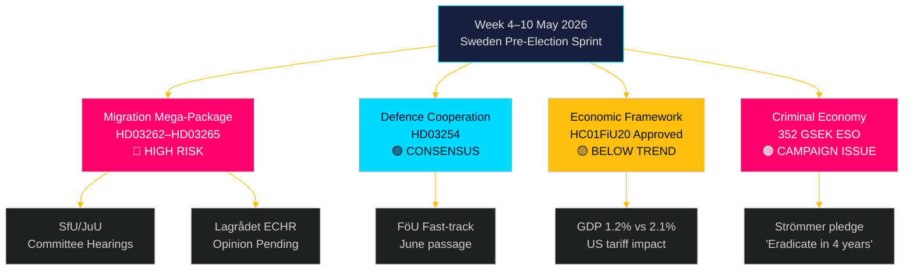

# Viikko eteenpäin: Ruotsin vaaleja edeltävä lainsäädäntömyrsky — 4.–10. toukokuuta 2026

**Tekijä**: James Pether Sörling
**Päivämäärä**: 2026-05-01
**Luokitus**: OSINT — Julkiset lähteet
**Luottamus**: KORKEA [B2]
**Ajo-ID**: 25207939386

## Yhteenveto

Viikko 4.–10. toukokuuta 2026 saapuu viisi kuukautta ennen Ruotsin vaaleja, jolloin Tidöalliansen on juuri jättänyt kautensa merkittävimmän — ja perustuslaillisesti riskialttiimman — lakipaketin: neljä samanaikaista maahanmuuton rajoituslakia, jotka poistavat pysyvät oleskeluluvat, laajentavat karkottamiskoneistoa, tiukentavat taustatarkistuksia ja laajentavat hallinnollista säilöönottoa. SfU:n ja JuU:n valiokuntakuulemisten aikataulu asettaa lainsäädäntötahdin ennen vaaleja. Samanaikaisesti riksdagin talousvaliokunta hyväksyi talouspolitiikan puitteet (HC01FiU20) ja jähmettää sitoumuksen alle-trendin kasvuun, kun taas ESO-raportti, joka sijoittaa Ruotsin rikostalouden 352 miljardiin kruunuun (5,5 % BKT:stä), astuu täyteen poliittiseen debattiin. Tällä viikolla avainpäätöksentekijät ovat: oikeusministeri Gunnar Strömmer (maahanmuuton täytäntöönpano + jengirikollisuus), puolustusministeri Pål Jonson (HD03254 puolustusyhteistyö), valtiovarainministeri Elisabeth Svantesson (HC01FiU20 taloudellinen kehys) ja riksdagin talman JuU/SfU-valiokuntien aikataulutuksesta. Vappu (1. toukokuuta) tarkoittaa, että ensimmäinen työpäivä on maanantai 4. toukokuuta — tiivistetty 5 päivän ikkuna ennen viikonloppua.

**Takautuva huomio**: 2026-05-01 on Vappu (Ruotsin julkinen vapaapäivä). Ei plenariumistuntoa. Asiakirjojen hankinnassa käytetään 2026-04-30 istuntoa (laillinen takautuva haku metodologian mukaan). Eteenpäin katsova kattavuusjakso on 4.–10. toukokuuta 2026.

## Päätökset, joita tämä tiivistelmä tukee

1. **Valiokuntatieto**: SfU ja JuU aikatauluttavat kuulemiset HD03262–65:stä tällä viikolla — näiden päivämäärien seuraaminen on kriittistä opposition koordinointiajankohdille ja mediakärjistämisstrategioille.
2. **ECHR-riskiportti**: Lagrådet ei ole vielä antanut lausuntoja HD03262/HD03265:stä — tällä viikolla julkaistu lausunto tulee olemaan istuntokauden oikeudellisesti merkittävin tapahtuma.
3. **Taloudellinen asemointi**: HC01FiU20-hyväksytty viitekehys määrittelee hallituksen säästöt-stimulus-sisällä taloudellisen identiteetin vaaleihin; mielipidemittausten seuraaminen antaa tietoa koalition vakausanalyysistä.

## 60 sekunnin tiedustelulukeminen

- 🔴 **Migraatio-megapaketti** (HD03262/63/64/65): Valiokuntakuulemiset alkavat viikolla 4. toukokuuta. S, V, MP vahvassa oppositiossa; C todennäköisesti osittain tukee. Lagrådets:n lausunto ECHR-yhteensopivuudesta odottaa.
- 🟡 **Puolustusyhteistyö** (HD03254): FöU-valiokunta käsittelee lakia nopeasti. Laaja puoluerajat ylittävä konsensus mukaan lukien S. Odotetaan sujuvan läpäisyn kesäkuuhun 2026 mennessä.
- 🟠 **Taloudellinen viitekehys** (HC01FiU20): Riksdag hyväksyi alhaisemmat kasvuennusteet Yhdysvaltain tullipaineessa. Ruotsin BNP-kasvu 2026 ennustetaan 1,2 %:ksi verrattuna potentiaaliseen 2,1 %:iin. Vaalivuoden finanssitiukkuus on poliittisesti riskialtista.
- 🔴 **Rikosekonomi**: ESO-raportti (352 GSEK / 5,5 % BKT:stä, 23 000 yritystä) astui virallisesti poliittiseen debattiin HD10451:n kautta. Strömmerin lupaus "hävittää jengirikollisuus 4 vuodessa" (HD10458) on nyt mitattava vaalilupaitus.
- 🟡 **Ympäristö-/energiamotiot**: S:n 7 motioista koostuva klusteri ympäristöviranomaisesta ja sähkölaista saa valiokuntaremissin MJU/NU:lle tällä viikolla.

## Johtava eteenpäin katsova laukaisin

**Kriittinen seuranta — viimeistään 2026-05-08**: Julkaiseeko Lagrådet lausunnot HD03262:sta (pysyvien lupien poistaminen) tai HD03265:stä (säilöönoton laajentaminen)? Estävä lausunto, jossa viitataan ECHR Art. 5:een tai Art. 8:aan, käynnistäisi perustuslaillisia uudistusvaatimuksia, viivästyttäisi pakettia kuukausilla ja antaisi oppositiolle sen tehokkaimmman vaalilauseen. Estävän lausunnon todennäköisyys: KESKINKER TAINEN [B3] — tanskalaiset ja saksalaiset rinnakkaisesimerkit viittaavat toimivaan mutta kapeaan ECHR-yhteensopivuuteen.

<!-- source-sha: 0662dfda88b9d02453368e18ec4258559dd23f48 -->
