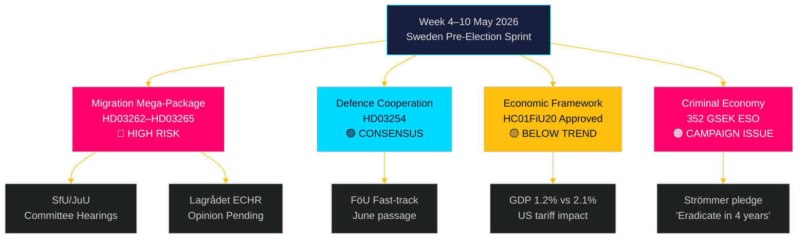

# La semaine à venir : La tempête législative pré-électorale suédoise — 4–10 mai 2026

**Auteur** : James Pether Sörling
**Date** : 2026-05-01
**Classification** : OSINT — Sources publiques
**Confiance** : ÉLEVÉE [B2]
**ID d'exécution** : 25207939386

## Conclusion

La semaine du 4 au 10 mai 2026 survient cinq mois avant les élections suédoises, alors que la Tidöalliansen vient de déposer son ensemble législatif le plus conséquent — et le plus risqué sur le plan constitutionnel — depuis son entrée en fonctions : quatre lois de restriction migratoire simultanées abolissant les permis de résidence permanents, élargissant l'appareil d'expulsion, resserrant la vérification du casier judiciaire et étendant la détention administrative. Les calendriers d'audition des commissions SfU et JuU détermineront le tempo législatif du sprint pré-électoral. Parallèlement, l'approbation par la commission des finances du Riksdag du cadre de politique économique (HC01FiU20) confirme une acceptation d'une croissance sous tendance, tandis que le rapport ESO plaçant l'économie criminelle suédoise à 352 milliards de SEK (5,5 % du PIB) entre dans le plein débat politique. Principaux décideurs de la semaine : le ministre de la Justice Gunnar Strömmer (application de la migration + criminalité des gangs), le ministre de la Défense Pål Jonson (HD03254 coopération défense), la ministre des Finances Elisabeth Svantesson (HC01FiU20 cadre économique) et le Talman du Riksdag concernant la planification des commissions JuU/SfU. Le jour de Valborg (1er mai) signifie que le premier jour ouvrable est le lundi 4 mai — une fenêtre comprimée de 5 jours avant le week-end.

**Note rétrospective** : 2026-05-01 est Valborg (jour férié national suédois). Pas de session plénière au Riksdag. La collecte de documents utilise la session du 2026-04-30 (rétrospective légitime selon la méthodologie). Période de couverture prospective : 4–10 mai 2026.

## Décisions que ce rapport soutient

1. **Renseignement sur les commissions** : SfU et JuU programmeront des auditions sur HD03262–65 cette semaine — le suivi de ces dates est crucial pour le timing de coordination de l'opposition et les stratégies d'escalade médiatique.
2. **Porte de risque CEDH** : Lagrådet n'a pas encore publié d'avis sur HD03262/HD03265 — tout avis publié cette semaine devient l'événement juridiquement le plus significatif de la session législative.
3. **Positionnement économique** : Le cadre approuvé HC01FiU20 définit l'identité économique d'austérité-dans-le-stimulus du gouvernement pour les élections ; le suivi des réponses aux sondages informe l'analyse de stabilité de la coalition.

## Lecture de renseignement en 60 secondes

- 🔴 **Méga-paquet migratoire** (HD03262/63/64/65) : Les auditions des commissions commencent la semaine du 4 mai. S, V, MP dans une forte opposition ; C probablement en soutien partiel. L'avis du Lagrådet sur la conformité CEDH est en attente.
- 🟡 **Coopération de défense** (HD03254) : La commission FöU met le projet de loi sur la voie rapide. Large consensus transpartisan y compris S. Passage en douceur attendu d'ici juin 2026.
- 🟠 **Cadre économique** (HC01FiU20) : Le Riksdag a approuvé des prévisions de croissance inférieures sous la pression tarifaire américaine. Croissance du PIB suédois 2026 prévue à 1,2 % contre 2,1 % potentiel. Le resserrement budgétaire en année électorale est politiquement risqué.
- 🔴 **Économie criminelle** : Rapport ESO (352 Mrd. SEK / 5,5 % du PIB, 23 000 entreprises) entré formellement dans le débat politique via HD10451. La promesse de Strömmer d'« éradiquer la criminalité des gangs en 4 ans » (HD10458) est désormais un engagement électoral mesurable.
- 🟡 **Motions environnementales/énergétiques** : Le groupe de 7 motions du S sur l'autorité environnementale et la loi sur l'électricité recevra une saisine des commissions MJU/NU cette semaine.

## Déclencheur prospectif principal

**Observation critique — d'ici le 2026-05-08** : Lagrådet publiera-t-il des avis sur HD03262 (abolition des permis permanents) ou HD03265 (extension de la détention) ? Un avis bloquant citant la CEDH Art. 5 ou Art. 8 déclencherait des exigences de révision constitutionnelle, retarderait le paquet de plusieurs mois et donnerait à l'opposition son argument électoral le plus puissant. Probabilité d'un avis bloquant : MOYEN [B3] — les parallèles danois et allemand suggèrent une conformité CEDH praticable mais étroite.

<!-- source-sha: 0662dfda88b9d02453368e18ec4258559dd23f48 -->
