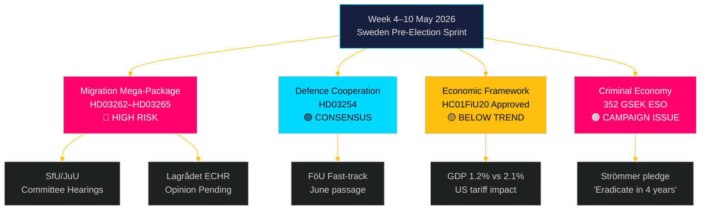

‏# השבוע הקרוב: סערת חקיקה בשוודיה ערב הבחירות — 4–10 במאי 2026

‏**מחבר**: ג'יימס פתר סורלינג
‏**תאריך**: 2026-05-01
‏**סיווג**: OSINT — מקורות ציבוריים
‏**רמת ביטחון**: גבוהה [B2]
‏**מזהה הרצה**: 25207939386

‏## סיכום מנהלים

‏שבוע ה-4–10 במאי 2026 מגיע חמישה חודשים לפני הבחירות השוודיות, כשה-Tidöalliansen זה עתה הגישה את חבילת החקיקה המשמעותית ביותר — והמסוכנת חוקתית ביותר — מאז עלותה לשלטון: ארבעה חוקי הגבלת הגירה בו-זמניים שיבטלו היתרי מגורים קבועים, יורחב מנגנון הגירוש, יוקשחו בדיקות רקע פלילי ותורחב המעצר המנהלי. לוחות הזמנים של ועדות SfU ו-JuU יקבעו את קצב החקיקה בסיבוב הקדם-בחירות. במקביל, אישור ועדת האוצר של הריקסדאג למסגרת המדיניות הכלכלית (HC01FiU20) מאשר קבלת צמיחה מתחת למגמה, בעוד דוח ESO המעריך את הכלכלה הפלילית השוודית ב-352 מיליארד כתרים (5.5% מהתמ"ג) נכנס לדיון הפוליטי המלא. קובעי ההחלטות המרכזיים השבוע: שר המשפטים גונר סטרומר (אכיפת הגירה + פשע כנופיות), שר הביטחון פול יונסון (HD03254 שיתוף פעולה ביטחוני), שרת האוצר אליזבת סוונטסון (HC01FiU20 מסגרת כלכלית) ויו"ר הריקסדאג לגבי תכנון ועדות JuU/SfU. חג הוולבורג (1 במאי) משמעותו שיום העבודה הראשון הוא יום שני, 4 במאי — חלון מצומצם של 5 ימים לפני סוף השבוע.

‏**הערת מבט לאחור**: 2026-05-01 הוא Valborg (חג לאומי שוודי). אין מושב מליאה בריקסדאג. איסוף המסמכים משתמש במושב מ-2026-04-30 (מבט לאחור לגיטימי לפי המתודולוגיה). תקופת הכיסוי לעתיד היא 4–10 במאי 2026.

‏## החלטות שדוח זה תומך בהן

‏1. **מודיעין ועדות**: SfU ו-JuU יתזמנו דיוני שמיעה בנושא HD03262–65 השבוע — מעקב אחר תאריכים אלה קריטי לתזמון תיאום האופוזיציה ואסטרטגיות הסלמה תקשורתית.
‏2. **שער סיכון ECHR**: ה-Lagrådet טרם הוציא חוות דעת על HD03262/HD03265 — כל חוות דעת שתפורסם השבוע תהיה האירוע המשפטי המשמעותי ביותר בדיון.
‏3. **מיצוב כלכלי**: מסגרת HC01FiU20 שאושרה מגדירה את הזהות הכלכלית צנע-בתוך-גירוי של הממשלה לבחירות; מעקב אחר תגובות סקרים מספק מידע לניתוח יציבות הקואליציה.

‏## קריאת מודיעין ב-60 שניות

‏- 🔴 **חבילת ההגירה הגדולה** (HD03262/63/64/65): דיוני ועדות מתחילים בשבוע ה-4 במאי. S, V, MP בהתנגדות חזקה; C כנראה תומכת חלקית. חוות דעת ה-Lagrådet על תאימות ECHR ממתינה.
‏- 🟡 **שיתוף פעולה ביטחוני** (HD03254): ועדת FöU מקדמת את הצעת החוק במסלול מהיר. קונצנזוס רחב חוצה מפלגות כולל S. צפויה אישור חלק עד יוני 2026.
‏- 🟠 **מסגרת כלכלית** (HC01FiU20): הריקסדאג אישר תחזיות צמיחה נמוכות יותר תחת לחץ מכסים אמריקאי. צמיחת התמ"ג השוודי 2026 צפויה ב-1.2% לעומת פוטנציאל 2.1%. הידוק פיסקלי בשנת בחירות הוא מסוכן פוליטית.
‏- 🔴 **כלכלה פלילית**: דוח ESO (352 מיליארד כתרים / 5.5% תמ"ג, 23,000 עסקים) נכנס רשמית לדיון הפוליטי דרך HD10451. הבטחת סטרומר "לחסל פשע כנופיות ב-4 שנים" (HD10458) היא כעת הבטחת בחירות מדידה.
‏- 🟡 **הצעות סביבה/אנרגיה**: אשכול 7 ההצעות של S על רשות הסביבה וחוק החשמל יקבל הפניה לוועדות MJU/NU השבוע.

‏## הטריגר הצופה קדימה המוביל

‏**תצפית קריטית — עד 2026-05-08**: האם ה-Lagrådet יוציא חוות דעת על HD03262 (ביטול היתרים קבועים) או HD03265 (הרחבת המעצר)? חוות דעת חוסמת המצטטת ECHR סע' 5 או 8 תפעיל דרישות לתיקון חוקתי, תעכב את החבילה בחודשים ותעניק לאופוזיציה את הטיעון הבחירותי החזק ביותר שלה. הסתברות לחוות דעת חוסמת: בינוני [B3] — מקבילות דניות וגרמניות מצביעות על תאימות ECHR ברת-ביצוע אך צרה.

<!-- source-sha: 0662dfda88b9d02453368e18ec4258559dd23f48 -->
