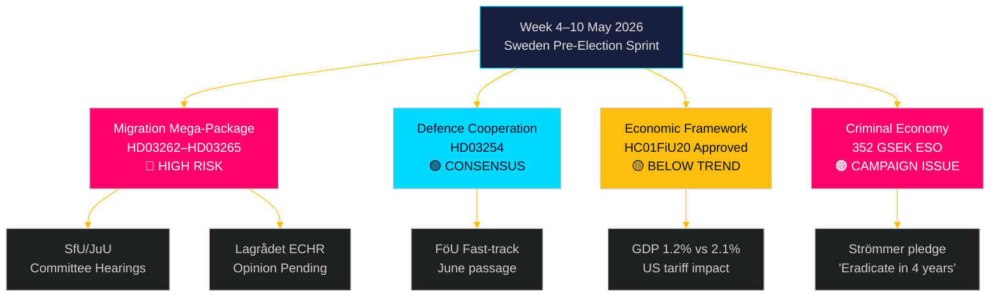

# 来週の展望：スウェーデンの選挙前立法嵐 — 2026年5月4日～10日

**著者**：ジェームズ・ペテル・ソーリング
**日付**：2026-05-01
**分類**：OSINT — 公開情報源
**信頼度**：高 [B2]
**実行ID**：25207939386

## エグゼクティブサマリー

2026年5月4日～10日の週は、スウェーデン選挙の5ヶ月前に位置し、ティドー連合が政権獲得以来最も重大で憲法上のリスクを伴う立法パッケージを提出した時期にあたる：永住許可を廃止し、強制退去の体制を拡大し、前科確認を強化し、行政拘留を拡張する4つの移民制限法を同時に提出した。SfU委員会およびJuU委員会の公聴会スケジュールが選挙前スプリントの立法ペースを決定する。同時に、リクスダーグ財務委員会の経済政策枠組み（HC01FiU20）承認はトレンド以下の成長を受容することを確認しており、スウェーデンの犯罪経済規模を3520億クローナ（GDP比5.5%）とするESO報告書が本格的な政治議論に入った。今週の主要意思決定者：グンナル・ストロメル法務大臣（移民執行＋ギャング犯罪）、ポール・ヨンソン国防大臣（HD03254 防衛協力）、エリサベト・スバンテソン財務大臣（HC01FiU20 経済枠組み）、JuU/SfUの委員会スケジュールに関するリクスダーグ議長。ヴァルボルグの日（5月1日）により、最初の営業日は月曜日の5月4日となり、週末前の5日間に圧縮される。

**回顧注記**：2026-05-01はヴァルボルグ（スウェーデンの国民祝日）。リクスダーグ本会議なし。文書収集には2026-04-30のセッションを使用（方法論に基づく正当な回顧）。展望的な対象期間は2026年5月4日～10日。

## 本報告書が支援する意思決定

1. **委員会インテリジェンス**：SfUとJuUは今週、HD03262–65に関する公聴会をスケジュールする予定 — これらの日程の追跡は野党の調整タイミングとメディア拡大戦略に不可欠。
2. **ECHRリスクゲート**：Lagrådetはまだ HD03262/HD03265 に関する意見書を発行していない — 今週発行されたいかなる意見書も、立法会期において法的に最も重要な事象となる。
3. **経済的位置付け**：承認されたHC01FiU20枠組みは、政府の選挙に向けた緊縮-刺激経済的アイデンティティを定義する；世論調査の反応を追跡することで連立安定性分析が深まる。

## 60秒インテリジェンス概要

- 🔴 **移民メガパッケージ**（HD03262/63/64/65）：委員会公聴会は5月4日の週から始まる。S、V、MPは強硬に反対；Cは部分的支持の可能性。ECHRへの適合性に関するLagrådetの意見書は保留中。
- 🟡 **防衛協力**（HD03254）：FöU委員会が法案を迅速審議。Sを含む幅広い超党派合意。2026年6月までの円滑な可決が見込まれる。
- 🟠 **経済枠組み**（HC01FiU20）：リクスダーグは米国関税の圧力下でより低い成長予測を承認。スウェーデンの2026年GDP成長率は潜在的2.1%に対して1.2%と予測。選挙年における財政引き締めは政治的にリスクが高い。
- 🔴 **犯罪経済**：ESO報告書（3520億クローナ / GDP比5.5%、23,000社）がHD10451を通じて正式に政治議論に入った。ストロメルの「4年でギャング犯罪を根絶する」という約束（HD10458）は今や測定可能な選挙公約となった。
- 🟡 **環境・エネルギー動議**：S党の環境機関と電力法に関する7動議クラスターが今週、MJU/NU委員会への付託を受ける。

## 主要先見性トリガー

**重要観察 — 2026-05-08までに**：Lagrådetは HD03262（永住許可廃止）またはHD03265（拘留拡大）に関する意見書を発行するか？ECHR第5条または第8条を引用した阻止的意見書は憲法改正要件を発動させ、パッケージを数ヶ月遅らせ、野党に最強の選挙議論を与えることになる。阻止的意見書の可能性：中程度 [B3] — デンマークおよびドイツの前例は実行可能だが余裕のないECHR適合性を示唆。

<!-- source-sha: 0662dfda88b9d02453368e18ec4258559dd23f48 -->
