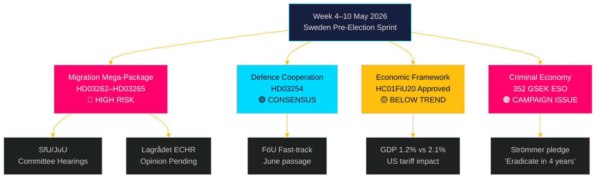

# 다음 주 전망: 선거 전 스웨덴 입법 폭풍 — 2026년 5월 4일~10일

**저자**: 제임스 페테르 소를링
**날짜**: 2026-05-01
**분류**: OSINT — 공개 출처
**신뢰도**: 높음 [B2]
**실행 ID**: 25207939386

## 개요

2026년 5월 4일~10일 주는 스웨덴 선거 5개월 전에 위치하며, 티도 연합이 집권 이후 가장 중대하고 헌법적으로 위험한 입법 패키지를 제출했다: 영구 거주 허가를 폐지하고, 강제 퇴거 체계를 확대하며, 전과 기록 확인을 강화하고, 행정 구금을 확장하는 4개의 이민 제한법을 동시에 제출했다. SfU와 JuU 위원회 청문회 일정이 선거 전 스프린트의 입법 속도를 결정한다. 동시에 리크스다그 재무위원회의 경제 정책 프레임워크(HC01FiU20) 승인은 추세 이하의 성장을 받아들인다는 것을 확인하며, 스웨덴 범죄 경제 규모를 3,520억 크로나(GDP 대비 5.5%)로 추정한 ESO 보고서가 본격적인 정치 논쟁에 들어갔다. 이번 주 핵심 의사결정자: 군나르 스트로메르 법무부 장관(이민 집행 + 갱 범죄), 팔 욘손 국방부 장관(HD03254 국방 협력), 엘리사벳 스반테손 재무부 장관(HC01FiU20 경제 프레임워크), JuU/SfU 위원회 일정 관련 리크스다그 의장. 발보르그의 날(5월 1일)로 인해 첫 영업일은 월요일 5월 4일로, 주말 전 5일 압축 기간이다.

**회고 참고**: 2026-05-01은 Valborg(스웨덴 국가 공휴일). 리크스다그 본회의 없음. 문서 수집은 2026-04-30 회의를 사용(방법론에 따른 정당한 회고). 전망적 대상 기간은 2026년 5월 4일~10일.

## 이 보고서가 지원하는 의사결정

1. **위원회 인텔리전스**: SfU와 JuU는 이번 주 HD03262–65에 관한 청문회를 일정에 넣을 예정 — 이 날짜 추적은 야당 조율 타이밍과 미디어 확대 전략에 중요하다.
2. **ECHR 리스크 관문**: Lagrådet은 아직 HD03262/HD03265에 관한 의견서를 발행하지 않았음 — 이번 주 발행되는 어떤 의견서도 입법 회기에서 법적으로 가장 중요한 사건이 된다.
3. **경제적 포지셔닝**: 승인된 HC01FiU20 프레임워크는 선거를 위한 정부의 긴축-자극 내 경제적 정체성을 정의한다; 여론 조사 반응 추적은 연립 안정성 분석에 정보를 제공한다.

## 60초 인텔리전스 요약

- 🔴 **이민 메가 패키지** (HD03262/63/64/65): 위원회 청문회가 5월 4일 주부터 시작. S, V, MP 강력 반대; C 부분 지지 가능성. ECHR 적합성에 대한 Lagrådet 의견서 보류 중.
- 🟡 **국방 협력** (HD03254): FöU 위원회가 법안을 신속 처리. S 포함 광범위한 초당적 합의. 2026년 6월까지 원활한 통과 예상.
- 🟠 **경제 프레임워크** (HC01FiU20): 리크스다그가 미국 관세 압박 하에 더 낮은 성장 전망을 승인. 스웨덴 2026년 GDP 성장률 잠재적 2.1%에 대해 1.2%로 예측. 선거 연도의 재정 긴축은 정치적으로 위험하다.
- 🔴 **범죄 경제**: ESO 보고서(3,520억 크로나 / GDP 5.5%, 23,000개 기업)가 HD10451을 통해 공식적으로 정치 논쟁에 진입. 스트로메르의 "4년 안에 갱 범죄 근절" 약속(HD10458)은 이제 측정 가능한 선거 공약이 됐다.
- 🟡 **환경/에너지 발의**: S의 환경 기관 및 전력법에 관한 7개 발의 클러스터가 이번 주 MJU/NU 위원회 회부를 받는다.

## 주요 선행 촉발 요인

**핵심 관찰 — 2026-05-08까지**: Lagrådet이 HD03262(영구 허가 폐지) 또는 HD03265(구금 확대)에 관한 의견서를 발행할 것인가? ECHR 제5조 또는 제8조를 인용한 차단 의견서는 헌법 개정 요건을 발동하고, 패키지를 수개월 지연시키며, 야당에게 가장 강력한 선거 논거를 제공할 것이다. 차단 의견서 가능성: 중간 [B3] — 덴마크 및 독일 전례는 실행 가능하지만 좁은 ECHR 적합성을 시사한다.

<!-- source-sha: 0662dfda88b9d02453368e18ec4258559dd23f48 -->
