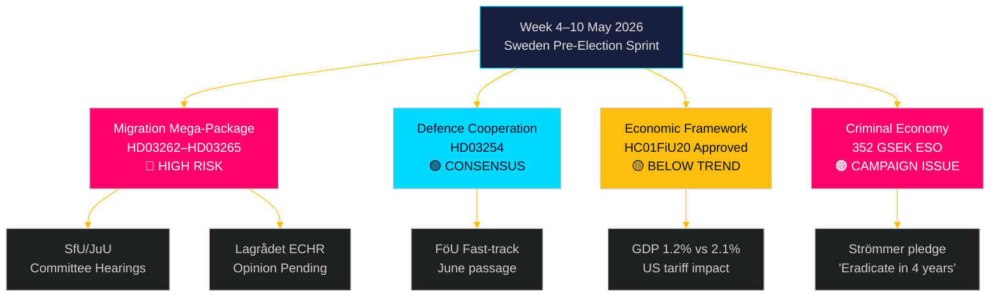

# De week vooruit: Zweden's pre-verkiezingswetgevingsstorm — 4–10 mei 2026

**Auteur**: James Pether Sörling
**Datum**: 2026-05-01
**Classificatie**: OSINT — Openbare bronnen
**Betrouwbaarheid**: HOOG [B2]
**Run-ID**: 25207939386

## Conclusie

De week van 4–10 mei 2026 vindt plaats vijf maanden voor de Zweedse verkiezingen, waarbij de Tidöalliansen zojuist het meest ingrijpende — en grondwettelijk meest risicovolle — wetgevingspakket heeft ingediend sinds haar aantreden: vier gelijktijdige migratierestrictiewetten die permanente verblijfsvergunningen afschaffen, het uitzettingsapparaat uitbreiden, de antecedentencontrole aanscherpen en de administratieve detentie uitbreiden. De hoorzittingsschema's van de SfU- en JuU-commissies bepalen het wetgevingstempo van de pre-verkiezingssprint. Tegelijkertijd bevestigt de goedkeuring door de Financiële Commissie van de Riksdag van het economisch beleidskader (HC01FiU20) acceptatie van ondertrends groei, terwijl het ESO-rapport dat de Zweedse criminele economie op 352 miljard SEK (5,5 % bbp) schat het volledige politieke debat ingaat. Belangrijkste besluitvormers deze week: Minister van Justitie Gunnar Strömmer (migratihandhaving + bendecrimiliteit), Minister van Defensie Pål Jonson (HD03254 defensiesamenwerking), Minister van Financiën Elisabeth Svantesson (HC01FiU20 economisch kader) en de Talman van de Riksdag betreffende JuU/SfU-commissieplanning. De Walpurgisdag (1 mei) betekent dat de eerste werkdag maandag 4 mei is — een gecomprimeerd 5-dagenvenster voor het weekend.

**Terugblikopmerking**: 2026-05-01 is Valborg (Zweedse nationale feestdag). Geen plenaire vergadering in de Riksdag. Documentenverzameling gebruikt de sessie van 2026-04-30 (legitiem terugblik volgens methodologie). Vooruitkijkende dekkingsperiode is 4–10 mei 2026.

## Beslissingen die dit rapport ondersteunt

1. **Commissie-inlichtingen**: SfU en JuU plannen hoorzittingen over HD03262–65 deze week — het bijhouden van deze datums is cruciaal voor het coördinatietiming van de oppositie en mediaescalatiestrategieën.
2. **EVRM-risicopoort**: Lagrådet heeft nog geen adviezen uitgebracht over HD03262/HD03265 — elk advies dat deze week wordt gepubliceerd, wordt de juridisch meest significante gebeurtenis van de wetgevende zitting.
3. **Economische positionering**: Het goedgekeurde HC01FiU20-kader definieert de bezuinigings-in-stimulans economische identiteit van de regering voor de verkiezingen; het bijhouden van peilingresponsies informeert de coalitiesstabiliteitsanalyse.

## 60-seconden nieuwslezing

- 🔴 **Migratiemegapakket** (HD03262/63/64/65): Commissiehorzittingen beginnen week van 4 mei. S, V, MP in sterke oppositie; C waarschijnlijk gedeeltelijk ondersteunend. Lagrådet-advies over EVRM-conformiteit in behandeling.
- 🟡 **Defensiesamenwerking** (HD03254): FöU-commissie behandelt wetsvoorstel op spoorkoers. Breed partijoverschrijdend consensus inclusief S. Vlotte aanneming verwacht voor juni 2026.
- 🟠 **Economisch kader** (HC01FiU20): Riksdag keurde lagere groeiverwachtingen goed onder Amerikaanse tariefdruk. Zweedse bbp-groei 2026 geprognosticeerd op 1,2 % versus potentieel 2,1 %. Begrotingsverkrapping in een verkiezingsjaar is politiek riskant.
- 🔴 **Criminele economie**: ESO-rapport (352 mrd. SEK / 5,5 % bbp, 23.000 bedrijven) trad formeel het politieke debat in via HD10451. Strömmer's belofte om 'bendecriminaliteit in 4 jaar uit te roeien' (HD10458) is nu een meetbare verkiezingsbelofte.
- 🟡 **Milieu-/energiemoties**: S's cluster van 7 moties over milieu-autoriteit en elektriciteitswet ontvangt commissieverwijzing naar MJU/NU deze week.

## Leidende vooruitkijkende trigger

**Kritische waarneming — voor 2026-05-08**: Zal Lagrådet adviezen uitbrengen over HD03262 (afschaffing van permanente vergunningen) of HD03265 (uitbreiding van detentie)? Een blokkerend advies dat EVRM Art. 5 of Art. 8 aanhaalt, zou eisen voor grondwetsherziening triggeren, het pakket maanden vertragen en de oppositie haar krachtigste verkiezingsargument geven. Kans op een blokkerend advies: GEMIDDELD [B3] — Deense en Duitse parallellen suggereren werkbare maar krappe EVRM-conformiteit.

<!-- source-sha: 0662dfda88b9d02453368e18ec4258559dd23f48 -->
