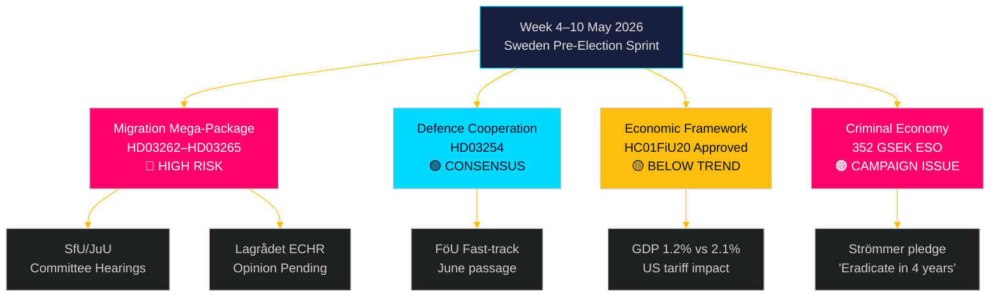

# Uken fremover: Sveriges forvalglovgivningsstorm — 4.–10. mai 2026

**Forfatter**: James Pether Sörling
**Dato**: 2026-05-01
**Klassifisering**: OSINT — Offentlige kilder
**Konfidens**: HØY [B2]
**Kjøre-ID**: 25207939386

## Konklusjon

Uken 4.–10. mai 2026 ankommer fem måneder før Riksdagens valg, med Tidöalliansen som nettopp har lagt frem sin mest konsekvente — og konstitusjonelt risikable — lovgivningspakke siden regjeringen tok over: fire samtidige innvandringsrestriksjonslover som avskaffer permanente oppholdstillatelser, utvider deportasjonsapparatet, strammer inn vandelskontroll og utvider administrativ internering. Utvalgshoringers tidsplaner ved SfU og JuU vil bestemme lovgivningstempoet for den siste sprinten mot valget. Samtidig låser Riksdagens finanskomités godkjenning av rammene for den økonomiske politikken (HC01FiU20) inn en aksept av under-trend vekst, mens ESO-rapporten som plasserer Riksdagens kriminaløkonomi på 352 milliarder SEK (5,5 % av BNP) trer inn i full politisk debatt. Sentrale beslutningstakere denne uken: Justisminister Gunnar Strömmer (migrasjonsapplikasjon + gjengkriminalitet), Forsvarsminister Pål Jonson (HD03254 forsvarssamarbeid), Finansminister Elisabeth Svantesson (HC01FiU20 økonomisk rammeverk) og Riksdagens talman angående JuU/SfU utvalgsplanlegging. Valborg-helligdagen (1. mai) betyr at den første arbeidsdagen er mandag 4. mai — et komprimert 5-dagers vindu før helgen.

**Tilbakeblikksnotat**: 2026-05-01 er Valborg (svensk offentlig helligdag). Ingen Riksdag-plenumssesjon. Dokumentinnhenting bruker sesjon 2026-04-30 (legitimt tilbakeblikk per metodologi). Fremoverskuende dekningsperiode er 4.–10. mai 2026.

## Beslutninger dette notatet støtter

1. **Utvalgsetterre tning**: SfU og JuU vil planlegge høringer om HD03262–65 denne uken — å spore disse datoene er avgjørende for opposisjonens koordineringstiming og medieeskaleringsstrategier.
2. **ECHR-risikoport**: Lagrådet har ennå ikke utstedt yttranden om HD03262/HD03265 — et yttrande publisert denne uken blir den mest juridisk signifikante begivenheten i lovgivningssesjonenets.
3. **Økonomisk posisjonering**: Det HC01FiU20-godkjente rammeverket definerer regjeringens strammings-innenfor-stimulus-identitet for valget; sporing av opinionsundersøkelsessvar informerer om koalisjonens stabilitetsanalyse.

## 60-sekunders etterretningslesning

- 🔴 **Migrations-megapakke** (HD03262/63/64/65): Utvalgshoringer begynner uken 4. mai. S, V, MP i hard opposisjon; C sannsynligvis delvis støtte. Lagrådets yttrande om ECHR-overholdelse avventes.
- 🟡 **Forsvarssamarbeid** (HD03254): FöU-utvalget ekspederer lovforslaget. Bred tverrpolitisk konsensus inkludert S. Forventes å passere smidig innen juni 2026.
- 🟠 **Økonomisk rammeverk** (HC01FiU20): Riksdagen godkjente lavere vekstprognoser under amerikansk tolpres. Norsk BNP-vekst 2026 prognostisert til 1,2 % mot potensielle 2,1 %. Finanspolitisk innstramming i valgåret er politisk risikabelt.
- 🔴 **Kriminaløkonomi**: ESO-rapport (352 GSEK / 5,5 % av BNP, 23.000 selskaper) trådte formelt inn i politisk debatt via HD10451. Strömmers løfte om å "utrydde gjengkriminalitet på 4 år" (HD10458) er nå et målbart valgengasjement.
- 🟡 **Miljø-/energimosioner**: S's 7-mosjonsklynge om miljømyndighet og ellov vil motta utvalgshenvisning til MJU/NU denne uken.

## Ledende fremoverskuende trigger

**Kritisk observasjon — innen 2026-05-08**: Vil Lagrådet publisere yttranden om HD03262 (avskaffelse av permanente tillatelser) eller HD03265 (utvidelse av internering)? Et blokkerende yttrande som siterer ECHR Art. 5 eller Art. 8 vil utløse krav om grunnlovsrevisjon, forsinke pakken med måneder og gi opposisjonen sitt mest potente valgargument. Sannsynlighet for blokkerende yttrande: MEDIUM [B3] — danske og tyske paralleller antyder en gjennomførbar men smal ECHR-overholdelse.

<!-- source-sha: 0662dfda88b9d02453368e18ec4258559dd23f48 -->
