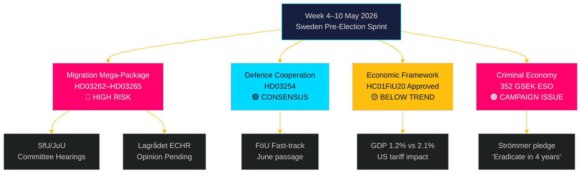

# Veckan framåt: Sveriges förvalslagstiftningsstorm — 4–10 maj 2026

**Författare**: James Pether Sörling
**Datum**: 2026-05-01
**Klassificering**: OSINT — Offentliga källor
**Konfidens**: HÖG [B2]
**Körnings-ID**: 25207939386

## Slutsats

Veckan 4–10 maj 2026 infaller fem månader före Sveriges riksdagsval, med Tidöalliansen som precis lagt fram det mest konsekventa — och konstitutionellt riskfyllda — lagstiftningspaketet sedan regeringstillträdet: fyra simultana migrationsbegränsningslagar som avskaffar permanenta uppehållstillstånd, utökar utvisningsmaskineriet, skärper vandelsprövning och utvidgar administrativt förvar. Utskottshearingarnas schema vid SfU och JuU avgör lagstiftningstempoet inför valspurten. Parallellt låser riksdagens finansutskotts godkännande av det ekonomisk-politiska ramverket (HC01FiU20) fast en acceptans av undertrendstillväxt, medan ESO-rapporten som placerar Sveriges kriminalekonomi på 352 miljarder kronor (5,5 % av BNP) träder in i full politisk debatt. Centrala beslutsfattare denna vecka: justitieminister Gunnar Strömmer (migrationstillämpning + gängkriminalitet), försvarsminister Pål Jonson (HD03254 försvarssamarbete), finansminister Elisabeth Svantesson (HC01FiU20 ekonomiskt ramverk) och riksdagens talman angående JuU/SfU:s utskottsplanering. Valborgshelgen (1 maj) innebär att den första arbetsdagen är måndag 4 maj — ett komprimerat 5-dagarsfönster inför helgen.

**Anmärkning om tillbakablick**: 2026-05-01 är Valborg (svensk allmän helgdag). Ingen riksdagsplenum. Dokumentinhämtning använder 2026-04-30 session (legitim tillbakablick per metodik). Framåtblickande täckningsperiod är 4–10 maj 2026.

## Beslut som detta underlag stöder

1. **Utskottsunderrättelse**: SfU och JuU schemalägger hearingar om HD03262–65 denna vecka — att spåra dessa datum är kritiskt för oppositionens samordningstiming och medieeskaleringsstrategier.
2. **ECHR-riskport**: Lagrådet har ännu inte utfärdat yttranden om HD03262/HD03265 — ett yttrande publicerat denna vecka blir den mest juridiskt signifikanta händelsen under lagstiftningssessionen.
3. **Ekonomisk positionering**: Det HC01FiU20-godkända ramverket definierar regeringens åtstramning-inom-stimulans ekonomiska identitet inför valet; spårning av opinionsundersökningssvar informerar om koalitionens stabilitetsanalys.

## 60-sekunders underrättelseläsning

- 🔴 **Migrations-megapaket** (HD03262/63/64/65): Utskottshearingar börjar veckan 4 maj. S, V, MP i hård opposition; C troligen partiellt stöd. Lagrådets yttrande om ECHR-efterlevnad avvaktas.
- 🟡 **Försvarssamarbete** (HD03254): FöU-utskottet snabbbehandlar lagen. Bred tvärpolitisk konsensus inklusive S. Förväntas passera obehindrat till juni 2026.
- 🟠 **Ekonomiskt ramverk** (HC01FiU20): Riksdagen godkände lägre tillväxtprognoser under amerikanskt trycktryck. Sveriges BNP-tillväxt 2026 prognosticeras till 1,2 % jämfört med potentiella 2,1 %. Valårets finansiella åtstramning är politiskt riskabel.
- 🔴 **Kriminalekonomi**: ESO-rapport (352 GSEK / 5,5 % av BNP, 23 000 företag) trädde formellt in i politisk debatt via HD10451. Strömmers "utrota gängkriminaliteten på 4 år"-löfte (HD10458) är nu ett mätbart valåtagande.
- 🟡 **Miljö-/energimotioner**: S:s 7-motionskluster om miljömyndighet och ellag får utskottsremiss till MJU/NU denna vecka.

## Ledande framåtblickande trigger

**Kritisk bevakning — senast 2026-05-08**: Kommer Lagrådet att publicera yttranden om HD03262 (avskaffande av permanenta tillstånd) eller HD03265 (utvidgning av förvar)? Ett blockerande yttrande med hänvisning till ECHR Art. 5 eller Art. 8 skulle utlösa krav på grundlagsrevision, försena paketet med månader och ge oppositionen sitt mest potenta valargument. Sannolikhet för blockerande yttrande: MEDEL [B3] — danska och tyska paralleller tyder på en genomförbar men smal ECHR-efterlevnad.

<!-- source-sha: 0662dfda88b9d02453368e18ec4258559dd23f48 -->
