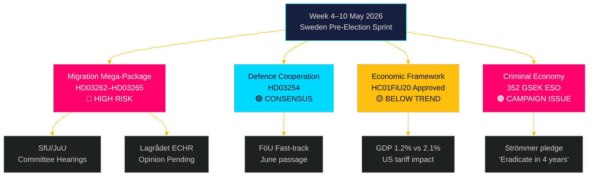

# 下周展望：瑞典选举前立法风暴 — 2026年5月4日至10日

**作者**：詹姆斯·佩瑟·索林
**日期**：2026-05-01
**分类**：OSINT — 公开信息来源
**可信度**：高 [B2]
**运行ID**：25207939386

## 执行摘要

2026年5月4日至10日这一周距瑞典选举还有五个月，蒂多联盟刚刚提交了其执政以来最重大、宪法风险最高的立法方案：同时推进四项移民限制法律，将废除永久居留许可、扩大强制遣返机制、强化犯罪背景审查、扩展行政拘留权限。SfU和JuU委员会的听证日程将决定选举前立法冲刺的节奏。与此同时，瑞典议会财政委员会批准经济政策框架（HC01FiU20），确认接受低于趋势线的增长，而将瑞典犯罪经济规模估算为3520亿克朗（占GDP 5.5%）的ESO报告正式进入政治辩论。本周关键决策者：司法部长贡纳尔·斯特罗默（移民执法 + 帮派犯罪）、国防部长帕尔·约翰逊（HD03254 国防合作）、财政部长伊丽莎白·斯万特松（HC01FiU20 经济框架）以及议会议长关于JuU/SfU委员会安排。瓦尔伯格日（5月1日）意味着第一个工作日是周一5月4日——周末前压缩为5天的窗口期。

**回溯说明**：2026-05-01是瓦尔伯格节（瑞典国家法定假日）。议会无全体会议。文件收集使用2026-04-30会期（依据方法论合规回溯）。前瞻报道期为2026年5月4日至10日。

## 本报告支持的决策

1. **委员会情报**：SfU和JuU本周将安排HD03262–65的听证会——追踪这些日期对于反对派协调时机和媒体升级策略至关重要。
2. **ECHR风险关口**：Lagrådet尚未就HD03262/HD03265发表意见——本周发布的任何意见将成为立法会期在法律上最重要的事件。
3. **经济定位**：已批准的HC01FiU20框架定义了政府面向选举的"紧缩中刺激"经济身份；追踪民调反应为联合政府稳定性分析提供信息。

## 60秒情报速览

- 🔴 **移民超级方案**（HD03262/63/64/65）：委员会听证会从5月4日当周开始。S、V、MP强烈反对；C可能部分支持。Lagrådet关于ECHR合规性的意见尚待发布。
- 🟡 **国防合作**（HD03254）：FöU委员会将法案走快速通道。包括S在内的广泛跨党派共识。预计2026年6月前顺利通过。
- 🟠 **经济框架**（HC01FiU20）：议会在美国关税压力下批准了更低的增长预测。瑞典2026年GDP增长预计为1.2%，而潜在增速为2.1%。选举年财政收紧具有政治风险。
- 🔴 **犯罪经济**：ESO报告（3520亿克朗 / GDP 5.5%，23,000家企业）通过HD10451正式进入政治辩论。斯特罗默"4年内消灭帮派犯罪"的承诺（HD10458）现已成为可衡量的选举承诺。
- 🟡 **环境/能源动议**：S党7项关于环境机构和电力法的动议组合本周将获得MJU/NU委员会转介。

## 领先前瞻性触发因素

**关键观察——在2026-05-08之前**：Lagrådet会否就HD03262（废除永久许可）或HD03265（扩展拘留）发表意见？援引ECHR第5条或第8条的阻止性意见将触发宪法修正要求，将方案延迟数月，并给予反对派最强有力的选举论据。阻止性意见的概率：中等 [B3]——丹麦和德国的先例表明ECHR合规性可行但空间狭窄。

<!-- source-sha: 0662dfda88b9d02453368e18ec4258559dd23f48 -->
