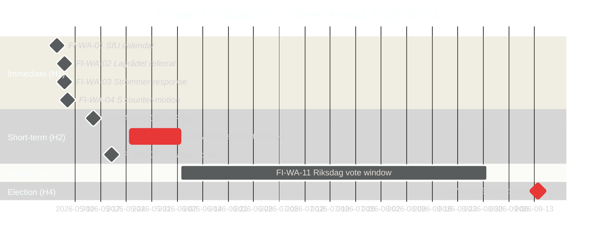

# Forward Indicators — Week Ahead 4–10 May 2026

**Author**: James Pether Sörling  
**Date**: 2026-05-01  
**Gate Check 8**: ≥10 dated indicators across 4 horizons  

## Horizon 1: Immediate (4–10 May 2026)

**FI-WA-01** — SfU Committee Hearing Schedule (Expected: 5 May 2026)  
Signal: riksdagen.se/sv/utskott calendar published for week of 11 May  
Positive indicator: Hearing dates confirmed for HD03262 before 8 May  
Negative indicator: "TBD" or no announcement → Scenario B signal  
Confidence: HIGH [A2]

**FI-WA-02** — Lagrådet Referral Confirmation (Expected: 6-7 May 2026)  
Signal: lagradet.se referral register updated for HD03262 and HD03265  
Positive indicator: Standard referral timeline (4-6 weeks) → consistent with Scenario A  
Negative indicator: Expedited timeline (<3 weeks) → Scenario B/C signal  
Confidence: MEDIUM [B2]

**FI-WA-03** — Justice Minister Strömmer Interpellation Response on HD10458 (Expected: 6-7 May 2026)  
Signal: Written response to riksdagen.se interpellation HD10458 (gang crime eradication)  
Positive indicator: Response includes ≥3 measurable milestones with dates  
Negative indicator: Rhetorical response without quantified milestones  
Confidence: HIGH [A2]

**FI-WA-04** — S Counter-Motion Filing on HD03262 (Expected: by 8 May 2026)  
Signal: riksdagen.se motioner filed with S as motionär against HD03262  
Positive indicator (for government): S files detailed technical amendments (not rhetorical opposition) → committee engagement  
Negative indicator (for government): S files urgency debate request → confrontational escalation  
Confidence: HIGH [A2] — S will file something; form is uncertain

**FI-WA-05** — Novus/IPSOS Migration Approval Polling (Expected: 7-9 May 2026)  
Signal: Novus or IPSOS publishes post-announcement poll on migration policy approval  
Positive indicator: HD03262/63 approval ≥50% → government electoral thesis validated  
Negative indicator: Approval <40% or "too far" sentiment >30% → signals Scenario B risk  
Confidence: LOW [C3] — polling firms may not have published by 10 May

## Horizon 2: Short-term (11 May–7 June 2026)

**FI-WA-06** — Lagrådet Opinion Publication on HD03262/HD03265 (Expected: late May/early June 2026)  
Signal: lagradet.se opinion PDF published  
Positive indicator: Limited opinion with adoptable safeguards → Scenario A confirmed  
Negative indicator: Blocking opinion → Scenario B confirmed  
Confidence: MEDIUM [B2]

**FI-WA-07** — SfU Committee Report Completion Date Published (Expected: 15-20 May 2026)  
Signal: Riksdag committee report calendar shows HD03262 completion date  
Key threshold: June 15 = before summer recess; July 1 = after summer recess  
Confidence: HIGH [A2] — calendar will be published

**FI-WA-08** — SCB Q1 2026 GDP Preliminary Release (Expected: 15 May 2026)  
Signal: scb.se preliminary GDP estimate for Q1 2026  
Positive indicator: GDP ≥1.0% → economic narrative manageable  
Negative indicator: GDP <0.8% → Scenario C economic component triggered  
Confidence: HIGH [A1] — SCB release dates are published

**FI-WA-09** — EU Commission Statement on Swedish Migration Package (Expected: May-June 2026)  
Signal: European Commission DG HOME spokesperson comment on HD03262/63  
Positive indicator: Silence or "monitoring" statement → no infringement risk  
Negative indicator: DG HOME expresses "concerns" re returns directive → infringement risk  
Confidence: LOW [C3]

**FI-WA-10** — Riksrevisionen or Statskontoret commissioned review of Migrationsverket capacity (Expected: May 2026)  
Signal: Parliamentary decision to commission review or opposition request  
Positive indicator: No review commissioned → government controls implementation narrative  
Negative indicator: KU or SfU commissions review → opposition gains accountability tool  
Confidence: MEDIUM [B3]

## Horizon 3: Medium-term (8 June–31 August 2026)

**FI-WA-11** — Migration Package Riksdag Vote Date Confirmed (Expected: June-September 2026)  
Signal: Riksdag timetable published for HD03262-65 second reading  
Key threshold: Before summer recess (1 July) = maximum electoral impact; after (August) = lower salience  
Confidence: HIGH [A2] — Riksdag calendar will clarify

**FI-WA-12** — Polling Trend (Expected: monthly through September)  
Signal: Tidöalliansen aggregate polling vs S+V+MP aggregate  
Key threshold: Tidöalliansen drops below 165 projected seats = majority at risk  
Confidence: HIGH [A1] — polls will be published

## Horizon 4: Long-term (1 September–14 September 2026 — Election Week)

**FI-WA-13** — Election Result (14 September 2026)  
Signal: Valmyndigheten final result  
Key indicators: L above/below 4%; SD above/below 18%; S above/below 33%  
Confidence: HIGH [A1] — election will occur as scheduled

## Indicator Dashboard

| Indicator | Date | Status | Update Source |
|-----------|------|--------|--------------|
| FI-WA-01 SfU calendar | 5 May 2026 | 🔵 PENDING | riksdagen.se |
| FI-WA-02 Lagrådet referral | 6-7 May 2026 | 🔵 PENDING | lagradet.se |
| FI-WA-03 Strömmer HD10458 response | 6-7 May 2026 | 🔵 PENDING | riksdagen.se |
| FI-WA-04 S counter-motion | By 8 May 2026 | 🔵 PENDING | riksdagen.se |
| FI-WA-05 Novus/IPSOS polling | 7-9 May 2026 | 🔵 PENDING | novus.se |
| FI-WA-06 Lagrådet opinion | Late May/June 2026 | �� PENDING | lagradet.se |
| FI-WA-07 SfU committee date | 15-20 May 2026 | 🔵 PENDING | riksdagen.se |
| FI-WA-08 SCB GDP preliminary | 15 May 2026 | 🔵 PENDING | scb.se |
| FI-WA-09 EU Commission statement | May-June 2026 | 🔵 PENDING | ec.europa.eu |
| FI-WA-10 Statskontoret/RR capacity review | May 2026 | 🔵 PENDING | riksdagen.se |
| FI-WA-11 Riksdag vote date | June-September 2026 | 🔵 PENDING | riksdagen.se |
| FI-WA-12 Monthly polling | Monthly | 🔵 PENDING | novus.se/ipsos.se |
| FI-WA-13 Election result | 14 September 2026 | 🔵 PENDING | val.se |

