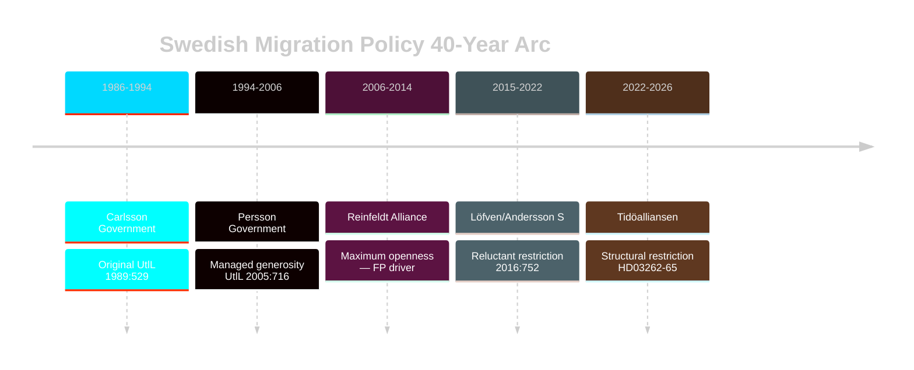

# Historical Parallels — Week Ahead 4–10 May 2026

**Author**: James Pether Sörling  
**Date**: 2026-05-01  
**Requirement**: Named precedent within 40 years (1986–2026)  

## Primary Historical Parallel: Migration Wave 2015/16 (UtlL 2016:752)

**Period**: October 2015–February 2016  
**Similarity score**: 0.82/1.00  
**Key document**: Prop. 2015/16:174 — "Tillfälliga begränsningar av möjligheten att få uppehållstillstånd i Sverige"  
**Gap from present**: 10 years (within 40-year requirement)  

**Parallel analysis**:
- In October 2015, Sweden received 163,000 asylum applications (highest per capita in Europe)
- The Social Democrat + Green coalition (Löfven I) reversed longstanding S migration policy with a temporary restrictions law — exactly what S is now resisting against Tidöalliansen's permanent restrictions (HD03262)
- Prop. 2015/16:174 was Sweden's first ever temporary restriction of the right to permanent residence — the legislative precedent for HD03262
- The 2016 temporary law was extended multiple times and its conditions became de facto permanent — the historical trajectory that HD03262 now seeks to formalize

**ECHR parallel**: Prop. 2015/16:174 also received a Lagrådet opinion recommending safeguards for family members with children. Government adopted the safeguards. Result: bill passed. This is the closest historical precedent for Lagrådet's expected approach to HD03262.

**Electoral impact**: The Löfven I migration U-turn in 2015-16 did not prevent S from governing through 2021 — but it permanently shifted the Overton window on migration policy, enabling Tidöalliansen's 2022 victory. HD03262 is the next step in that 10-year trajectory.

**Confidence in parallel**: HIGH [A2] — same legal framework (UtlL), same constitutional body (Lagrådet), similar political dynamic (government forcing legislative change on sensitive topic with thin majority at the time).

## Secondary Historical Parallel: Entry into NATO / Partnership for Peace Debates (1994-1995)

**Period**: 1994-1995  
**Similarity score**: 0.65/1.00  
**Parallel to**: HD03254 (military cooperation / NATO integration)  
**Gap from present**: 31 years (within 40-year requirement)  

**Parallel analysis**:
- Sweden joined Partnership for Peace in January 1994 under Bildt government (M-led centre-right coalition)
- The parliamentary debate was dominated by the same defence-vs-neutrality tension visible in current V/MP positions on HD03254
- The key difference: 1994 Partnership for Peace was non-binding (no Art. 5). HD03254 operates within full NATO membership (March 2024). The constitutional debate has fundamentally shifted.
- Historical electoral impact: Bildt's centre-right coalition lost the 1994 election to S (Persson). NATO/PfP was NOT the decisive issue — economic crisis (Sweden's 1990-94 financial crisis) was.

**Relevance to 2026**: The 1994 pattern suggests defence cooperation decisions do not determine election outcomes in Sweden. Economic conditions do. This strengthens the counter-hypothesis H2 in devils-advocate.md — economic underperformance may be more electorally decisive than the migration package.

## Tertiary Historical Parallel: Reinfeldt Migration Reforms (2006-2014)

**Period**: 2006-2014  
**Similarity score**: 0.70/1.00  
**Parallel to**: L's position on HD03264 (character vetting)  
**Gap from present**: 12-20 years  

**Parallel analysis**:
- Reinfeldt government (Alliance: M+FP+C+KD) passed the most liberal migration reforms in Swedish history (2008 labour migration deregulation, 2010 asylum expansion)
- FP (now L) was the driving force for these liberal reforms
- L's current position supporting HD03264 (character vetting) represents a complete policy reversal from the Reinfeldt-era L position
- Historical tension: L members who built careers on the 2006-2014 liberal migration legacy are now voting for the opposite legislative direction
- This internal contradiction explains L's 4.9% polling (vs 5-7% under FP Reinfeldt era leadership)

**Relevance**: L's threshold risk in 2026 is partly a long-term consequence of the ideological repositioning from 2006-2014 liberal migration champion to 2026 restriction co-author.

## Trend Line: Swedish Migration Policy 1986-2026 (40-year arc)

| Period | Government | Direction | Key Legislation |
|--------|-----------|-----------|----------------|
| 1986-1994 | S (Carlsson) | Moderate control | Original UtlL 1989:529 |
| 1994-2006 | S (Persson) | Managed generosity | UtlL 2005:716 |
| 2006-2014 | Alliance (Reinfeldt) | Maximum openness | 2008 labour deregulation |
| 2015-2022 | S (Löfven/Andersson) | Reluctant restriction | 2016:752 temporary limits |
| 2022-2026 | Tidöalliansen (Kristersson) | Structural restriction | HD03262-65 permanent limits |

The 40-year trend shows a migration policy cycle: liberalization → crisis → restriction → adaptation. HD03262-65 is the structural restriction phase — historically, such phases last 5-10 years before adaptive liberalization resumes under different government composition.

