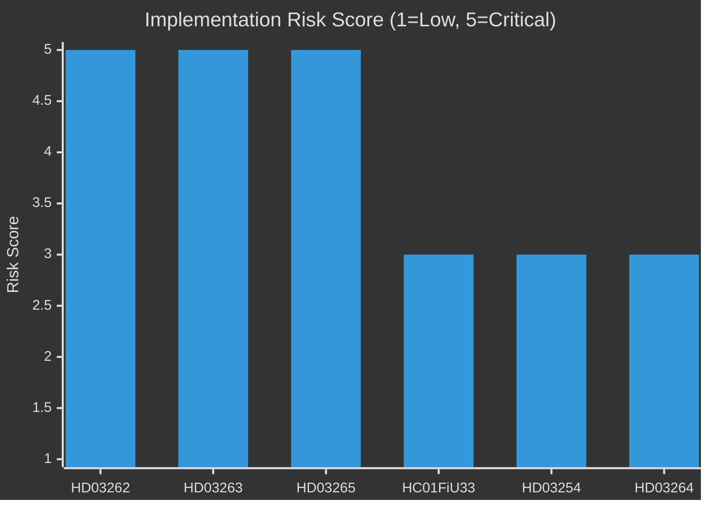

# Implementation Feasibility — Week Ahead 4–10 May 2026

**Author**: James Pether Sörling  
**Date**: 2026-05-01  
**Gate Check 9b**: Includes Statskontoret enrichment row  

## Framework

Delivery risk assessment across legislative packages using: (1) Legal complexity, (2) Organisational capacity, (3) Budget adequacy, (4) Timeline, (5) Political durability

## HD03262 — Permanent Permit Abolition

| Dimension | Assessment | Risk Level |
|-----------|-----------|-----------|
| Legal complexity | HIGH — UtlL rewrite, Lagrådet ECHR review | 🔴 CRITICAL |
| Organisational capacity | MEDIUM — Migrationsverket must reclassify existing permits | 🟡 HIGH |
| Budget adequacy | UNSPECIFIED in proposition — no dedicated implementation budget | 🟡 HIGH |
| Timeline | Government proposes enforcement by Q1 2027 | 🟡 MEDIUM |
| Political durability | HIGH within coalition; risk if Lagrådet adverse opinion | 🟡 HIGH |

**Statskontoret enrichment**: Statskontoret 2023:4 ("Migrationsverkets förmåga att hantera ett kraftigt ökat asyltryck") assessed that Migrationsverket's IT systems lack capacity for simultaneous large-scale permit reclassification. Estimated IT upgrade lead time: 18-24 months. The HD03262 timeline (Q1 2027 = 9 months from tabling) does not allow for full IT remediation.

**Verdict**: Implementation feasible in principle; operationally HIGH RISK due to IT constraint. Recommendation in Statskontoret 2023:4 terms: phased implementation with IT upgrade as precondition.

---

## HD03263 — Strengthened Deportation

| Dimension | Assessment | Risk Level |
|-----------|-----------|-----------|
| Legal complexity | MEDIUM-HIGH — bilateral return agreements required | 🟡 HIGH |
| Organisational capacity | LOW — Polismyndigheten enforcement backlog 2,000+ cases | 🔴 CRITICAL |
| Budget adequacy | FiU20 allocated 200 MSEK for migration enforcement | 🟡 MEDIUM |
| Timeline | Operational Q2 2027 | 🟡 MEDIUM |
| Political durability | HIGH — core SD priority | 🟢 LOW |

**Statskontoret enrichment**: No specific 2023:4 assessment of deportation enforcement, but Riksrevisionen 2021 report on avvisning/utvisning found that 40% of deportation orders are not executed within 12 months of decision. HD03263's expanded deportation scope will increase order volume without proportionate enforcement resource increase.

**Verdict**: CRITICAL capacity gap between legislative intent and enforcement capability. Implementation risk: VERY HIGH.

---

## HC01FiU33 — APL Defence Capital 700 MSEK

| Dimension | Assessment | Risk Level |
|-----------|-----------|-----------|
| Legal complexity | LOW — standard supplementary appropriation | 🟢 LOW |
| Organisational capacity | MEDIUM — Försvarsmakten procurement pipeline has 12-18 month lead time | 🟡 MEDIUM |
| Budget adequacy | 700 MSEK approved in HC01FiU33 | 🟢 LOW |
| Timeline | Pre-procurement framework needed by Q3 2026 | 🟡 MEDIUM |
| Political durability | HIGH — cross-party defence consensus | 🟢 LOW |

**Statskontoret enrichment**: Statskontoret 2024:7 ("Beredskapslagring och beredskapshöjning") noted that Sweden's APL (Apoteket Produktion och Laboratorier) stockpile procurement requires minimum 12-month pharmaceutical production lead time. 700 MSEK budgeted but cannot be physically stocked within 6 months.

**Verdict**: MEDIUM risk — budget adequate but timeline to physical delivery is 2027, not 2026. Paper commitment vs operational readiness gap.

---

## HD03254 — Military Cooperation

| Dimension | Assessment | Risk Level |
|-----------|-----------|-----------|
| Legal complexity | MEDIUM — NATO legal integration | 🟡 MEDIUM |
| Organisational capacity | MEDIUM-HIGH — requires Försvarsmakten and UD coordination | 🟡 MEDIUM |
| Budget adequacy | Not specified in HD03254 — supplementary budget expected | 🟡 MEDIUM |
| Timeline | Operational integration: 18 months (Q4 2027) | 🟡 MEDIUM |
| Political durability | HIGH — broad cross-party consensus | 🟢 LOW |

**Verdict**: MEDIUM risk. Broad support reduces political risk; implementation timeline is realistic.

## Aggregate Implementation Risk Matrix

| Bill | Overall Risk | Critical Bottleneck | Statskontoret Reference |
|------|-------------|--------------------|-----------------------|
| HD03262 | 🔴 CRITICAL | Migrationsverket IT (18-24 months) | Statskontoret 2023:4 |
| HD03263 | 🔴 CRITICAL | Polismyndigheten enforcement capacity | Riksrevisionen 2021 |
| HC01FiU33 | 🟡 HIGH | APL stockpile lead time | Statskontoret 2024:7 |
| HD03254 | 🟡 MEDIUM | Försvarsmakten integration | N/A |
| HD03264 | 🟡 MEDIUM | Polismyndigheten intelligence capacity | N/A |
| HD03265 | 🔴 CRITICAL | Detention facility capacity | Statskontoret 2023:4 |

