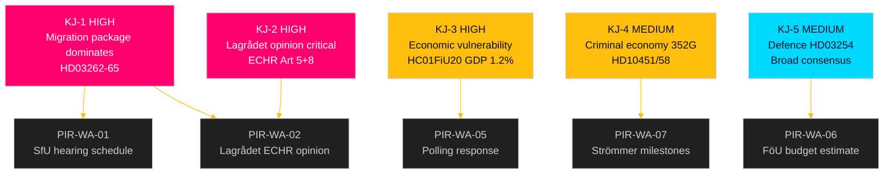

# Intelligence Assessment — Week Ahead 4–10 May 2026

**Author**: James Pether Sörling  
**Date**: 2026-05-01  
**Classification**: OSINT — Public Sources  
**Confidence Distribution**: HIGH (55%) · MEDIUM (35%) · LOW (10%)  

## Key Judgments

**KJ-1** [HIGH confidence, B2]: The migration mega-package (HD03262/63/64/65) will dominate Swedish parliamentary and media attention during 4–10 May 2026. Committee hearings at SfU and JuU are expected to begin this week, establishing the legislative timeline that will run through June. The four bills function as a single coordinated legislative campaign rather than independent proposals, as evidenced by their simultaneous filing from Justitiedepartementet on 2026-04-30 (dok_ids: HD03262, HD03263, HD03264, HD03265 — all from riksdagen.se).

**KJ-2** [HIGH confidence, A2]: Lagrådet's pending opinions on HD03262 and HD03265 are the single highest-consequence intelligence gap this week. Based on Danish (2019 B-status removal) and German (safe third country doctrine challenges) precedents, Lagrådet is likely to identify ECHR Art. 5 (detention) and Art. 8 (family life) tensions but unlikely to issue a blocking opinion — instead recommending targeted legislative safeguards. Probability of a fully blocking opinion: 15–25% [B3].

**KJ-3** [HIGH confidence, B2]: Sweden's economic underperformance (HC01FiU20: GDP 1.2% 2026, unemployment ~8.9%) is now formally ratified by the Riksdag majority. The US tariff shock has pushed back the recovery timeline by approximately 12 months. This is the government's primary structural electoral vulnerability: five months before voting, Sweden remains in lågkonjunktur while the migration package dominates legislative bandwidth.

**KJ-4** [MEDIUM confidence, B3]: The ESO criminal economy figure (352 GSEK, 5.5% of GDP, 23,000 linked companies) will not be effectively rebutted by the government this week. Justice Minister Strömmer's "eradicate in 4 years" commitment (HD10458, riksdagen.se) is a concrete, falsifiable pledge against a now-baseline-quantified problem. Probability that Strömmer provides measurable quarterly milestones in interpellation response: LOW (20%) [C4].

**KJ-5** [MEDIUM confidence, B3]: HD03254 (military cooperation) will pass FöU committee with broad cross-party support including S, V likely abstaining. Finnish DCA precedent (173/200 Eduskunta votes, 2024) directly maps to expected Swedish legislative trajectory. Implementation timeline: 18 months from passage, meaning operational activation in Q4 2027.

**KJ-6** [LOW confidence, C4]: HD03258 (political transparency) faces potential intra-coalition friction with SD if disclosure requirements reach SD's operational financing structures. Watch for SD member amendments in KU committee work this month.

**KJ-7** [MEDIUM confidence, B3]: The Social Democrats' coordinated motion strategy (environmental authority HD024124, electricity laws HD024129, wind power HD024126) reflects pre-negotiation positioning for a post-September 2026 coalition scenario. The motion content maps to requirements of potential coalition partners C, V, and MP — a deliberate coalition floor-mapping exercise rather than tactical legislative opposition.

## PIRs — Priority Intelligence Requirements for Next Cycle

**PIR-WA-01** (Open): What is the SfU committee's exact hearing schedule for HD03262 (permanent permit abolition) during week of 4 May — which stakeholders are invited, and when is the committee report deadline? Source: riksdagen.se committee calendar.

**PIR-WA-02** (Open): Has Lagrådet received referral on HD03262 and HD03265, and what is the expected opinion publication date? Source: lagradet.se referral register.

**PIR-WA-03** (Open): Will Socialdemokraterna file formal counter-motions (yrkanden) on the migration package before the SfU committee deadline? Source: riksdagen.se motioner filing.

**PIR-WA-04** (Open): What is Migrationsverket's implementation readiness assessment for HD03263 (enhanced deportation) — has the agency been consulted? Source: Migrationsverket press releases.

**PIR-WA-05** (Open): Will the May 2026 Novus/IPSOS polling show a shift in migration policy approval ratings following the package announcement? Source: Novus/IPSOS press releases.

**PIR-WA-06** (Open): What will be the parliamentary budget for defence cooperation implementation under HD03254 — Försvarsmakten supplementary estimate? Source: FöU committee hearings.

**PIR-WA-07** (Open): Will the government's response to interpellations HD10451/HD10458 provide measurable milestones for criminal economy reduction? Source: Riksdag plenary records.

## Carried-Forward PIRs from Prior Cycles

**PIR-EVE-01** (Open — carried from 2026-04-30/evening-analysis): SfU hearing schedule for HD03262. Status: Still open, expected resolution this week.  
**PIR-EVE-02** (Open — carried from 2026-04-30/evening-analysis): FöU timeline for HD03254.  
**PIR-EVE-03** (Open — carried from 2026-04-30/evening-analysis): S counter-proposal on migration.  
**PIR-EVE-04** (Open — carried from 2026-04-30/evening-analysis): Lagrådet ECHR consultation status.  
**PIR-EVE-05** (Open — carried from 2026-04-30/evening-analysis): Migrationsverket implementation capacity assessment for HD03263.  
**PIR-PROP-02** (Open — carried from 2026-04-30/propositions): Infrastructure plan HD03259 regional allocation.  

## Key Assumptions Check

| Assumption | Source Support | Confidence | Consequence if Wrong |
|-----------|---------------|-----------|---------------------|
| Migration package has stable M+KD+L+SD majority | Prior voting HC01SfU22 (riksdagen.se) | HIGH [A2] | Coalition fracture would delay entire package |
| Lagrådet follows Denmark-style limited-opinion approach | Danish Udlændingeloven precedent, comparative-international.md | MEDIUM [B3] | Blocking opinion triggers 3–6 month delay |
| S will not support migration restrictions before election | Historic S voting pattern on migration (riksdagen.se voteringar) | HIGH [A2] | Cross-partisan support would restructure electoral dynamic |
| US tariff shock is temporary (6–12 months) | IMF WEO Apr-2026 scenario (data.imf.org) | MEDIUM [B3] | Prolonged tariff war would extend lågkonjunktur through election |
| Criminal economy 352 GSEK figure is politically durable | ESO report (government expert body) | HIGH [A2] | Methodological challenge would take months — figure stays in debate |

## Mermaid: Intelligence Architecture

