# Media Framing Analysis — Week Ahead 4–10 May 2026

**Author**: James Pether Sörling  
**Date**: 2026-05-01  
**Framework**: Per-party + press quadrant framing  

## Expected Media Frames (4–10 May 2026)

### Government/Ruling Coalition Frames

| Actor | Expected Frame | Key Narrative | Message Channel |
|-------|---------------|--------------|----------------|
| Justitiedepartementet (Strömmer) | "Responsible enforcement" | Migration laws = proportionate response to genuine capacity crisis | Press releases, SVT Agenda |
| M (Kristersson) | "Promise kept" | SD-M: together we're delivering on the mandate voters gave us in 2022 | Riksdag chamber + DN interview |
| SD (Åkesson) | "Sweden reclaims control" | Permanent permits were always a mistake — Sweden is now like all other European countries | SD social media + Aftonbladet |
| KD (Busch) | "Humane but firm" | Families protected; criminals removed; values upheld | KD press + Expressen |
| L (Pehrson) | "Rule of law, not just rules" | Supporting the principle while demanding Lagrådet ECHR review | Liberal press + L website |

### Opposition Frames

| Actor | Expected Frame | Key Narrative | Message Channel |
|-------|---------------|--------------|----------------|
| S (Andersson) | "Constitutional responsibility" | Sweden's Lagrådet should review this before vote — democracy requires patience | SVT Agenda + S press |
| V (Dadgostar) | "Human rights under attack" | HD03265 detention expansion = EU carceral creep; children in detention | V social media + Aftonbladet |
| MP (Bolund) | "Migration politics crowd out climate" | While Riksdag debates detention, climate emergency deepens — missed priorities | MP press + social media |
| C (Thorbjörn) | "We're watching implementation" | C will not oppose in principle but demands proportionality oversight | C press statement |

### Independent/Media Frames

| Outlet | Expected Editorial Line | Key Question |
|--------|------------------------|-------------|
| Dagens Nyheter (DN) | "Rights-balancing" | Are ECHR protections being adequately safeguarded? |
| Svenska Dagbladet (SvD) | "Implementation challenge" | Can Migrationsverket actually execute this? |
| Aftonbladet | "Whose Sweden?" | Who benefits and who suffers from these policies? |
| Expressen | "Strong government" | Government delivers; critics cavil |
| SVT (public TV) | "Balanced" | Committed to presenting all party perspectives |
| SR (public radio) | "Scrutiny" | Investigative questioning of implementation capacity and ECHR |

## Press Quadrant Analysis

```
HIGH PROMINENCE
     │
     │   SD/M "Promise kept"     │   S/V "Constitutional"
     │   (government frame)      │   (opposition frame)
     │   Expressen + SvD         │   DN + SR
     │                           │
─────┼───────────────────────────┼──────────────
PRO  │                           │  CRITICAL
GOV  │   KD "Humane but firm"    │   MP/V "Human rights"
     │   Expressen               │   Aftonbladet
     │                           │
LOW PROMINENCE
```

## Contested Narratives This Week

**Narrative battle 1: ECHR framing**
- Government: "Our lawyers have reviewed this; ECHR is satisfied"
- Opposition: "Lagrådet hasn't opined yet — you're legislating in constitutional darkness"
- Media arbiter: SVT Agenda (Sunday 10 May) likely to provide the most visible platform for this clash

**Narrative battle 2: Implementation capacity**
- Government: "Migrationsverket will receive resources to implement"
- Opposition: "Statskontoret 2023:4 says IT systems are fragile — you're setting up for failure"
- Key intelligence: If S or V commissions an independent expert statement from Statskontoret or Riksrevisionen this week, the implementation narrative gains credibility

**Narrative battle 3: Criminal economy 352 GSEK**
- Government (Strömmer): "We have a plan — we're making progress"
- Opposition: "ESO says 352 GSEK — what's your quarterly target? What's your Q2 baseline?"
- Media arbiter: Aftonbladet and SVT crime reporters

```mermaid
%%{init: {"theme": "dark", "themeVariables": {"primaryColor": "#00d9ff", "primaryTextColor": "#e0e0e0", "primaryBorderColor": "#ff006e"}}}%%
graph LR
    subgraph GovFrame["Government Framing Machine"]
        M1["M: Promise kept"]
        SD1["SD: Sweden reclaims control"]
        KD1["KD: Humane but firm"]
        L1["L: Rule of law"]
    end
    subgraph OppFrame["Opposition Framing Machine"]
        S1["S: Constitutional responsibility"]
        V1["V: Human rights"]
        MP1["MP: Missed priorities"]
    end
    subgraph Media["Media Quadrant"]
        Exp["Expressen: Government"]
        DN1["DN: Rights-balancing"]
        AB["Aftonbladet: Whose Sweden?"]
        SVT1["SVT: Balanced arbiter"]
    end
    GovFrame --> SVT1
    OppFrame --> SVT1
    SVT1 -->|"Agenda Sunday 10 May"| Outcome["Electoral narrative\nformed by week-end"]
    style GovFrame fill:#1a1e3d,stroke:#ff006e
    style OppFrame fill:#1a1e3d,stroke:#00d9ff
    style SVT1 fill:#ffbe0b,color:#0a0e27
```


