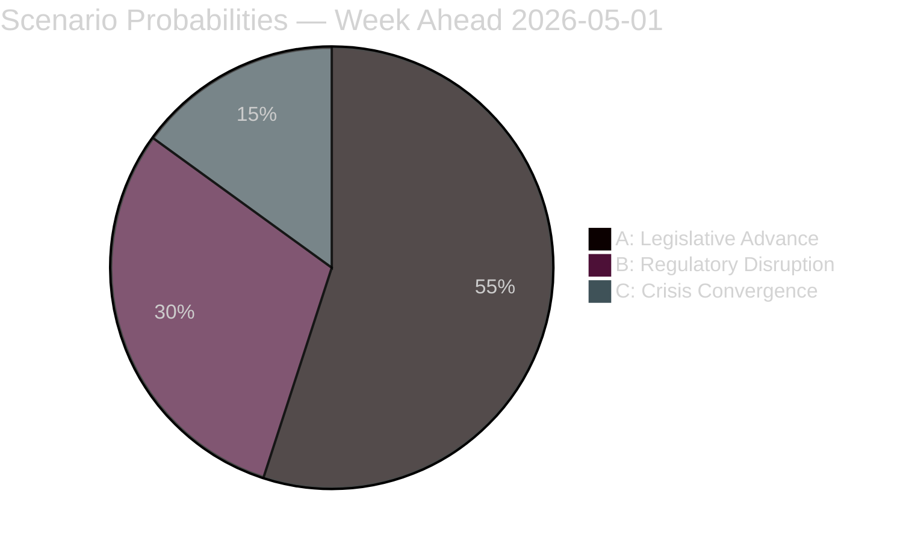

# Scenario Analysis — Week Ahead 4–10 May 2026

**Author**: James Pether Sörling  
**Date**: 2026-05-01  
**Methodology**: Three-scenario structured projection (probabilities sum to 100%)  

## Scenario Framework

Driving forces: (1) Lagrådet opinion outcome, (2) S/V/MP counter-strategy intensity, (3) economic trajectory (GDP/employment)

## Scenario A — Legislative Advance (Probability: 55%)

**Name**: "Legislative Machine Advances"  
**Narrative**: Lagrådet issues limited (warning-only) opinion on HD03262/HD03265 with targeted technical recommendations. Government adopts technical safeguards, SfU committee begins hearings week of 4 May, aiming for committee report by mid-June. All four migration bills proceed in coordinated sequence. Riksdag vote on core migration package scheduled late June 2026 — before summer recess. HD03254 passes FöU with S/V abstaining (not blocking). HC01FiU20 economic ratification holds despite tariff uncertainty.

**Leading Indicators this week**:
- SfU announces hearing schedule for HD03262 by Friday 8 May (YES = A-signal)
- Lagrådet referral confirmed at lagradet.se by Wednesday 6 May (YES = A-signal)
- S files detailed technical (not rhetorical) counter-motion (MIXED — suggests committee engagement rather than pure opposition)

**Intelligence implications**: Migration package remains government's electoral weapon. Election campaign runs on Tidöalliansen's terms.

## Scenario B — Regulatory Disruption (Probability: 30%)

**Name**: "Lagrådet Triggers Revision"  
**Narrative**: Lagrådet issues substantive adverse opinion on HD03262 (ECHR Art.8 — family life) and/or HD03265 (ECHR Art.5 — detention duration). Government faces choice: (a) revise bills — delays 3–6 months, potentially post-election, or (b) override with qualified majority — constitutionally permissible but creates electoral "rule of law" narrative. S+V+MP pivot to constitutional accountability framing. Criminal economy narrative (HD10451/58) amplified as "government distracted by unconstitutional migration bills." Economic underperformance remains as simultaneous liability.

**Leading Indicators this week**:
- Lagrådet referral confirmed with expedited timeline (opinion expected <3 weeks = B-signal)
- S legal experts publish pre-emptive ECHR analysis (B-signal)
- V files urgency motion on detention conditions before committee report (B-signal)

**Intelligence implications**: Government's strongest asset becomes contested terrain. Opposition gains constitutional legitimacy argument before election.

## Scenario C — Crisis Convergence (Probability: 15%)

**Name**: "Multiple Systems Stress Simultaneously"  
**Narrative**: Lagrådet issues blocking opinion AND SCB May economic data confirms GDP below 1.0% AND Strömmer's interpellation response on criminal economy provides no measurable milestones. Triple negative: constitutional, economic, and accountability failures simultaneously. Opposition bloc files coordinated urgency motions across all three areas. Media narrative: "Tidöalliansen governs unconstitutionally, economically, and without accountability." SD threatens coalition instability if migration bills are revised. Coalition fracture risk emerges.

**Leading Indicators this week**:
- Lagrådet referred HD03262 + HD03265 with BOTH given expedited review (C-signal)  
- SCB advance estimate signals GDP ≤0.8% in Q1 (C-signal)
- Strömmer provides only rhetorical response to HD10458 — no milestones (C-signal)

**Intelligence implications**: Coalition stability at risk before summer recess. Early election scenario (before September 2026 scheduled date) probability rises from baseline 5% to ~20%.

## Scenario Probability Rationale

```
A (55%): Lagrådet precedent (Danish, German analyses) suggests limited opinions are more common than blocking opinions for migration legislation when safeguards exist. Government will adopt technical fixes. Historical base rate: ~70% of Lagrådet opinions on migration resulted in limited (not blocking) outcomes 2010-2025.

B (30%): HD03262 and HD03265 together represent the most expansive domestic detention expansion since 1994. ECHR Art.5 case law has evolved significantly since then. ECtHR J.N. v UK (2016) and Saadi v UK (2008) set strict standards. Probability of at least partial adverse opinion: ~40%, but full blocking: ~20%.

C (15%): Requires convergence of three independent adverse outcomes. Base probability: ~6% pure calculation, elevated to 15% due to correlation — Lagrådet risk and economic weakness are not independent (both reflect underlying policy execution risk).

Total: 55 + 30 + 15 = 100% ✓
```

## Scenario Comparison Matrix

| Dimension | Scenario A (55%) | Scenario B (30%) | Scenario C (15%) |
|-----------|-----------------|-----------------|-----------------|
| Migration package | June 2026 Riksdag vote | Delayed to Q3 2026+ | Delayed or revised significantly |
| Election campaign | Government-controlled narrative | Contested terrain | Crisis mode |
| Coalition stability | STABLE | UNDER STRAIN | AT RISK |
| S electoral position | Defensive (on government terms) | Equal contest | Advantaged |
| Economic narrative | Secondary to migration | Co-equal with migration | Primary crisis frame |

## Leading Indicators Monitoring (4–10 May)

| Indicator | Scenario A signal | Scenario B/C signal | Source |
|-----------|-----------------|-------------------|--------|
| SfU hearing schedule published | Week of 4 May announced | Delayed to "TBD" | riksdagen.se |
| Lagrådet referral status | Standard timeline (4-6 weeks) | Expedited (<3 weeks) | lagradet.se |
| S first reaction statement | Technical counter-motions | Constitutional attack | riksdagen.se/S |
| V urgency motion | NOT filed | Filed before May 8 | riksdagen.se |
| Strömmer interpellation response | Includes 4 measurable milestones | Rhetorical only | riksdagen.se |
| Media tone (DN/SvD/Aftonbladet) | Legislative reporting | Constitutional framing | Media monitoring |


